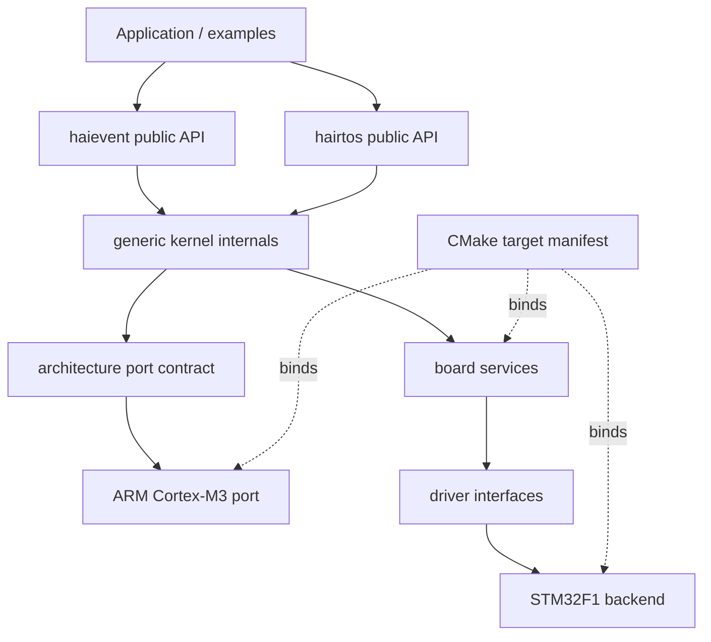
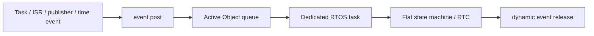

# hairtos

> **Phiên bản source:** `1.0.0-rc1`  
> **Định hướng:** static-first preemptive RTOS kernel + event-driven framework (`haievent`) + flat state machine / Active Object  
> **Target tham chiếu:** `bluepill_f103c8` — STM32F103C8T6 / ARM Cortex-M3

`hairtos` là một project RTOS học thuật–thực nghiệm nhưng implementation được tổ chức như một codebase hệ thống thật: public/internal boundary rõ, object ownership tĩnh, scheduler/timeout/IPC có invariant, Cortex-M3 context switch viết ở architecture port, host sanitizer tests, target manifest và một framework event-driven độc lập chạy trên chính kernel.

Điểm quan trọng nhất khi đọc repo này là **không nhầm roadmap với implementation**. `docs/00`–`08`, source và examples mô tả v1 hiện hành. `docs/09-version2/` chỉ là thiết kế tương lai.

## Mục lục

- [Kiến trúc tổng thể](#architecture)
- [Kernel v1](#kernel)
- [`haievent`](#haievent)
- [Cortex-M3 / STM32F103 target](#target)
- [Build, test và evidence](#build)
- [Lộ trình examples](#examples)
- [Repository map](#repo-map)
- [Documentation](#docs)
- [Giới hạn v1](#limits)
- [References](#references)

<a id="architecture"></a>
## Kiến trúc tổng thể



### Boundary chính

- **Application** chỉ nên include `hairtos/hairtos.h`, `haievent/haievent.h` và `board.h`.
- **Public kernel objects** (`hr_task_t`, `hr_queue_t`, `hr_mutex_t`, ...) là opaque fixed-size storage. Internal control block được đặt bên trong union storage và `_Static_assert` bảo đảm config đủ lớn.
- **Kernel internal** sở hữu ready/wait/timeout lists, scheduler policy, blocking/wakeup protocol và object-specific invariants.
- **Architecture port** sở hữu PSP/MSP, SVC, PendSV, critical section và context save/restore.
- **SoC/board/driver** tách register/clock/pin/peripheral khỏi generic kernel.

<a id="kernel"></a>
## Kernel v1

### Scheduling và task

- Fixed-priority preemptive scheduling; **priority số nhỏ hơn cao hơn**.
- `8 mức priority; số nhỏ hơn có priority cao hơn; idle ở priority 7`.
- Một intrusive FIFO ready queue cho mỗi priority + bitmap cho non-empty priority.
- Equal-priority round-robin khi `HR_CFG_TIME_SLICING=1`; default slice = 1 tick.
- Task được tạo bằng caller-owned `hr_task_t` + stack; không có dynamic kernel allocation.
- Task model: CREATED, READY, RUNNING, BLOCKED, SUSPENDED.
- Base/effective priority tách riêng để hỗ trợ priority inheritance.

### Time, blocking và IPC

- Tick type là `uint32_t`; default `1 kHz`.
- Timeout dùng hai sorted lists (`current`/`overflow`) để xử lý wrap-around.
- Queue FIFO có blocking send/receive, timeout, ISR non-blocking API và direct handoff.
- Semaphore counting/binary; ISR give hỗ trợ wake task.
- Mutex normal/recursive; ownership + chained priority inheritance + direct handoff.
- Software timer callback chạy trong timer-service task, không chạy trực tiếp trong SysTick ISR.

### Diagnostics

- Stack fill `0xA5`, guard `0xDEADBEEF`, high-watermark.
- Runtime counters và health report.
- Panic/fault record trong `.noinit` để có thể đọc sau reset.
- Fault context lưu stacked register + CFSR/HFSR/DFSR/AFSR/MMFAR/BFAR/SHCSR.

<a id="haievent"></a>
## `haievent`



v1 có:

- static event và dynamic event từ fixed-block pool;
- reference counting;
- flat state machine với reserved signals ENTRY/EXIT/INIT/TIMEOUT;
- Active Object = task + queue + state machine;
- time event dựa trên software timer;
- publish/subscribe với bảng subscriber tĩnh;
- post từ task và ISR.

v1 **chưa** có HSM, deferred event, history state hoặc shared-executor AO.

<a id="target"></a>
## Cortex-M3 / STM32F103 target

Target hoàn chỉnh hiện tại: `bluepill_f103c8`.

| Thuộc tính | Binding hiện tại |
| --- | --- |
| MCU | STM32F103C8T6 |
| CPU | ARM Cortex-M3 |
| Clock | 72 MHz nominal (HSE 8 MHz → PLL ×9), có HSI fallback |
| UART | USART1 PA9/PA10, 115200 8-N-1 |
| LED | PC13 active-low |
| Kernel tick | SysTick, 1 kHz |
| Context start/switch | SVC / PendSV |
| Benchmark clock | DWT CYCCNT |
| Benchmark marker | PB0 active-high |
| Debug | ST-Link + SWD + OpenOCD/GDB |

Cortex-M3 context path:

```mermaid
sequenceDiagram
    participant M as main / MSP
    participant S as SVC
    participant T as task / PSP
    participant P as PendSV
    participant K as kernel selector
    M->>S: hr_kernel_start() → svc #0
    S->>T: restore initial frame, Thread mode uses PSP
    T->>P: yield/preempt/block requests switch
    P->>P: save R4-R11; hardware frame already on PSP
    P->>K: select next task
    K-->>P: current TCB updated
    P->>T: restore R4-R11 + exception return
```

<a id="build"></a>
## Build, test và evidence

Makefile là command wrapper; CMake là source-of-truth cho target/example/module/source.

```bash
make help
make list-targets
make list-examples
```

Target build:

```bash
make TARGET=bluepill_f103c8 EXAMPLE=16-diagnostics-stress-stabilization build
```

Host tests:

```bash
make TARGET=bluepill_f103c8 host-tests
```

### Validation đã chạy trong lần audit tài liệu này

- GCC host build + AddressSanitizer + UndefinedBehaviorSanitizer: **PASS**.
- `ctest`: **PASS**.
- 64 host test function được build vào suite.
- `02-kernel-data-structures-host`: **PASS**.
- `14-memory-allocator-lab` host demo: **PASS**.
- `16-diagnostics-stress-stabilization` host stress: **PASS**, 500.000 iteration.

Môi trường audit **không có** `arm-none-eabi-gcc`, `arm-none-eabi-gdb` hoặc OpenOCD, vì vậy README này không tuyên bố firmware target đã được cross-build/flash lại trong phiên hiện tại.

<a id="examples"></a>
## Lộ trình examples

| Stage | Examples | Cơ chế |
| --- | --- | --- |
| Bare-metal | 01 | board/UART/LED/tick baseline |
| Kernel structures | 02 | intrusive list, ready set, wait list |
| Task bootstrap | 03–05 | TCB, stack frame, SVC, PendSV |
| Scheduling/time | 06–08 | priority, blocking delay, preemption, round-robin |
| IPC/sync | 09–12 | queue, semaphore, mutex PI, suspend/resume, timer |
| Event-driven | 13-01…13-06 | event, AO, FSM, time event, pub-sub, integration |
| Experiments/evidence | 14–16 | allocator, benchmark, diagnostics/stress |

Chi tiết: [`examples/README.md`](examples/README.md).

<a id="repo-map"></a>
## Repository map

```text
hairtos/
├── arch/                     # architecture-specific context/critical/fault/benchmark
├── benchmarks/kernel/        # generic benchmark statistics
├── boards/                   # board binding, linker, marker/UART/LED services
├── cmake/                    # target/module/example source-of-truth
├── config/                   # compile-time kernel + haievent policy
├── docs/                     # technical docs v1 + explicit v2 roadmap
├── drivers/                  # public peripheral contracts + STM32F1 backend
├── examples/                 # learning/evidence sequence 01–16
├── haievent/                 # event framework
├── kernel/                   # public/internal/source of RTOS kernel
├── labs/memory-allocator/    # allocator experiment outside kernel runtime
├── soc/                      # STM32F1 startup/clock/IRQ/register layer
├── tests/                    # host, mocks, portability probes, stress
└── tools/                    # OpenOCD/GDB helpers
```

<a id="docs"></a>
## Documentation

Bắt đầu tại [`docs/README.md`](docs/README.md). Các nhóm quan trọng:

- [`docs/00-overview/`](docs/00-overview/README.md) — architecture, principles, capability/config/dependency.
- [`docs/01-kernel-core/`](docs/01-kernel-core/README.md) — task, scheduler, context switch, interrupt, timeout, invariants.
- [`docs/02-synchronization/`](docs/02-synchronization/README.md) — queue/semaphore/mutex/timer/suspend-resume.
- [`docs/03-haievent/`](docs/03-haievent/README.md) — event ownership, AO, FSM, time event, pub-sub.
- [`docs/04-platform/`](docs/04-platform/README.md) — Cortex-M3/STM32/target/porting.
- [`docs/05-api-reference/`](docs/05-api-reference/README.md) — public API contract.
- [`docs/06-testing-and-quality/`](docs/06-testing-and-quality/README.md) — tests, diagnostics, benchmark, release.
- [`docs/07-labs-and-examples/`](docs/07-labs-and-examples/README.md) — learning map + allocator lab.
- [`docs/08-appendices/`](docs/08-appendices/README.md) — glossary/source map/limitations.
- [`docs/09-version2/`](docs/09-version2/README.md) — **future plan only**.

<a id="limits"></a>
## Giới hạn v1

- single-core only;
- không FPU context / MPU isolation;
- critical section Cortex-M3 dùng PRIMASK, chưa có application interrupt ceiling dựa trên BASEPRI;
- tickless idle chưa có;
- không general dynamic kernel heap;
- `haievent` chỉ flat FSM, one-task-per-AO;
- target hoàn chỉnh hiện mới có Blue Pill STM32F103C8T6;
- benchmark là evidence theo target/build, không phải chứng nhận hard real-time.

<a id="references"></a>
## References

**Tài liệu nền tảng chính thức:**

- [Arm Cortex-M3 Technical Reference Manual](https://developer.arm.com/documentation/100165/latest/)
- [Arm Cortex-M3 Devices Generic User Guide](https://developer.arm.com/documentation/dui0552/latest/)
- [ST RM0008 — STM32F101/102/103/105/107 Reference Manual](https://www.st.com/resource/en/reference_manual/cd00171190-stm32f101xx-stm32f102xx-stm32f103xx-stm32f105xx-and-stm32f107xx-advanced-arm-based-32-bit-mcus-stmicroelectronics.pdf)
- [STM32F103 Documentation](https://www.st.com/en/microcontrollers-microprocessors/stm32f103/documentation.html)
- [CMake — Toolchain Files](https://cmake.org/cmake/help/latest/manual/cmake-toolchains.7.html)
- [OpenOCD User's Guide](https://openocd.org/doc/html/index.html)

**Nguồn implementation trong repository:**
- `config/hairtos_config.h`
- `kernel/src/hr_kernel.c`
- `kernel/src/hr_task.c`
- `kernel/src/hr_scheduler.c`
- `kernel/src/hr_timeout.c`
- `kernel/src/hr_wait.c`
- `arch/arm/cortex-m3/hr_port.c`
- `arch/arm/cortex-m3/hr_port_stack.c`
- `arch/arm/cortex-m3/hr_portasm.S`
- `config/haievent_config.h`
- `haievent/src/he_event.c`
- `haievent/src/he_active.c`
- `haievent/src/he_state_machine.c`
- `haievent/src/he_time_event.c`
- `haievent/src/he_pubsub.c`
- `soc/stm32f1/startup_stm32f103.S`
- `soc/stm32f1/system_stm32f1.c`
- `soc/stm32f1/stm32f1_clock.c`
- `boards/bluepill_f103c8/board.c`
- `boards/bluepill_f103c8/STM32F103C8Tx_FLASH.ld`
- `cmake/targets/bluepill_f103c8.cmake`
