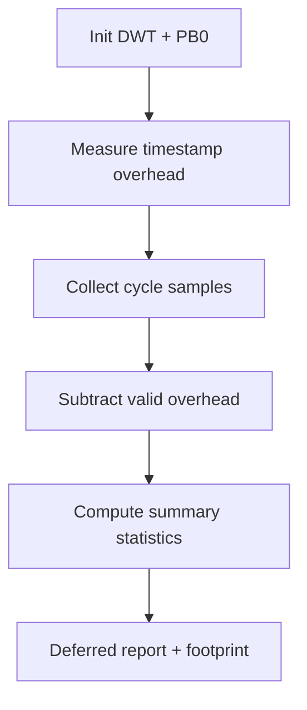

# Kernel benchmark support

> **Phạm vi:** Implementation `hairtos 1.0.0-rc1`, bao gồm source, config, build graph và host-test evidence hiện có.

[← Root README](../../README.md)

## Mục lục

- [Tổng quan và bản chất](#tong-quan)
- [Implementation trong repository](#implementation)
- [Mô hình và luồng thực thi](#mo-hinh)
- [Ownership, concurrency và invariants](#invariants)
- [Failure modes và giới hạn](#failure)
- [Validation và cách kiểm chứng](#validation)
- [Source map](#source-map)
- [Tài liệu tham khảo](#references)

<a id="tong-quan"></a>
## Tổng quan và bản chất

Benchmark module tách cơ chế đo generic khỏi clock/marker target-specific. Trên Blue Pill, timestamp dùng DWT CYCCNT và board có marker PB0 để đối chiếu logic-analyzer; example 15 trì hoãn UART output cho tới sau khi thu mẫu để giảm nhiễu đo.


<a id="implementation"></a>
## Implementation trong repository

Implementation hiện tại gồm:

- Statistics container có bounded sample capacity và tính min/max/mean/percentile.
- Cycle arithmetic dùng unsigned wrap-safe subtraction và convert sang nanosecond bằng clock frequency.
- Example đo read overhead trước để có thể report adjusted cycle cho primitive nhỏ.
- Metrics gồm critical section, scheduler selection, semaphore/mutex/queue primitive, yield roundtrip, queue wakeup, event dispatch và timer jitter.
- Benchmark là measurement evidence của target/build cụ thể, không phải hard real-time guarantee cho mọi board/toolchain.
- lưu sample trong mảng tĩnh;
- tính min, max, mean và percentile;
- điều chỉnh measurement overhead;
- đổi cycle sang nanosecond khi biết clock;
- định nghĩa contract cho benchmark clock backend.
- Sample count không vượt `HR_BENCHMARK_MAX_SAMPLES`.
- Percentile được tính trên bản sao/sắp xếp phù hợp với implementation hiện tại.

Các chi tiết implementation quan trọng:

- Clock backend phải là monotonic modulo 32-bit trong thời gian một sample.
- Kết quả phụ thuộc target, clock, compiler, optimization, interrupt load và debugger.
- Build PASS không chứng minh độ chính xác của clock backend trên hardware.
- Example benchmark được phép truy cập internal scheduler API có chủ đích; đây không phải mẫu application thông thường.


<a id="mo-hinh"></a>
## Mô hình và luồng thực thi



Các function và source file tương ứng được liệt kê trong phần Source map.

<a id="invariants"></a>
## Ownership, concurrency và invariants

Các invariant nền áp dụng cho chủ đề này:

- Opaque object public chỉ hợp lệ sau create/init thành công và magic/internal state khớp contract.
- Intrusive node chỉ được linked vào đúng một list tại một thời điểm; remove/timeout/wake phải để node về trạng thái unlinked nhất quán.
- Thread API có thể block chỉ khi kernel RUNNING và không ở ISR; ISR API phải non-blocking và sử dụng `higher_priority_task_woken` khi cần defer switch sang PendSV.
- Critical section hiện dùng PRIMASK trên Cortex-M3, nghĩa là mask interrupt toàn cục trong đoạn ngắn; vì vậy code trong critical section phải bounded và không được gọi operation có thể block.
- Priority dùng **effective priority** ở ready/wait policy khi mutex inheritance đang active; base priority chỉ là cấu hình gốc.
- Static-first không có nghĩa “không có lifetime”: caller-owned TCB/stack/queue storage/event pool vẫn phải sống lâu hơn mọi object đang tham chiếu tới chúng.

<a id="failure"></a>
## Failure modes và giới hạn

- `hairtos 1.0.0-rc1` là single-core, không có SMP, FPU context, MPU isolation hay general dynamic kernel heap.
- Interrupt masking model hiện là PRIMASK; repository chưa có BASEPRI ceiling contract cho application ISR priority phức tạp.
- Tickless idle chưa có; time model hiện dựa trên tick 1 kHz ở target tham chiếu.
- `haievent` v1 là flat state machine và one-task-per-AO; HSM/deferred event/shared executor nằm ở roadmap Version 2.
- Build/link PASS không tự chứng minh real-time timing hoặc race-free behavior trên hardware; target tests và measurement vẫn cần thiết.

<a id="validation"></a>
## Validation và cách kiểm chứng

- Host suite của repository được build bằng GCC với AddressSanitizer + UndefinedBehaviorSanitizer và `ctest`.
- Host validation baseline: `make TARGET=bluepill_f103c8 host-tests` PASS.
- Host examples `02-kernel-data-structures-host`, `14-memory-allocator-lab`, `16-diagnostics-stress-stabilization` chạy PASS; stress scheduler report 500.000 iteration.
- Không suy ra target runtime PASS từ host test. Cortex-M3 assembly, timing, exception priority, UART/LED và hardware clock vẫn cần cross-build + board validation.

Các lệnh reproduction chính:

```bash
make TARGET=bluepill_f103c8 EXAMPLE=15-kernel-benchmark build
make TARGET=bluepill_f103c8 EXAMPLE=15-kernel-benchmark run
make TARGET=bluepill_f103c8 host-tests
```


<a id="source-map"></a>
## Source map

- `benchmarks/kernel/src/hr_benchmark_stats.c`
- `arch/arm/cortex-m3/hr_benchmark_clock_dwt.c`
- `examples/15-kernel-benchmark/main.c`
- `tests/host/test_benchmark.c`
- `benchmarks/kernel/`
- `cmake/hairtos_modules.cmake`


<a id="references"></a>
## Tài liệu tham khảo

- [Arm Cortex-M3 Technical Reference Manual](https://developer.arm.com/documentation/100165/latest/)
- [Arm Cortex-M3 Devices Generic User Guide](https://developer.arm.com/documentation/dui0552/latest/)

**Nguồn implementation trong repository:**
- `benchmarks/kernel/src/hr_benchmark_stats.c`
- `arch/arm/cortex-m3/hr_benchmark_clock_dwt.c`
- `examples/15-kernel-benchmark/main.c`
- `tests/host/test_benchmark.c`
- `benchmarks/kernel/`
- `cmake/hairtos_modules.cmake`
