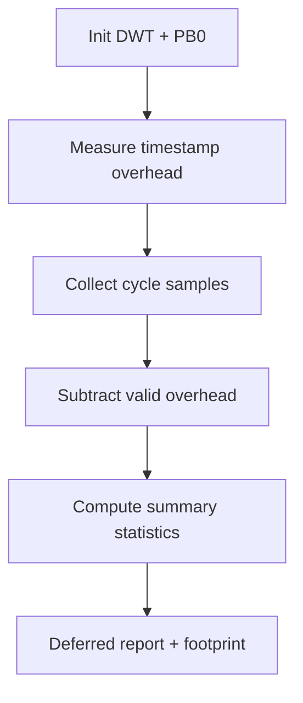

# Kernel benchmark support

> **Scope:** `hairtos 1.0.0-rc1` implementation, including the current source, configuration, build graph, and host-test evidence.

[← Root README](../../README.md)

## Table of Contents

- [Overview and Core Concepts](#overview)
- [Implementation in the Repository](#implementation)
- [Execution Model and Runtime Flow](#runtime-model)
- [Ownership, Concurrency, and Invariants](#invariants)
- [Failure Modes and Limitations](#failure)
- [Validation and Verification](#validation)
- [Source map](#source-map)
- [References](#references)

<a id="overview"></a>
## Overview and Core Concepts

The benchmark module separates generic measurement logic from target-specific clocks/markers. On Blue Pill, timestamps use DWT CYCCNT and the board exposes PB0 as a logic-analyzer marker; example 15 defers UART output until after sample collection to reduce measurement interference.


<a id="implementation"></a>
## Implementation in the Repository

The current implementation includes:

- The statistics container has bounded sample capacity and computes min/max/mean/percentiles.
- Cycle arithmetic uses unsigned wrap-safe subtraction and converts cycles to nanoseconds using the clock frequency.
- The example measures timestamp-read overhead first so it can report adjusted cycles for short primitives.
- Metrics include critical-section cost, scheduler selection, semaphore/mutex/queue primitives, yield round-trip, queue wakeup, event dispatch, and timer jitter.
- Benchmark results are measurement evidence for a specific target/build, not a hard real-time guarantee across every board/toolchain.
- store samples in static arrays;
- compute min, max, mean, and percentiles;
- compensate for measurement overhead;
- convert cycles to nanoseconds when the clock is known;
- define the contract for the benchmark clock backend.
- Sample count never exceeds `HR_BENCHMARK_MAX_SAMPLES`.
- Percentiles are computed from a copy/sort strategy consistent with the current implementation.

Key implementation details:

- The clock backend must be monotonic modulo 32 bits over the duration of a sample.
- Results depend on target, clock, compiler, optimization, interrupt load, and debugger state.
- A successful build does not prove the accuracy of the clock backend on hardware.
- The benchmark example intentionally has access to internal scheduler APIs; this is not a normal application pattern.


<a id="runtime-model"></a>
## Execution Model and Runtime Flow



The corresponding functions and source files are listed in the Source Map section.

<a id="invariants"></a>
## Ownership, Concurrency, and Invariants

The following baseline invariants apply to this topic:

- A public opaque object is valid only after a successful create/init operation and when its magic/internal state matches the contract.
- An intrusive node may be linked into exactly one list at a time; remove/timeout/wake paths must leave the node in a consistent unlinked state.
- A thread API may block only while the kernel is RUNNING and the caller is not in ISR context; ISR APIs must be non-blocking and use `higher_priority_task_woken` when a switch should be deferred to PendSV.
- Critical sections currently use PRIMASK on Cortex-M3, globally masking interrupts for a short bounded interval; therefore critical-section code must remain bounded and must not invoke operations that can block.
- Ready/wait policy uses **effective priority** while mutex priority inheritance is active; base priority remains the task's configured priority.
- Static-first does not mean “no lifetime”: caller-owned TCB, stack, queue storage, and event-pool storage must outlive every object that still references them.

<a id="failure"></a>
## Failure Modes and Limitations

- `hairtos 1.0.0-rc1` is single-core and provides no SMP, FPU context management, MPU isolation, or general-purpose dynamic kernel heap.
- The current interrupt-masking model uses PRIMASK; the repository does not yet define a BASEPRI ceiling contract for applications with complex ISR-priority schemes.
- Tickless idle is not implemented; the current time model uses a 1 kHz tick on the reference target.
- `haievent` v1 provides a flat state machine and one task per AO; HSMs, deferred events, and a shared executor are Version 2 roadmap items.
- A successful build/link does not by itself prove real-time timing or race-free behavior on hardware; target tests and measurements remain necessary.

<a id="validation"></a>
## Validation and Verification

- The repository's host suite is built with GCC, AddressSanitizer, UndefinedBehaviorSanitizer, and `ctest`.
- Host validation baseline: `make TARGET=bluepill_f103c8 host-tests` PASS.
- Host examples `02-kernel-data-structures-host`, `14-memory-allocator-lab`, and `16-diagnostics-stress-stabilization` pass; the scheduler stress test reports 500,000 iterations.
- Do not infer target-runtime PASS from host tests. Cortex-M3 assembly, timing, exception priorities, UART/LED behavior, and hardware clocks still require cross-build and board validation.

Primary reproduction commands:

```bash
make TARGET=bluepill_f103c8 EXAMPLE=15-kernel-benchmark build
make TARGET=bluepill_f103c8 EXAMPLE=15-kernel-benchmark run
make TARGET=bluepill_f103c8 host-tests
```


<a id="source-map"></a>
## Source map

- `benchmarks/kernel/src/hr_benchmark_stats.c`
- `arch/arm/cortex-m3/hr_benchmark_clock_dwt.c`
- `examples/15-kernel-benchmark/main.c`
- `tests/host/test_benchmark.c`
- `benchmarks/kernel/`
- `cmake/hairtos_modules.cmake`


<a id="references"></a>
## References

- [Arm Cortex-M3 Technical Reference Manual](https://developer.arm.com/documentation/100165/latest/)
- [Arm Cortex-M3 Devices Generic User Guide](https://developer.arm.com/documentation/dui0552/latest/)

**Implementation sources in the repository:**
- `benchmarks/kernel/src/hr_benchmark_stats.c`
- `arch/arm/cortex-m3/hr_benchmark_clock_dwt.c`
- `examples/15-kernel-benchmark/main.c`
- `tests/host/test_benchmark.c`
- `benchmarks/kernel/`
- `cmake/hairtos_modules.cmake`
