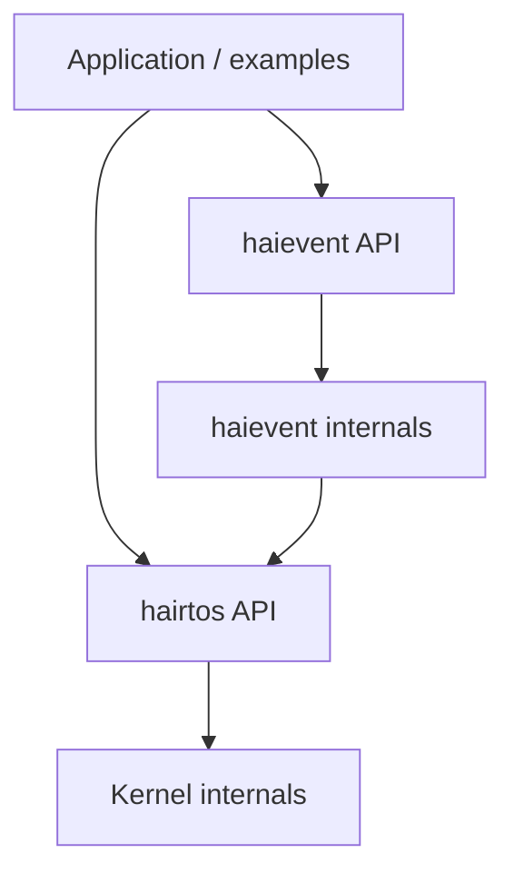
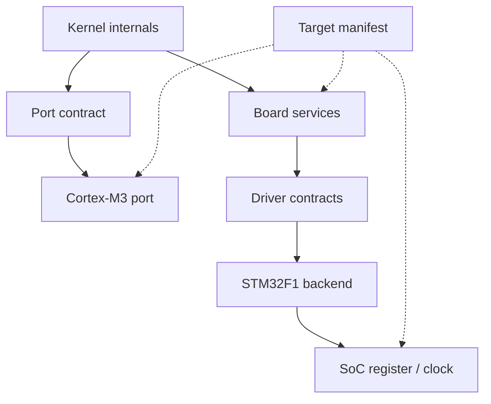
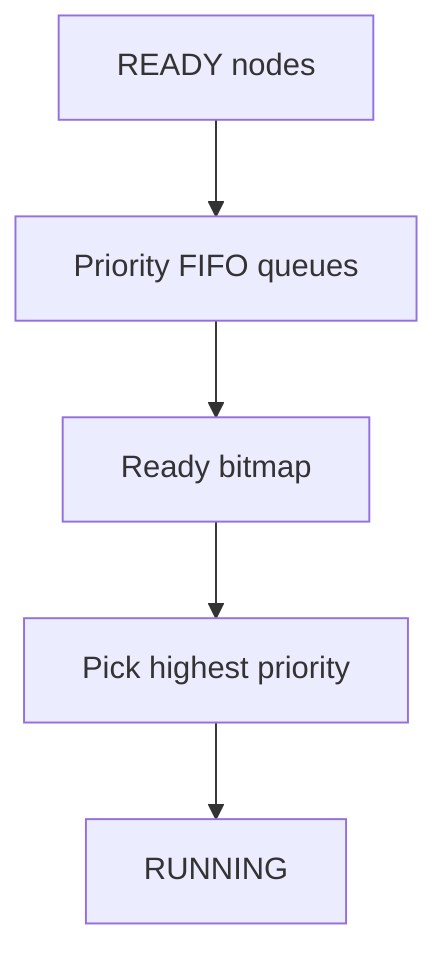
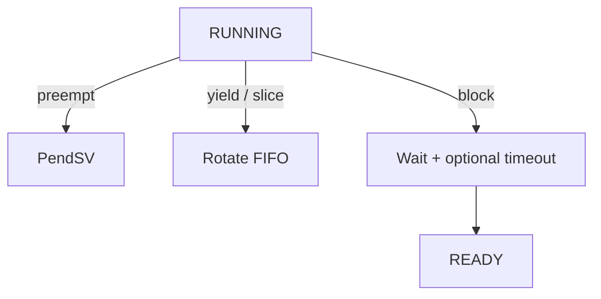
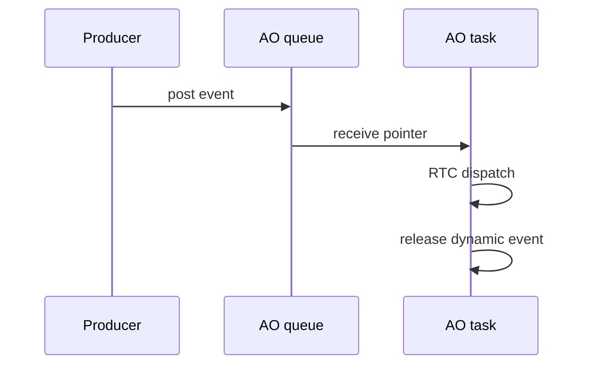

# `hairtos 1.0.0-rc1` Architecture

> **Scope:** Runtime and build architecture that actually exists in the v1 source; Version 2 roadmap material is kept separate.

[← Root README](../../README.md) · [↑ Back to section](README.md) · [Next →](capability-matrix.md)

## Table of Contents

- [Mental model](#mental)
- [Layers and Dependency Direction](#layers)
- [Kernel execution model](#kernel)
- [`haievent`](#haievent)
- [Platform/target model](#platform)
- [Build graph](#build)
- [Cross-cutting invariants](#invariants)
- [Validation](#validation)
- [References](#references)

<a id="mental"></a>
## Mental model

`hairtos` has two primary runtime subsystems but only one scheduler:

```text
hairtos kernel
    ├── task + scheduler + time/blocking
    ├── queue / semaphore / mutex / software timer
    └── diagnostics

haievent
    ├── event + pool + refcount
    ├── flat state machine
    ├── Active Object
    ├── time event
    └── publish/subscribe
```

`haievent` **does not** provide a separate thread scheduler. An Active Object creates a hairtos task, so AO priority participates in the same ready set, preemption rules, and PendSV mechanism as every other task.

<a id="layers"></a>
## Layers and Dependency Direction

**Runtime dependency path**



**Target/platform path**



Dependency direction is designed so the generic kernel knows nothing about STM32 registers, pins, or OpenOCD configuration. Normal application code also does not know TCB layout. Only architecture assembly has one narrow TCB contract: `stack_pointer` must be at offset 0.

### Public/internal boundary

Public:

- `kernel/include/hairtos/`
- `haievent/include/haievent/`
- `drivers/include/`
- public target-board includes such as `board.h`

Internal:

- `kernel/internal/`
- `haievent/internal/`

CMake may grant host tests and benchmarks access to internal includes for policy testing/measurement, but that does not make internal headers part of the API compatibility surface.

<a id="kernel"></a>
## Kernel execution model

Kernel state progresses from reset/uninitialized → initialized → running. `hr_kernel_init()` constructs the scheduler, timeout lists, idle task, registry, and baseline timer subsystem; user tasks are created/started; `hr_kernel_start()` selects/prepares the current task and enters the architecture port.

### Scheduling path

**Ready selection**



**Running-task outcomes**



### Context path

Cortex-M3 hardware stacks R0–R3/R12/LR/PC/xPSR. Port assembly additionally saves R4–R11. The first task starts through SVC; subsequent switches use PendSV. Task Thread mode uses PSP; exception handlers use MSP.

### Blocking path

Queues, semaphores, mutexes, and delays all reduce to one kernel blocking contract: the current task leaves the ready set, attaches wait metadata and optionally a timeout node, then exactly one wake path performs cleanup and returns the task to the ready set. This is a central kernel invariant.

<a id="haievent"></a>
## `haievent`



Dynamic events are allocated from a fixed-block pool and reference-counted; static events remain caller-owned. Pub/sub snapshots the subscriber list inside a critical section and posts outside it. A Time Event is simply a software-timer → AO-event adapter.

<a id="platform"></a>
## Platform/target model

Target `bluepill_f103c8` bind:

- Cortex-M3 port;
- STM32F1 startup/clock/IRQ;
- Blue Pill linker/board;
- STM32F1 driver backend;
- ST-Link/OpenOCD config;
- DWT benchmark clock;
- compile flags CPU/Thumb.

Portability is demonstrated structurally, but v1 has only one complete target, so it is not yet proven as a multi-target implementation.

<a id="build"></a>
## Build graph

CMake is the source of truth:

```text
cmake/hairtos_targets.cmake   -> target registry
cmake/targets/<target>.cmake  -> concrete binding
cmake/hairtos_examples.cmake  -> environment/module/define per example
cmake/hairtos_modules.cmake   -> source list per module
CMakeLists.txt                -> compose final target/host executable
Makefile                      -> user-facing command wrapper
```

Host and target builds differ by toolchain/source subset rather than by duplicating the entire project.

<a id="invariants"></a>
## Cross-cutting invariants

- Opaque objects must be init/create-complete before use; magic/internal state establishes validity.
- Caller-owned storage must outlive the object.
- An intrusive node must not be linked into two lists.
- ISR paths never block.
- Critical sections must be bounded; Cortex-M3 v1 uses PRIMASK.
- Effective priority, not base priority, controls ready/wait ordering while inheritance is active.
- Roadmap content must not be mixed into v1 capabilities.

<a id="validation"></a>
## Validation

The host suite passes under ASan/UBSan. Tests cover data structures/policies, timeout wrap, initial stack construction, IPC/synchronization, timers, diagnostics, haievent, allocator, benchmark logic, and scheduler stress. Target context/IRQ/timing behavior requires a separate cross-toolchain and hardware path.

<a id="references"></a>
## References

- [Arm Cortex-M3 Technical Reference Manual](https://developer.arm.com/documentation/100165/latest/)
- [Arm Cortex-M3 Devices Generic User Guide](https://developer.arm.com/documentation/dui0552/latest/)
- [ST RM0008 — STM32F10x Reference Manual](https://www.st.com/resource/en/reference_manual/cd00171190-stm32f101xx-stm32f102xx-stm32f103xx-stm32f105xx-and-stm32f107xx-advanced-arm-based-32-bit-mcus-stmicroelectronics.pdf)
- [STM32F103 documentation portal](https://www.st.com/en/microcontrollers-microprocessors/stm32f103/documentation.html)
- [CMake — CMAKE_TOOLCHAIN_FILE](https://cmake.org/cmake/help/latest/variable/CMAKE_TOOLCHAIN_FILE.html)
- [CMake — CMAKE_EXPORT_COMPILE_COMMANDS](https://cmake.org/cmake/help/latest/variable/CMAKE_EXPORT_COMPILE_COMMANDS.html)

**Primary sources:** `CMakeLists.txt`, `cmake/*.cmake`, `kernel/`, `haievent/`, `arch/`, `soc/`, `boards/`, `drivers/`.
