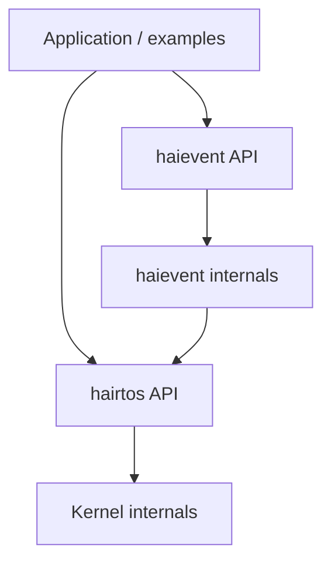
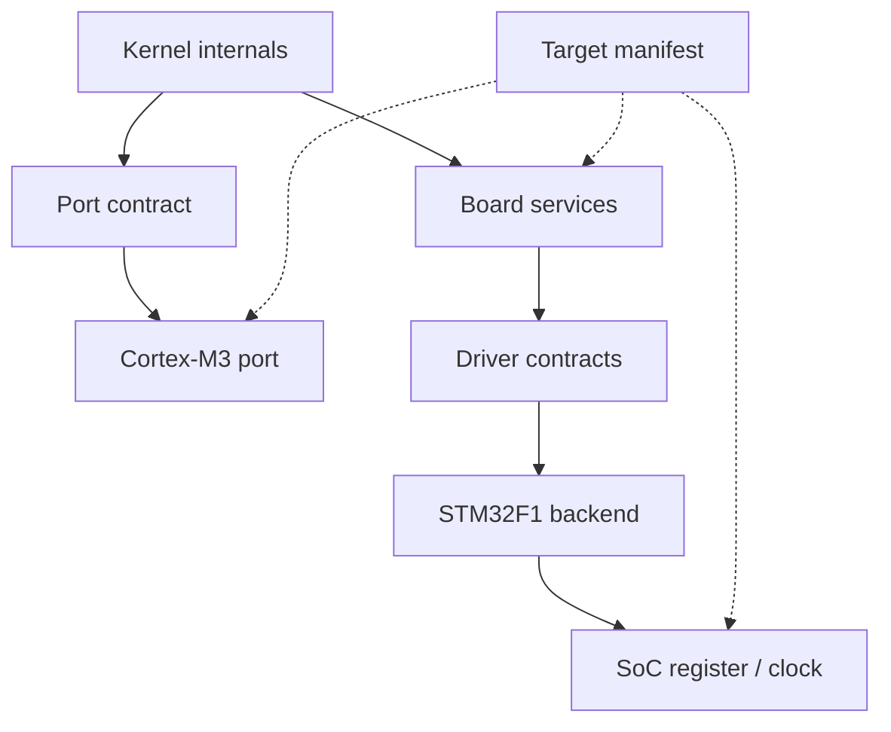
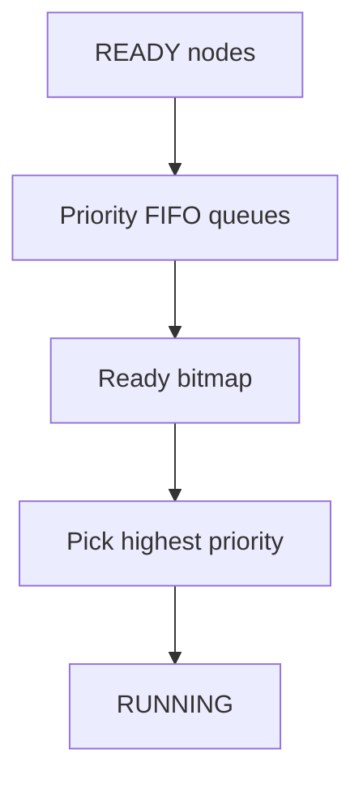
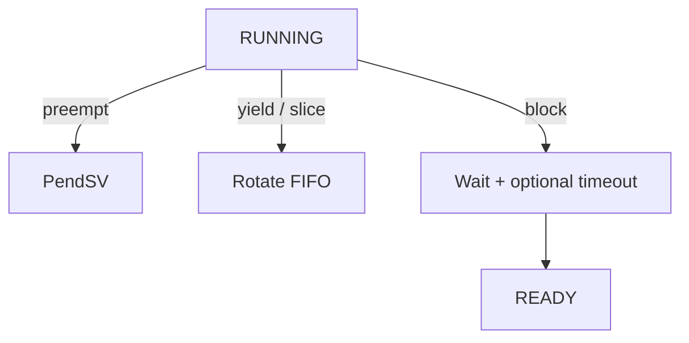
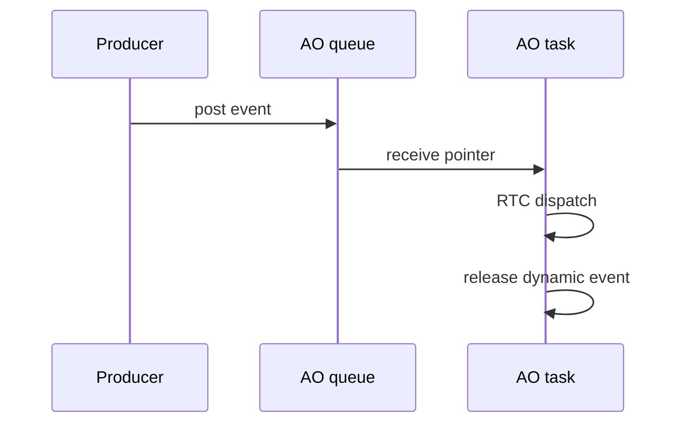

# Kiến trúc `hairtos 1.0.0-rc1`

> **Phạm vi:** Kiến trúc runtime và build architecture thực sự có trong source v1; không trộn roadmap Version 2.

[← Root README](../../README.md) · [↑ Back to section](README.md) · [Next →](capability-matrix.md)

## Mục lục

- [Mental model](#mental)
- [Layer và dependency direction](#layers)
- [Kernel execution model](#kernel)
- [`haievent`](#haievent)
- [Platform/target model](#platform)
- [Build graph](#build)
- [Cross-cutting invariants](#invariants)
- [Validation](#validation)
- [References](#references)

<a id="mental"></a>
## Mental model

`hairtos` có hai runtime subsystem chính nhưng chỉ một scheduler:

```text
hairtos kernel
    ├── task + scheduler + time/blocking
    ├── queue / semaphore / mutex / software timer
    └── diagnostics

haievent
    ├── event + pool + refcount
    ├── flat state machine
    ├── Active Object
    ├── time event
    └── publish/subscribe
```

`haievent` **không** có thread scheduler riêng. Một Active Object tạo một hairtos task; priority của AO vì vậy đi qua cùng ready set, preemption và PendSV như mọi task khác.

<a id="layers"></a>
## Layer và dependency direction

**Runtime dependency path**



**Target/platform path**



Dependency direction được thiết kế để generic kernel không biết STM32 register, pin hay OpenOCD config. Application bình thường cũng không biết TCB layout. Chỉ architecture assembly có một contract rất hẹp với TCB: `stack_pointer` phải ở offset 0.

### Public/internal boundary

Public:

- `kernel/include/hairtos/`
- `haievent/include/haievent/`
- `drivers/include/`
- target board public include như `board.h`

Internal:

- `kernel/internal/`
- `haievent/internal/`

Host tests và benchmark có thể được CMake cấp internal include để kiểm thử/đo policy, nhưng đó không biến internal header thành API compatibility surface.

<a id="kernel"></a>
## Kernel execution model

Kernel state đi từ reset/uninitialized → initialized → running. `hr_kernel_init()` dựng scheduler, timeout list, idle task, registry và timer subsystem baseline; user task được create/start; `hr_kernel_start()` chuẩn bị current task rồi đi vào architecture port.

### Scheduling path

**Ready selection**



**Running-task outcomes**



### Context path

Cortex-M3 hardware stack R0–R3/R12/LR/PC/xPSR. Port assembly save thêm R4–R11. First task dùng SVC; switch tiếp theo dùng PendSV. Task Thread mode dùng PSP; exception handler dùng MSP.

### Blocking path

Queue/semaphore/mutex và delay đều quy về một kernel blocking contract: current task rời ready set, gắn wait metadata, có thể gắn timeout node, rồi một wake path duy nhất cleanup và đưa task trở lại ready set. Đây là invariant trung tâm của kernel.

<a id="haievent"></a>
## `haievent`



Dynamic event được cấp từ fixed-block pool và reference count; static event do caller sở hữu. Pub/sub snapshot subscriber list trong critical section, sau đó post ngoài critical section. Time event chỉ là adapter software timer → AO event.

<a id="platform"></a>
## Platform/target model

Target `bluepill_f103c8` bind:

- Cortex-M3 port;
- STM32F1 startup/clock/IRQ;
- Blue Pill linker/board;
- STM32F1 driver backend;
- ST-Link/OpenOCD config;
- DWT benchmark clock;
- compile flags CPU/Thumb.

Portability được chứng minh về **structure**, nhưng v1 mới có một target hoàn chỉnh nên chưa thể gọi là multi-target proven.

<a id="build"></a>
## Build graph

CMake là source-of-truth:

```text
cmake/hairtos_targets.cmake   -> target registry
cmake/targets/<target>.cmake  -> concrete binding
cmake/hairtos_examples.cmake  -> environment/module/define per example
cmake/hairtos_modules.cmake   -> source list per module
CMakeLists.txt                -> compose final target/host executable
Makefile                      -> user-facing command wrapper
```

Host và target khác nhau ở toolchain/source subset, không bằng cách duplicate toàn bộ project.

<a id="invariants"></a>
## Cross-cutting invariants

- Opaque object phải được init/create trước use; magic/internal state xác nhận validity.
- Caller-owned storage phải sống lâu hơn object.
- Intrusive node không được linked vào hai list.
- ISR path không block.
- Critical section phải bounded; Cortex-M3 v1 dùng PRIMASK.
- Effective priority, không phải base priority, quyết định ready/wait order khi inheritance active.
- Roadmap không được lẫn vào capability v1.

<a id="validation"></a>
## Validation

Host suite đã PASS dưới ASan/UBSan. Các test bao phủ data structure/policy, timeout wrap, initial stack, IPC/sync, timer, diagnostics, haievent, allocator, benchmark và scheduler stress. Target context/IRQ/timing cần cross-toolchain + hardware riêng.

<a id="references"></a>
## References

- [Arm Cortex-M3 Technical Reference Manual](https://developer.arm.com/documentation/100165/latest/)
- [Arm Cortex-M3 Devices Generic User Guide](https://developer.arm.com/documentation/dui0552/latest/)
- [ST RM0008 — STM32F10x Reference Manual](https://www.st.com/resource/en/reference_manual/cd00171190-stm32f101xx-stm32f102xx-stm32f103xx-stm32f105xx-and-stm32f107xx-advanced-arm-based-32-bit-mcus-stmicroelectronics.pdf)
- [STM32F103 documentation portal](https://www.st.com/en/microcontrollers-microprocessors/stm32f103/documentation.html)
- [CMake — CMAKE_TOOLCHAIN_FILE](https://cmake.org/cmake/help/latest/variable/CMAKE_TOOLCHAIN_FILE.html)
- [CMake — CMAKE_EXPORT_COMPILE_COMMANDS](https://cmake.org/cmake/help/latest/variable/CMAKE_EXPORT_COMPILE_COMMANDS.html)

**Source chính:** `CMakeLists.txt`, `cmake/*.cmake`, `kernel/`, `haievent/`, `arch/`, `soc/`, `boards/`, `drivers/`.
