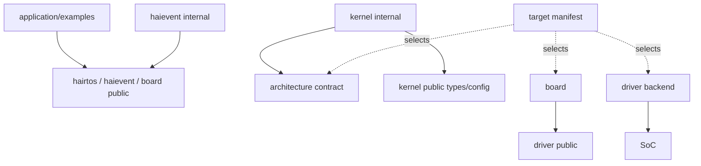

# Dependency rules

> **Scope:** Rule thực tế giữa application, public API, internal kernel/framework, architecture, SoC, board, driver và build manifests.

[← Root README](../../README.md) · [↑ Back to section](README.md) · [← Previous](configuration.md) · [Next →](design-principles.md)

## Mục lục

- [Allowed dependency graph](#graph)
- [Forbidden dependencies](#forbidden)
- [Internal access exceptions](#internal)
- [Target/build rules](#target)
- [Review checklist](#review)

## Allowed dependency graph

## Forbidden dependencies

- Generic kernel không include `stm32f1.h` hoặc board pin header.
- Application production không include `kernel/internal/*` hay `haievent/internal/*`.
- Driver backend không quyết định scheduler/task state.
- Target manifest không chứa runtime kernel logic.
- `haievent` có thể dùng hairtos public API nhưng hairtos kernel không phụ thuộc `haievent`.
- Allocator lab không được kernel runtime gọi ngầm.

## Internal access exceptions

Host tests cần internal header để unit-test ready/wait/scheduler structures. Example 02 cố ý là educational internal-data-structure demo. Example 15 benchmark cần internal scheduler primitive để đo selection cost. CMake encode exception này thay vì thêm internal include vào global public include path.

## Target/build rules

`target → architecture + SoC + board + driver + linker + debugger`, còn `example → modules + feature defines`. Hai chiều này độc lập để cùng example có thể port target khác mà không copy application source.

## Review checklist

Khi thêm module mới, hỏi:

1. API này là public hay internal?
2. Có kéo MCU register vào generic layer không?
3. Storage/lifetime do ai sở hữu?
4. ISR có thể gọi không, và có blocking không?
5. Source được CMake module nào sở hữu?
6. Example/test nào chứng minh contract?
7. Target mới cần bind gì mà không sửa core?

## References

- [CMake — CMAKE_TOOLCHAIN_FILE](https://cmake.org/cmake/help/latest/variable/CMAKE_TOOLCHAIN_FILE.html)
- [CMake — CMAKE_EXPORT_COMPILE_COMMANDS](https://cmake.org/cmake/help/latest/variable/CMAKE_EXPORT_COMPILE_COMMANDS.html)
