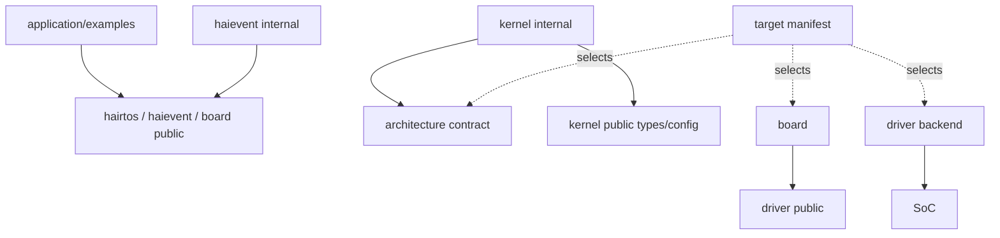

# Dependency rules

> **Scope:** Practical dependency rules among application code, public APIs, internal kernel/framework code, architecture, SoC, board, drivers, and build manifests.

[← Root README](../../README.md) · [↑ Back to section](README.md) · [← Previous](configuration.md) · [Next →](design-principles.md)

## Table of Contents

- [Allowed dependency graph](#graph)
- [Forbidden dependencies](#forbidden)
- [Internal access exceptions](#internal)
- [Target/build rules](#target)
- [Review checklist](#review)

## Allowed dependency graph

## Forbidden dependencies

- The generic kernel does not include `stm32f1.h` or board pin headers.
- Production application code does not include `kernel/internal/*` or `haievent/internal/*`.
- Driver backends do not decide scheduler/task state.
- Target manifests contain no runtime kernel logic.
- `haievent` may use the hairtos public API, but the hairtos kernel does not depend on `haievent`.
- The allocator lab is never called implicitly by kernel runtime.

## Internal access exceptions

Host tests need internal headers to unit-test ready/wait/scheduler structures. Example 02 is intentionally an educational internal-data-structure demo. Example 15 needs an internal scheduler primitive to measure selection cost. CMake encodes these exceptions rather than adding internal include paths to the global public include path.

## Target/build rules

`target → architecture + SoC + board + driver + linker + debugger`, while `example → modules + feature defines`. These dimensions remain independent so the same example can move to another target without copying application source.

## Review checklist

When adding a new module, ask:

1. Is this API public or internal?
2. Does it pull MCU registers into a generic layer?
3. Who owns the storage and lifetime?
4. Can an ISR call it, and can it block?
5. Which CMake module owns the source?
6. Which example/test proves the contract?
7. What must a new target bind without modifying the core?

## References

- [CMake — CMAKE_TOOLCHAIN_FILE](https://cmake.org/cmake/help/latest/variable/CMAKE_TOOLCHAIN_FILE.html)
- [CMake — CMAKE_EXPORT_COMPILE_COMMANDS](https://cmake.org/cmake/help/latest/variable/CMAKE_EXPORT_COMPILE_COMMANDS.html)
