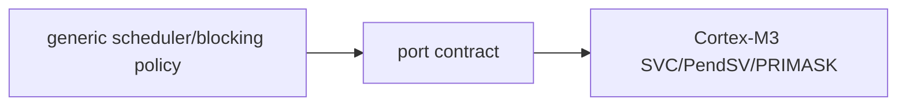

# Design principles

> **Scope:** Architectural decisions directly observable in source, not generic RTOS slogans.

[← Root README](../../README.md) · [↑ Back to section](README.md) · [← Previous](dependency-rules.md) · [Next →](project-analysis.md)

## Table of Contents

- [Static-first](#static)
- [Opaque public objects](#opaque)
- [Explicit ownership](#ownership)
- [Policy/mechanism separation](#policy)
- [Bounded ISR work](#isr)
- [Testability](#testability)
- [Fail visibly](#failure)

## Static-first

The kernel does not allocate heap memory for TCBs, stacks, queues, mutexes, or timers. The caller chooses storage and lifetime. This makes RAM footprint visible at link/static-object level and eliminates allocator failure from kernel paths. The allocator lab remains separate so dynamic allocation can be studied without silently changing the kernel contract.

## Opaque public objects

A public handle is fixed-size aligned byte storage. Applications know its configured size but not internal fields. Internal structures carry magic values and compile-time size assertions. This balances **static allocation** with **encapsulation**.

## Explicit ownership

- A task owns caller-supplied stack storage.
- A queue owns the logical use of its item storage but does not allocate that storage.
- A mutex has an actual owner; a semaphore does not.
- Dynamic events are reference-counted; static events are caller-owned.
- An AO owns the task/queue/FSM composition, while backing arrays remain caller-owned.

Ownership is documented because many failures in small systems come from lifetime/wakeup races rather than syntax errors.

## Policy / mechanism separation

Scheduler policy lives in generic C; PendSV/SVC mechanisms live in architecture assembly. Time policy lives in kernel timeout/timer code; the target-specific SysTick handler only forwards ticks. The target manifest binds sources; it does not decide which task has higher priority.

## Bounded ISR work

ISR APIs do not block. SysTick does not execute user timer callbacks. `higher_priority_task_woken` only requests PendSV after handler completion. Critical sections use PRIMASK, making bounded critical-section code especially important.

## Host-testable generic C

Lists/scheduler/wait/timeout/IPC/timer/haievent/allocator/benchmark statistics are structured so they can execute on the host. Cortex-M assembly has initial-stack-frame tests for behavior that can be modeled in C, while exception runtime still requires target evidence.

## Fail visibly

Magic values, invariant validators, stack guards, retained panic records, fault context, and strict compiler warnings prioritize early fault detection. `-Werror -Wshadow -Wundef -Wconversion -Wsign-conversion` prevent type and implicit-conversion issues from silently passing the build.

## References

- [Arm Cortex-M3 Technical Reference Manual](https://developer.arm.com/documentation/100165/latest/)
- [Arm Cortex-M3 Devices Generic User Guide](https://developer.arm.com/documentation/dui0552/latest/)
- [CMake — CMAKE_TOOLCHAIN_FILE](https://cmake.org/cmake/help/latest/variable/CMAKE_TOOLCHAIN_FILE.html)
- [CMake — CMAKE_EXPORT_COMPILE_COMMANDS](https://cmake.org/cmake/help/latest/variable/CMAKE_EXPORT_COMPILE_COMMANDS.html)
