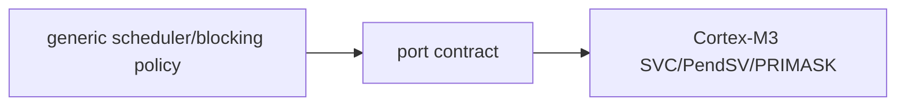

# Design principles

> **Scope:** Những quyết định kiến trúc có thể quan sát trực tiếp trong source, không phải khẩu hiệu chung về RTOS.

[← Root README](../../README.md) · [↑ Back to section](README.md) · [← Previous](dependency-rules.md) · [Next →](project-analysis.md)

## Mục lục

- [Static-first](#static)
- [Opaque public objects](#opaque)
- [Explicit ownership](#ownership)
- [Policy/mechanism separation](#policy)
- [Bounded ISR work](#isr)
- [Testability](#testability)
- [Fail visibly](#failure)

## Static-first

Kernel không tự cấp heap cho TCB/stack/queue/mutex/timer. Caller quyết định storage và lifetime. Điều này làm RAM footprint thấy được ở link/static object level và tránh allocator failure trong kernel path. Allocator lab được giữ riêng để học dynamic allocation mà không âm thầm thay đổi kernel contract.

## Opaque public objects

Public handle là fixed-size aligned byte storage. Application biết kích thước config nhưng không biết internal field. Internal struct có magic và compile-time size assert. Cách này cân bằng **static allocation** với **encapsulation**.

## Explicit ownership

- Task owns stack storage do caller cấp.
- Queue owns logical use của item storage nhưng không cấp phát storage đó.
- Mutex có owner thật, semaphore không.
- Dynamic event có reference count; static event caller-owned.
- AO sở hữu task/queue/FSM composition nhưng backing arrays vẫn caller-owned.

Ownership được document vì đa số bug hệ thống nhỏ đến từ lifetime/wake race hơn là syntax.

## Policy / mechanism separation

Scheduler policy nằm ở generic C; PendSV/SVC mechanism nằm ở architecture assembly. Time policy nằm trong kernel timeout/timer; SysTick handler target-specific chỉ forward tick. Target manifest bind source; không quyết định “task nào cao priority hơn”.

## Bounded ISR work

ISR API không block. SysTick không chạy user timer callback. `higher_priority_task_woken` chỉ yêu cầu PendSV sau handler. Critical section dùng PRIMASK nên càng cần giữ code bounded.

## Host-testable generic C

List/scheduler/wait/timeout/IPC/timer/haievent/allocator/benchmark statistics được tách để chạy host. Cortex-M assembly có stack-frame unit tests cho phần có thể model bằng C và vẫn cần target evidence cho exception runtime.

## Fail visibly

Magic, invariant validator, stack guard, panic record, fault context và strict compiler warnings ưu tiên phát hiện lỗi sớm. `-Werror -Wshadow -Wundef -Wconversion -Wsign-conversion` giúp lỗi type/implicit conversion không trôi qua build.

## References

- [Arm Cortex-M3 Technical Reference Manual](https://developer.arm.com/documentation/100165/latest/)
- [Arm Cortex-M3 Devices Generic User Guide](https://developer.arm.com/documentation/dui0552/latest/)
- [CMake — CMAKE_TOOLCHAIN_FILE](https://cmake.org/cmake/help/latest/variable/CMAKE_TOOLCHAIN_FILE.html)
- [CMake — CMAKE_EXPORT_COMPILE_COMMANDS](https://cmake.org/cmake/help/latest/variable/CMAKE_EXPORT_COMPILE_COMMANDS.html)
