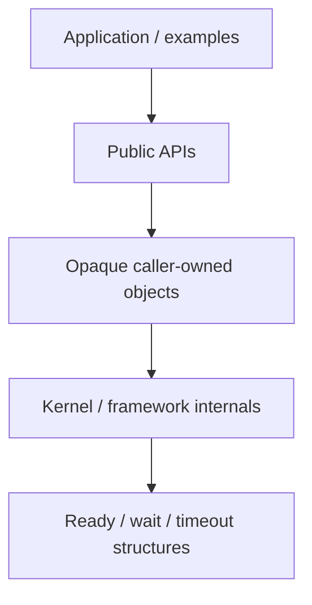
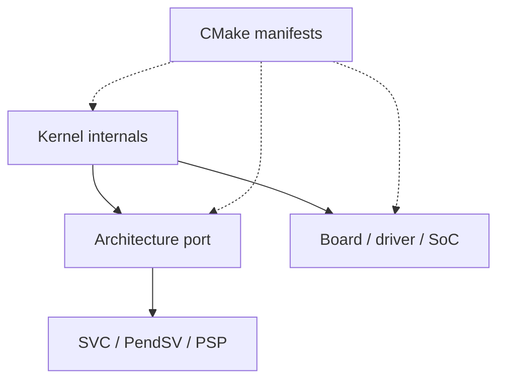
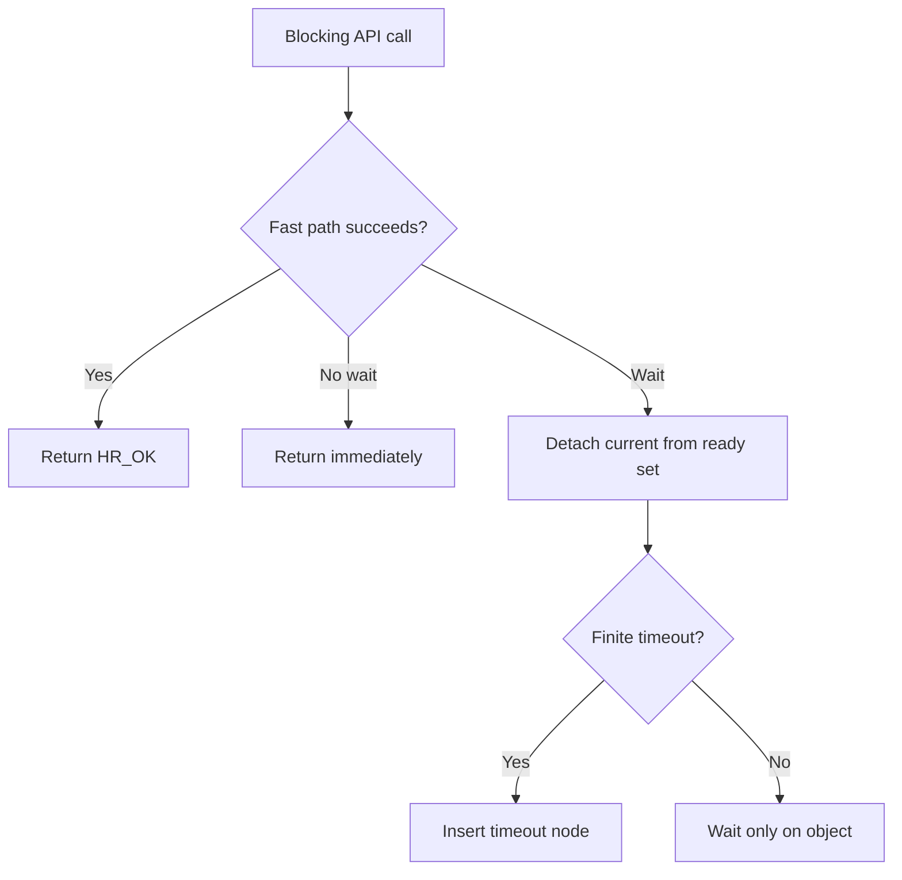
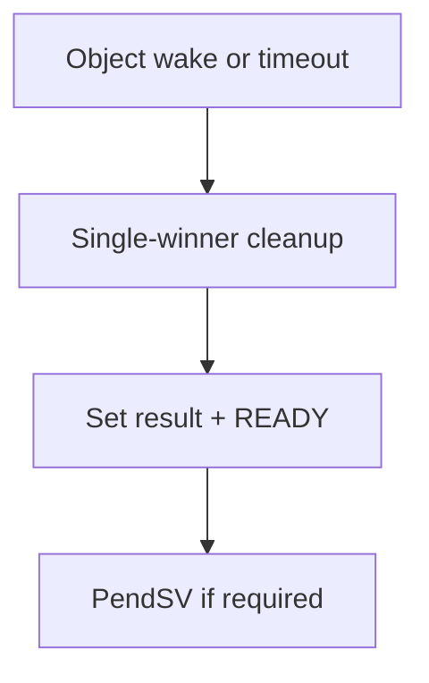

# Phân tích toàn bộ project `hairtos 1.0.0-rc1`

> **Mục đích:** Phân tích source-driven về runtime modules, ownership/concurrency boundary, build graph, evidence và limitation.

[← Root README](../../README.md) · [↑ Back to section](README.md) · [← Previous](design-principles.md) · [Next →](project-layout.md)

## Mục lục

- [Mental model](#mental)
- [Runtime layers](#layers)
- [Kernel data model](#kernel)
- [Blocking and wake protocol](#blocking)
- [Cortex-M3 execution model](#cm3)
- [`haievent`](#event)
- [Platform/build graph](#platform)
- [Tests/evidence](#tests)
- [Limitations](#limits)
- [Source map](#source-map)

<a id="mental"></a>
## Mental model

`hairtos` không phải wrapper mỏng quanh một RTOS khác. Scheduler, TCB, wait/timeout lists, queue/semaphore/mutex/timer và Cortex-M3 context switch đều được implement trong repo. Đồng thời project cố ý giữ kernel nhỏ bằng ba nguyên tắc: **static-first**, **opaque public storage**, **target logic outside generic core**.

**Runtime core**



**Target and build binding**



<a id="layers"></a>
## Runtime layers

### Public kernel

`kernel/include/hairtos/` export task/kernel/time/context/queue/semaphore/mutex/timer/diagnostics/hooks/status/types. `hairtos.h` là umbrella include.

### Internal kernel

- `hr_list.c`: doubly linked intrusive list + validation.
- `hr_scheduler.c`: ready queues/bitmap + fixed-priority policy.
- `hr_wait.c`: priority-ordered wait list.
- `hr_timeout.c`: two-list wrap-aware timeout set.
- `hr_task.c`: TCB creation, stack guard/high-watermark, state queries/control.
- `hr_kernel.c`: lifecycle, blocking/unblocking, tick, selection, preemption/time-slice, invariant validation.
- object modules: queue/semaphore/mutex/timer.
- diagnostics: health/runtime/fault retention.

### Framework

`haievent` nằm trên kernel primitives; nó không thay scheduler. AO tạo một hairtos task và queue riêng, sau đó dispatch event vào flat FSM.

<a id="kernel"></a>
## Kernel data model

Public object là fixed-size opaque union. Internal TCB hiện chứa:

```text
saved SP / stack low-high
name / entry / argument
state + suspended_resume_state
base/effective priority
time slice / wake tick
ready node
wait node
timeout node
all-task node
waiting object / wait list / buffer / cleanup / result / kind
owned mutex list + count
stack words / critical nesting / runtime counter / magic
```

Saved stack pointer ở field đầu tiên được compile-time assert vì SVC/PendSV assembly load/store offset 0 trực tiếp.

Ready set có 8 FIFO lists + bitmap. Wait list sort theo effective priority. Timeout set tách `current/overflow` để xử lý tick `uint32_t` wrap.

<a id="blocking"></a>
## Blocking and wake protocol

Mọi primitive blocking cuối cùng quy về kernel wait contract:

**Blocking entry**



**Wake path**



Điểm khó không phải insert list mà là **single-winner wake**: object path và timeout path có thể gần như đồng thời; cleanup phải remove node còn lại và chỉ publish một result.

<a id="cm3"></a>
## Cortex-M3 execution model

- `main()` và exceptions dùng MSP trước khi kernel start.
- SVC lấy saved stack pointer từ TCB, restore R4–R11, set PSP và `CONTROL=2`, rồi exception-return với `0xFFFFFFFD`.
- Hardware tự unstack R0–R3/R12/LR/PC/xPSR để vào task.
- PendSV hardware-stack current frame, software save R4–R11, gọi C selector trên MSP, rồi restore next.
- SVC priority cao nhất, PendSV thấp nhất, SysTick mức giữa trong SHP config hiện tại.
- Critical section dùng PRIMASK; diagnostics có thể enable Usage/Bus/Mem faults và trap divide-by-zero/unaligned.

<a id="event"></a>
## `haievent`

Dynamic events từ fixed block pool có reference count. AO post retain event; AO dispatch xong release. Pub/sub snapshot subscriber list trong critical section, post ngoài critical section và consume publisher reference của dynamic event. Time event dùng software timer callback để post timeout signal vào AO. Flat FSM có ENTRY/EXIT/INIT và bound init-transition count = 8.

<a id="platform"></a>
## Platform và build graph

CMake data model:

```text
target  -> architecture + SoC + board + drivers + linker + debugger
example -> module set + compile definitions + environment
module  -> exact C/ASM source list + visibility kind
```

Makefile chỉ wrap configure/build/run/check. Host build bật ASan/UBSan; target build dùng cross toolchain file + `-ffreestanding`, `-Wall -Wextra -Werror -Wshadow -Wundef -Wconversion -Wsign-conversion`.

<a id="tests"></a>
## Tests và evidence

Host suite có 64 test function bao phủ list, ready set, scheduler policy, wait list, timeout wrap, task/stack, port initial frame, queue, semaphore, mutex, timer, diagnostics, haievent, benchmark, allocator và deterministic scheduler stress.

Validation baseline gồm:

```text
hairtos_host_tests: PASS
02 host example: PASS
14 allocator host demo: PASS
16 scheduler stress host: PASS
iterations = 500000
```

Target assembly/hardware không được host test thay thế; cần cross-build + Blue Pill để xác nhận exception entry, IRQ priority, clock/UART/LED và benchmark DWT.

<a id="limits"></a>
## Limitations

- 1 target hoàn chỉnh;
- PRIMASK critical sections, chưa BASEPRI ceiling;
- no tickless;
- no FPU/MPU/SMP;
- no general dynamic kernel heap;
- flat FSM only;
- one-task-per-AO only;
- target benchmark không phải certification/hard deadline proof.

<a id="source-map"></a>
## Source map

- `config/hairtos_config.h`
- `kernel/src/hr_kernel.c`
- `kernel/src/hr_task.c`
- `kernel/src/hr_scheduler.c`
- `kernel/src/hr_timeout.c`
- `kernel/src/hr_wait.c`
- `arch/arm/cortex-m3/hr_port.c`
- `arch/arm/cortex-m3/hr_port_stack.c`
- `arch/arm/cortex-m3/hr_portasm.S`
- `kernel/src/hr_queue.c`
- `kernel/src/hr_semaphore.c`
- `kernel/src/hr_mutex.c`
- `kernel/src/hr_timer.c`
- `kernel/src/hr_wait.c`
- `kernel/src/hr_timeout.c`
- `config/haievent_config.h`
- `haievent/src/he_event.c`
- `haievent/src/he_active.c`
- `haievent/src/he_state_machine.c`
- `haievent/src/he_time_event.c`
- `haievent/src/he_pubsub.c`
- `arch/arm/cortex-m3/hr_port.c`
- `arch/arm/cortex-m3/hr_port_stack.c`
- `arch/arm/cortex-m3/hr_portasm.S`
- `soc/stm32f1/startup_stm32f103.S`
- `soc/stm32f1/system_stm32f1.c`
- `soc/stm32f1/stm32f1_clock.c`
- `boards/bluepill_f103c8/board.c`
- `boards/bluepill_f103c8/STM32F103C8Tx_FLASH.ld`
- `cmake/targets/bluepill_f103c8.cmake`

## References

- [CMake — CMAKE_TOOLCHAIN_FILE](https://cmake.org/cmake/help/latest/variable/CMAKE_TOOLCHAIN_FILE.html)
- [CMake — CMAKE_EXPORT_COMPILE_COMMANDS](https://cmake.org/cmake/help/latest/variable/CMAKE_EXPORT_COMPILE_COMMANDS.html)

**Nguồn implementation trong repository:**
- `config/hairtos_config.h`
- `kernel/src/hr_kernel.c`
- `kernel/src/hr_task.c`
- `kernel/src/hr_scheduler.c`
- `kernel/src/hr_timeout.c`
- `kernel/src/hr_wait.c`
- `arch/arm/cortex-m3/hr_port.c`
- `arch/arm/cortex-m3/hr_port_stack.c`
- `arch/arm/cortex-m3/hr_portasm.S`
- `kernel/src/hr_queue.c`
- `kernel/src/hr_semaphore.c`
- `kernel/src/hr_mutex.c`
- `kernel/src/hr_timer.c`
- `kernel/src/hr_wait.c`
- `kernel/src/hr_timeout.c`
- `config/haievent_config.h`
- `haievent/src/he_event.c`
- `haievent/src/he_active.c`
- `haievent/src/he_state_machine.c`
- `haievent/src/he_time_event.c`
- `haievent/src/he_pubsub.c`
- `arch/arm/cortex-m3/hr_port.c`
- `arch/arm/cortex-m3/hr_port_stack.c`
- `arch/arm/cortex-m3/hr_portasm.S`
- `soc/stm32f1/startup_stm32f103.S`
- `soc/stm32f1/system_stm32f1.c`
- `soc/stm32f1/stm32f1_clock.c`
- `boards/bluepill_f103c8/board.c`
- `boards/bluepill_f103c8/STM32F103C8Tx_FLASH.ld`
- `cmake/targets/bluepill_f103c8.cmake`
