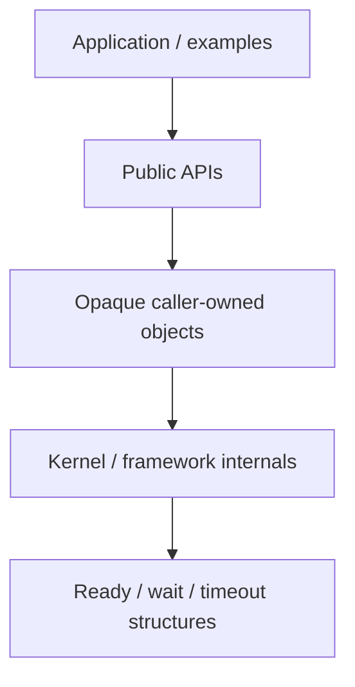
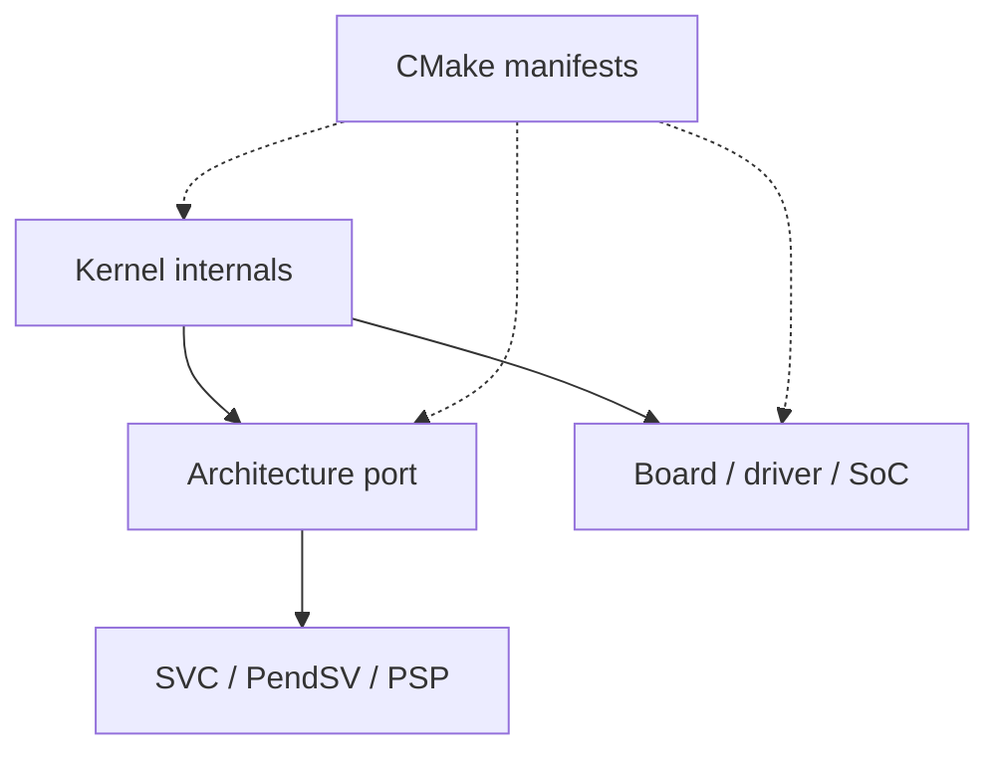
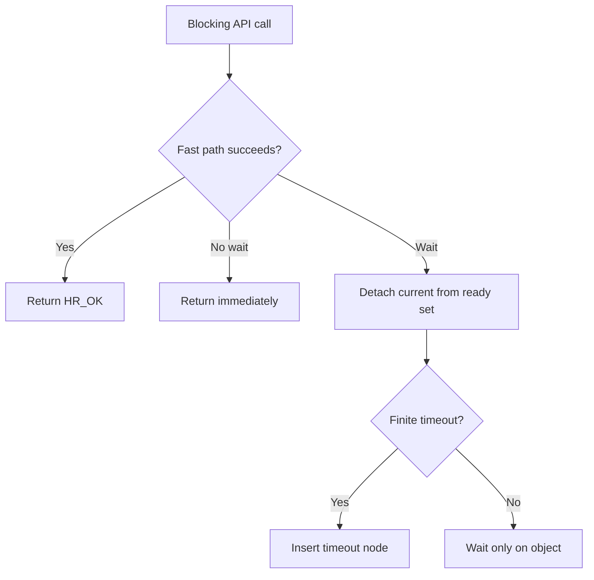
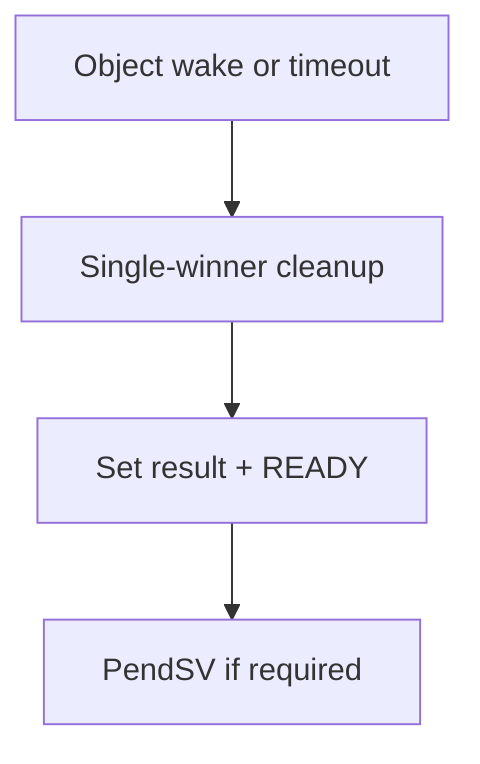

# Full Project Analysis — `hairtos 1.0.0-rc1`

> **Purpose:** Source-driven analysis of runtime modules, ownership/concurrency boundaries, build graph, evidence, and limitations.

[← Root README](../../README.md) · [↑ Back to section](README.md) · [← Previous](design-principles.md) · [Next →](project-layout.md)

## Table of Contents

- [Mental model](#mental)
- [Runtime layers](#layers)
- [Kernel data model](#kernel)
- [Blocking and wake protocol](#blocking)
- [Cortex-M3 execution model](#cm3)
- [`haievent`](#event)
- [Platform/build graph](#platform)
- [Tests/evidence](#tests)
- [Limitations](#limits)
- [Source map](#source-map)

<a id="mental"></a>
## Mental model

`hairtos` is not a thin wrapper around another RTOS. The scheduler, TCB, wait/timeout lists, queue/semaphore/mutex/timer primitives, and Cortex-M3 context switch are implemented in this repository. The project intentionally keeps the kernel small through three principles: **static-first**, **opaque public storage**, and **target logic outside the generic core**.

**Runtime core**



**Target and build binding**



<a id="layers"></a>
## Runtime layers

### Public kernel

`kernel/include/hairtos/` exports task/kernel/time/context/queue/semaphore/mutex/timer/diagnostics/hooks/status/types. `hairtos.h` is the umbrella include.

### Internal kernel

- `hr_list.c`: doubly linked intrusive list + validation.
- `hr_scheduler.c`: ready queues/bitmap + fixed-priority policy.
- `hr_wait.c`: priority-ordered wait list.
- `hr_timeout.c`: two-list wrap-aware timeout set.
- `hr_task.c`: TCB creation, stack guard/high-watermark, state queries/control.
- `hr_kernel.c`: lifecycle, blocking/unblocking, tick, selection, preemption/time-slice, invariant validation.
- object modules: queue/semaphore/mutex/timer.
- diagnostics: health/runtime/fault retention.

### Framework

`haievent` sits above kernel primitives; it does not replace the scheduler. An AO creates a hairtos task and its own queue, then dispatches events into a flat FSM.

<a id="kernel"></a>
## Kernel data model

A public object is a fixed-size opaque union. The internal TCB currently contains:

```text
saved SP / stack low-high
name / entry / argument
state + suspended_resume_state
base/effective priority
time slice / wake tick
ready node
wait node
timeout node
all-task node
waiting object / wait list / buffer / cleanup / result / kind
owned mutex list + count
stack words / critical nesting / runtime counter / magic
```

The saved stack pointer is compile-time-asserted as the first field because SVC/PendSV assembly directly loads/stores offset 0.

The ready set contains 8 FIFO lists plus a bitmap. Wait lists are sorted by effective priority. The timeout set uses separate `current/overflow` lists to handle `uint32_t` tick wrap.

<a id="blocking"></a>
## Blocking and wake protocol

Every blocking primitive ultimately reduces to the kernel wait contract:

**Blocking entry**



**Wake path**



The difficult part is not list insertion but **single-winner wakeup**: object and timeout paths may occur nearly simultaneously; cleanup must remove the remaining node and publish exactly one result.

<a id="cm3"></a>
## Cortex-M3 execution model

- `main()` and exceptions use MSP before the kernel starts.
- SVC loads the saved stack pointer from the TCB, restores R4–R11, sets PSP and `CONTROL=2`, then exception-returns using `0xFFFFFFFD`.
- Hardware automatically unstacks R0–R3/R12/LR/PC/xPSR to enter the task.
- PendSV hardware-stacks the current frame, software-saves R4–R11, calls the C selector on MSP, then restores the next task.
- SVC has the highest priority, PendSV the lowest, and SysTick an intermediate level in the current SHP configuration.
- Critical sections use PRIMASK; diagnostics can enable Usage/Bus/Mem faults and trap divide-by-zero/unaligned accesses.

<a id="event"></a>
## `haievent`

Dynamic events from the fixed-block pool are reference-counted. AO post retains the event; AO release occurs after dispatch. Pub/sub snapshots the subscriber list inside a critical section, posts outside the critical section, and consumes the publisher's dynamic-event reference. Time Events use software-timer callbacks to post timeout signals to AOs. The flat FSM supports ENTRY/EXIT/INIT with a bounded initial-transition count of 8.

<a id="platform"></a>
## Platform and Build Graph

CMake data model:

```text
target  -> architecture + SoC + board + drivers + linker + debugger
example -> module set + compile definitions + environment
module  -> exact C/ASM source list + visibility kind
```

Makefile only wraps configure/build/run/check operations. Host builds enable ASan/UBSan; target builds use a cross-toolchain file plus `-ffreestanding`, `-Wall -Wextra -Werror -Wshadow -Wundef -Wconversion -Wsign-conversion`.

<a id="tests"></a>
## Tests and Evidence

The host suite contains 64 test functions covering lists, ready sets, scheduler policy, wait lists, timeout wrap, tasks/stacks, port initial frames, queues, semaphores, mutexes, timers, diagnostics, haievent, benchmarks, allocator behavior, and deterministic scheduler stress.

The validation baseline includes:

```text
hairtos_host_tests: PASS
02 host example: PASS
14 allocator host demo: PASS
16 scheduler stress host: PASS
iterations = 500000
```

Host tests do not replace target assembly/hardware validation; cross-build plus Blue Pill execution is required to confirm exception entry, IRQ priorities, clock/UART/LED behavior, and DWT benchmarking.

<a id="limits"></a>
## Limitations

- 1 complete target;
- PRIMASK critical sections, no BASEPRI ceiling yet;
- no tickless;
- no FPU/MPU/SMP;
- no general dynamic kernel heap;
- flat FSM only;
- one-task-per-AO only;
- target benchmarks are not certification or hard-deadline proof.

<a id="source-map"></a>
## Source map

- `config/hairtos_config.h`
- `kernel/src/hr_kernel.c`
- `kernel/src/hr_task.c`
- `kernel/src/hr_scheduler.c`
- `kernel/src/hr_timeout.c`
- `kernel/src/hr_wait.c`
- `arch/arm/cortex-m3/hr_port.c`
- `arch/arm/cortex-m3/hr_port_stack.c`
- `arch/arm/cortex-m3/hr_portasm.S`
- `kernel/src/hr_queue.c`
- `kernel/src/hr_semaphore.c`
- `kernel/src/hr_mutex.c`
- `kernel/src/hr_timer.c`
- `kernel/src/hr_wait.c`
- `kernel/src/hr_timeout.c`
- `config/haievent_config.h`
- `haievent/src/he_event.c`
- `haievent/src/he_active.c`
- `haievent/src/he_state_machine.c`
- `haievent/src/he_time_event.c`
- `haievent/src/he_pubsub.c`
- `arch/arm/cortex-m3/hr_port.c`
- `arch/arm/cortex-m3/hr_port_stack.c`
- `arch/arm/cortex-m3/hr_portasm.S`
- `soc/stm32f1/startup_stm32f103.S`
- `soc/stm32f1/system_stm32f1.c`
- `soc/stm32f1/stm32f1_clock.c`
- `boards/bluepill_f103c8/board.c`
- `boards/bluepill_f103c8/STM32F103C8Tx_FLASH.ld`
- `cmake/targets/bluepill_f103c8.cmake`

## References

- [CMake — CMAKE_TOOLCHAIN_FILE](https://cmake.org/cmake/help/latest/variable/CMAKE_TOOLCHAIN_FILE.html)
- [CMake — CMAKE_EXPORT_COMPILE_COMMANDS](https://cmake.org/cmake/help/latest/variable/CMAKE_EXPORT_COMPILE_COMMANDS.html)

**Implementation sources in the repository:**
- `config/hairtos_config.h`
- `kernel/src/hr_kernel.c`
- `kernel/src/hr_task.c`
- `kernel/src/hr_scheduler.c`
- `kernel/src/hr_timeout.c`
- `kernel/src/hr_wait.c`
- `arch/arm/cortex-m3/hr_port.c`
- `arch/arm/cortex-m3/hr_port_stack.c`
- `arch/arm/cortex-m3/hr_portasm.S`
- `kernel/src/hr_queue.c`
- `kernel/src/hr_semaphore.c`
- `kernel/src/hr_mutex.c`
- `kernel/src/hr_timer.c`
- `kernel/src/hr_wait.c`
- `kernel/src/hr_timeout.c`
- `config/haievent_config.h`
- `haievent/src/he_event.c`
- `haievent/src/he_active.c`
- `haievent/src/he_state_machine.c`
- `haievent/src/he_time_event.c`
- `haievent/src/he_pubsub.c`
- `arch/arm/cortex-m3/hr_port.c`
- `arch/arm/cortex-m3/hr_port_stack.c`
- `arch/arm/cortex-m3/hr_portasm.S`
- `soc/stm32f1/startup_stm32f103.S`
- `soc/stm32f1/system_stm32f1.c`
- `soc/stm32f1/stm32f1_clock.c`
- `boards/bluepill_f103c8/board.c`
- `boards/bluepill_f103c8/STM32F103C8Tx_FLASH.ld`
- `cmake/targets/bluepill_f103c8.cmake`
