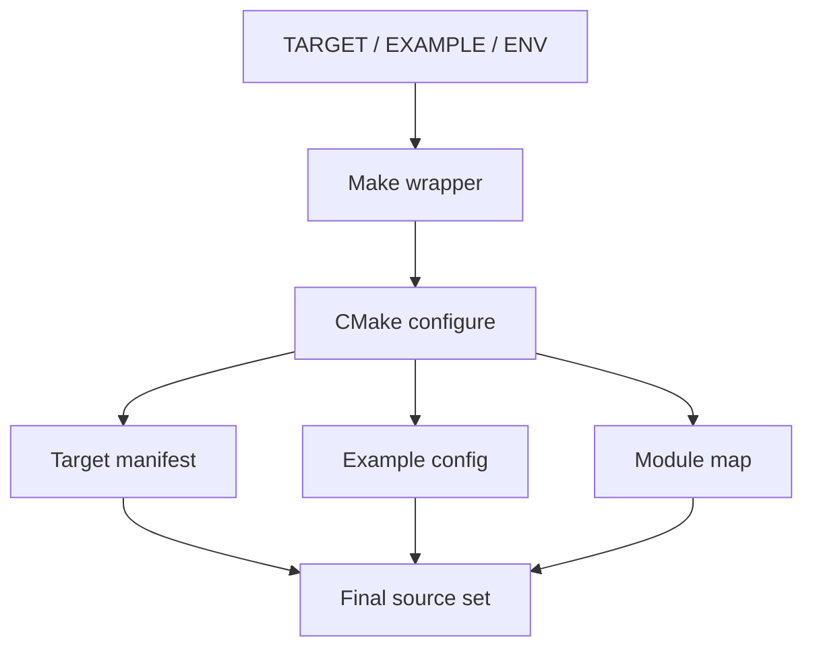

# Repository layout và ownership

> **Scope:** Mỗi directory được giải thích theo trách nhiệm runtime/build/test, không chỉ liệt kê tree.

[← Root README](../../README.md) · [↑ Back to section](README.md) · [← Previous](project-analysis.md) · [Next →](roadmap.md)

## Repository tree

```text
arch/                 CPU/ISA-specific context, critical, fault, benchmark clock
benchmarks/kernel/    generic benchmark stats
boards/                concrete board binding + linker + marker/UART/LED services
cmake/                 target/example/module source-of-truth
config/                compile-time contracts
_docs_/                architecture/API/testing/labs/appendices/v2 roadmap
drivers/               public peripheral contracts + STM32F1 backend
examples/              staged executable learning/evidence
haievent/              event-driven framework
kernel/                RTOS public/internal/source
labs/memory-allocator/ allocator experiment outside runtime
soc/                   startup/register/clock/IRQ for MCU family
tests/                 host/mocks/portability/stress
tools/                 debugger/OpenOCD helpers
```

## Ownership theo directory

| Directory | Sở hữu | Không nên sở hữu |
| --- | --- | --- |
| `kernel/` | scheduler/blocking/object policy | STM32 pin/register |
| `haievent/` | event/AO/FSM/pubsub semantics | context-switch assembly |
| `arch/` | CPU execution mechanism | board pin binding |
| `soc/` | chip-family startup/clock/register IRQ | application policy |
| `boards/` | concrete board service/linker | generic scheduler |
| `drivers/` | small peripheral contracts/backend | application workflow |
| `cmake/` | source composition | runtime state machine |
| `tests/` | executable verification | production dependency |
| `examples/` | learning/integration evidence | hidden reusable core logic |
| `labs/` | isolated experiment | implicit kernel dependency |

## Build path



## Source discoverability

Nếu muốn hiểu một public API, đi từ `kernel/include/hairtos/<x>.h` → `kernel/src/<x>.c` → `kernel/internal/<x>_internal.h` → relevant host test. Nếu behavior là CPU-specific, tiếp tục sang `arch/arm/cortex-m3`. Nếu là pin/UART/clock, đi qua board/driver/SoC.

## References

- [CMake — CMAKE_TOOLCHAIN_FILE](https://cmake.org/cmake/help/latest/variable/CMAKE_TOOLCHAIN_FILE.html)
- [CMake — CMAKE_EXPORT_COMPILE_COMMANDS](https://cmake.org/cmake/help/latest/variable/CMAKE_EXPORT_COMPILE_COMMANDS.html)
