# Roadmap của nhánh v1

> **Scope:** Cách sequence hiện tại 01–16 xây RTOS từ dưới lên. Roadmap Version 2 riêng nằm trong `docs/09-version2/`.

[← Root README](../../README.md) · [↑ Back to section](README.md) · [← Previous](project-layout.md)

## Progression

```mermaid
flowchart LR
    E1["01 bare metal"] --> E2["02 data structures"]
    E2 --> E3["03 stack/TCB"]
    E3 --> E4["04 SVC first task"]
    E4 --> E5["05 PendSV"]
    E5 --> E6["06 scheduler"]
    E6 --> E7["07 timeout"]
    E7 --> E8["08 preemption/RR"]
    E8 --> E9["09 queue"]
    E9 --> E10["10 semaphore/mutex"]
    E10 --> E11["11 suspend/resume"]
    E11 --> E12["12 timer"]
    E12 --> E13["13 haievent"]
    E13 --> E14["14 allocator lab"]
    E14 --> E15["15 benchmark"]
    E15 --> E16["16 diagnostics/stress"]
```

## Vì sao thứ tự này quan trọng

- Context switch chỉ có ý nghĩa sau khi initial stack/TCB đúng.
- Blocking IPC cần scheduler + timeout trước.
- Priority inheritance cần base/effective priority và requeue logic đúng.
- Software timer cần kernel time + service task.
- Active Object dựa trên task + queue + timer; framework event-driven được đưa vào sau khi primitives đủ ổn định.
- Benchmark/diagnostics ở cuối vì chúng đo/quan sát hệ thống đã có nhiều cơ chế tương tác.

## Completion baseline

`1.0.0-rc1` hiện có source cho toàn chuỗi trên và host tests tương ứng. V1 chưa được coi là portability-complete vì mới một hardware target. Các mục HSM/tickless/trace/second target chuyển sang Version 2 roadmap.

## References

- [`../../examples/README.md`](../../examples/README.md)
- [`../09-version2/README.md`](../09-version2/README.md)
