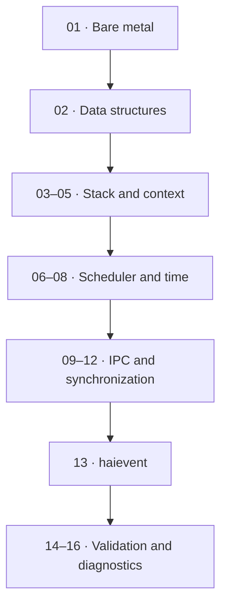

# v1 Branch Roadmap

> **Scope:** How the current 01–16 sequence builds the RTOS bottom-up. The separate Version 2 roadmap lives under `docs/09-version2/`.

[← Root README](../../README.md) · [↑ Back to section](README.md) · [← Previous](project-layout.md)

## Progression

## Why This Order Matters

- Context switching is meaningful only after the initial stack/TCB is correct.
- Blocking IPC requires scheduler and timeout support first.
- Priority inheritance requires correct base/effective priority and requeue logic.
- Software timers require kernel time plus a service task.
- Active Objects depend on tasks + queues + timers; the event-driven framework appears only after these primitives are sufficiently stable.
- Benchmarks/diagnostics come last because they measure and observe a system with many interacting mechanisms.

## Completion baseline

`1.0.0-rc1` currently contains source for the complete sequence above plus corresponding host tests. v1 is not considered portability-complete because it has only one hardware target. HSM/tickless/trace/second-target work moves to the Version 2 roadmap.

## References

- [`../../examples/README.md`](../../examples/README.md)
- [`../09-version2/README.md`](../09-version2/README.md)
