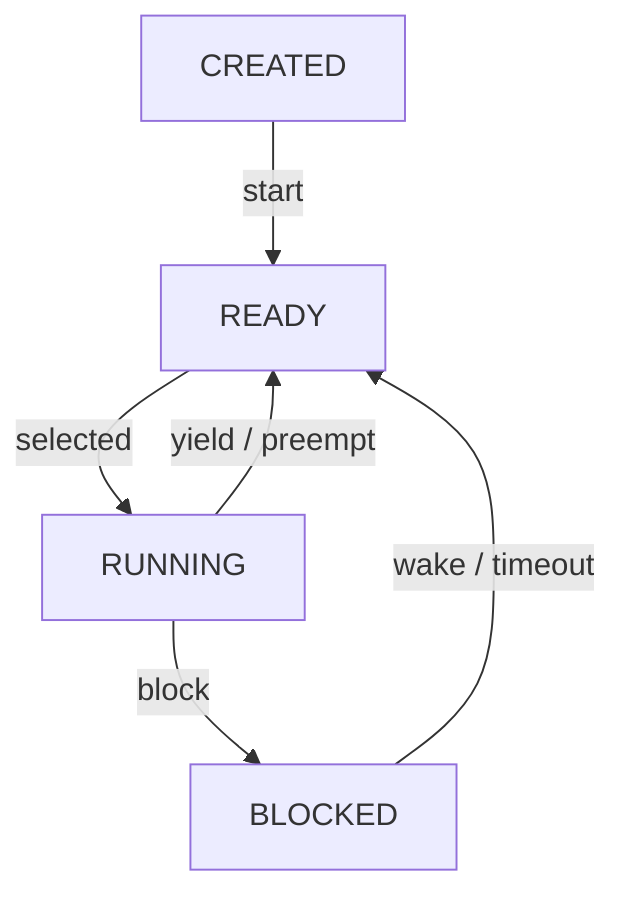
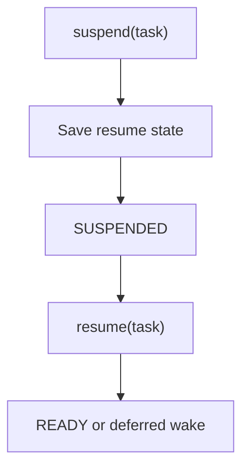

# Task Model and TCB

> **Scope:** `hairtos 1.0.0-rc1` implementation, including the current source, configuration, build graph, and host-test evidence.

[← Root README](../../README.md) · [↑ Back to section](README.md) · [← Previous](scheduler.md) · [Next →](time-and-timeout.md)

## Table of Contents

- [Overview and Core Concepts](#overview)
- [Implementation in the Repository](#implementation)
- [Execution Model and Runtime Flow](#runtime-model)
- [Ownership, Concurrency, and Invariants](#invariants)
- [Failure Modes and Limitations](#failure)
- [Validation and Verification](#validation)
- [Source map](#source-map)
- [References](#references)

## Overview and Core Concepts

A task is an opaque public object with fixed-size storage, but internally it contains a full TCB: saved stack pointer, stack bounds, entry/argument, state, base/effective priority, ready/wait/timeout nodes, wait context, owned-mutex list, critical nesting, runtime counter, and magic value.

## Implementation in the Repository

The current implementation includes:

- Tasks are created statically from caller-owned `hr_task_t` objects and stack arrays; the kernel does not `malloc()` TCBs or stacks.
- The public task-state model is INVALID → CREATED → READY/RUNNING ↔ BLOCKED, plus SUSPENDED.
- Base priority is the configured priority; effective priority may be boosted by mutex priority inheritance.
- Stacks are filled with `0xA5`; guard word `0xDEADBEEF` supports stack-integrity checks, and high-water-mark analysis estimates untouched stack space.
- A task entry function must not return normally; the initial LR points to `hr_task_exit_error()` so a returned task becomes a controlled error.
- saved stack pointer;
- stack base/top/word count;
- entry + argument;
- state + suspended resume state;
- base/effective priority;
- wake tick;
- time-slice remaining;

Key implementation details:

- ready/wait/timeout/all-task nodes;
- wait object/list/buffer/cleanup/result/kind;
- owned mutex list/count;
- runtime counters;
- restart;
- dynamic stack;
- affinity;
- application set-priority.

## Execution Model and Runtime Flow

**Scheduling and blocking states**

**Suspend/resume path**

The corresponding functions and source files are listed in the Source Map section.

## Ownership, Concurrency, and Invariants

The following baseline invariants apply to this topic:

- A public opaque object is valid only after a successful create/init operation and when its magic/internal state matches the contract.
- An intrusive node may be linked into exactly one list at a time; remove/timeout/wake paths must leave the node in a consistent unlinked state.
- A thread API may block only while the kernel is RUNNING and the caller is not in ISR context; ISR APIs must be non-blocking and use `higher_priority_task_woken` when a switch should be deferred to PendSV.
- Critical sections currently use PRIMASK on Cortex-M3, globally masking interrupts for a short bounded interval; therefore critical-section code must remain bounded and must not invoke operations that can block.
- Ready/wait policy uses **effective priority** while mutex priority inheritance is active; base priority remains the task's configured priority.
- Static-first does not mean “no lifetime”: caller-owned TCB, stack, queue storage, and event-pool storage must outlive every object that still references them.

## Failure Modes and Limitations

- `hairtos 1.0.0-rc1` is single-core and provides no SMP, FPU context management, MPU isolation, or general-purpose dynamic kernel heap.
- The current interrupt-masking model uses PRIMASK; the repository does not yet define a BASEPRI ceiling contract for applications with complex ISR-priority schemes.
- Tickless idle is not implemented; the current time model uses a 1 kHz tick on the reference target.
- `haievent` v1 provides a flat state machine and one task per AO; HSMs, deferred events, and a shared executor are Version 2 roadmap items.
- A successful build/link does not by itself prove real-time timing or race-free behavior on hardware; target tests and measurements remain necessary.

## Validation and Verification

- The repository's host suite is built with GCC, AddressSanitizer, UndefinedBehaviorSanitizer, and `ctest`.
- Host validation baseline: `make TARGET=bluepill_f103c8 host-tests` PASS.
- Host examples `02-kernel-data-structures-host`, `14-memory-allocator-lab`, and `16-diagnostics-stress-stabilization` pass; the scheduler stress test reports 500,000 iterations.
- Do not infer target-runtime PASS from host tests. Cortex-M3 assembly, timing, exception priorities, UART/LED behavior, and hardware clocks still require cross-build and board validation.

## Source map

- `kernel/src/hr_task.c`
- `kernel/internal/hr_task_internal.h`
- `kernel/src/hr_kernel.c`
- `tests/host/test_task.c`

## References

- [Arm Cortex-M3 Technical Reference Manual](https://developer.arm.com/documentation/100165/latest/)
- [Arm Cortex-M3 Devices Generic User Guide](https://developer.arm.com/documentation/dui0552/latest/)

**Implementation sources in the repository:**
- `kernel/src/hr_task.c`
- `kernel/internal/hr_task_internal.h`
- `kernel/src/hr_kernel.c`
- `tests/host/test_task.c`
