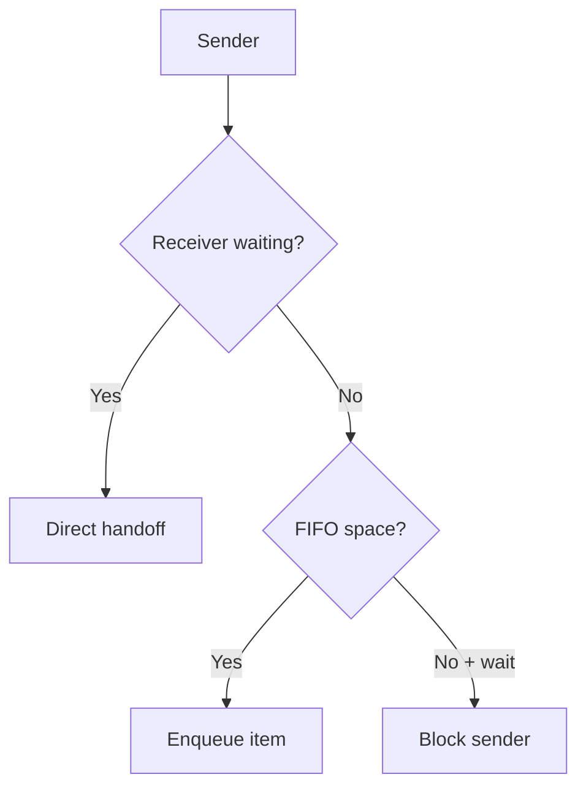
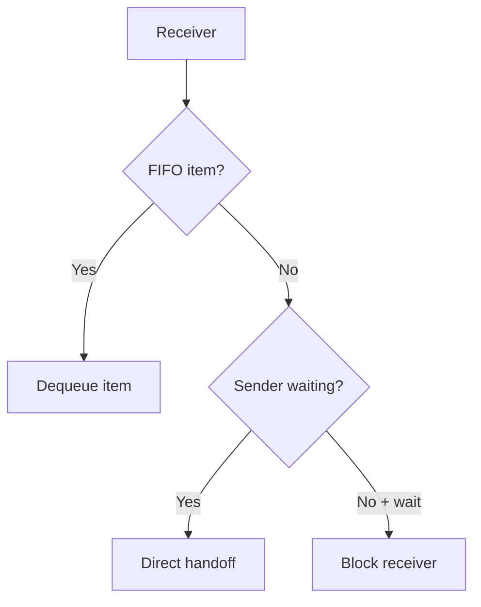

# Queue

> **Phạm vi:** Implementation `hairtos 1.0.0-rc1`, bao gồm source, config, build graph và host-test evidence hiện có.

[← Root README](../../README.md) · [↑ Back to section](README.md) · [← Previous](mutex.md) · [Next →](semaphore.md)

## Mục lục

- [Tổng quan và bản chất](#tong-quan)
- [Implementation trong repository](#implementation)
- [Mô hình và luồng thực thi](#mo-hinh)
- [Ownership, concurrency và invariants](#invariants)
- [Failure modes và giới hạn](#failure)
- [Validation và cách kiểm chứng](#validation)
- [Source map](#source-map)
- [Tài liệu tham khảo](#references)

## Tổng quan và bản chất

Queue là bounded FIFO dùng caller-owned byte storage và một control block opaque. Ngoài circular buffer thông thường, implementation còn có priority-ordered wait list cho sender/receiver và đường direct handoff để chuyển item thẳng giữa producer/consumer đang chờ khi có thể.

## Implementation trong repository

Implementation hiện tại gồm:

- Storage queue không được cấp phát động; `item_size × capacity` do caller sở hữu và phải tồn tại suốt đời queue.
- Task API hỗ trợ timeout; ISR API luôn non-blocking và báo `higher_priority_task_woken` thay vì tự schedule trực tiếp.
- Waiters được sắp theo effective priority, FIFO trong cùng priority nhờ wait-list insertion order.
- Khi receiver đang chờ, send có thể copy trực tiếp vào receive buffer thay vì bắt buộc enqueue rồi dequeue; tương tự receive có thể lấy trực tiếp từ blocked sender.
- Queue full/empty với `HR_NO_WAIT` trả status ngay; blocking chỉ hợp lệ khi kernel đang RUNNING và caller không ở ISR.
- `count <= capacity`;
- head/tail trong range;
- sender wait khi không thể send;
- receiver wait khi không thể receive;
- wait buffer lifetime còn hợp lệ khi task block;
- item_size/capacity không đổi sau create.

## Mô hình và luồng thực thi

**Send path**

**Receive path**

Các function và source file tương ứng được liệt kê trong phần Source map.

## Ownership, concurrency và invariants

Các invariant nền áp dụng cho chủ đề này:

- Opaque object public chỉ hợp lệ sau create/init thành công và magic/internal state khớp contract.
- Intrusive node chỉ được linked vào đúng một list tại một thời điểm; remove/timeout/wake phải để node về trạng thái unlinked nhất quán.
- Thread API có thể block chỉ khi kernel RUNNING và không ở ISR; ISR API phải non-blocking và sử dụng `higher_priority_task_woken` khi cần defer switch sang PendSV.
- Critical section hiện dùng PRIMASK trên Cortex-M3, nghĩa là mask interrupt toàn cục trong đoạn ngắn; vì vậy code trong critical section phải bounded và không được gọi operation có thể block.
- Priority dùng **effective priority** ở ready/wait policy khi mutex inheritance đang active; base priority chỉ là cấu hình gốc.
- Static-first không có nghĩa “không có lifetime”: caller-owned TCB/stack/queue storage/event pool vẫn phải sống lâu hơn mọi object đang tham chiếu tới chúng.

## Failure modes và giới hạn

- `hairtos 1.0.0-rc1` là single-core, không có SMP, FPU context, MPU isolation hay general dynamic kernel heap.
- Interrupt masking model hiện là PRIMASK; repository chưa có BASEPRI ceiling contract cho application ISR priority phức tạp.
- Tickless idle chưa có; time model hiện dựa trên tick 1 kHz ở target tham chiếu.
- `haievent` v1 là flat state machine và one-task-per-AO; HSM/deferred event/shared executor nằm ở roadmap Version 2.
- Build/link PASS không tự chứng minh real-time timing hoặc race-free behavior trên hardware; target tests và measurement vẫn cần thiết.

## Validation và cách kiểm chứng

- Host suite của repository được build bằng GCC với AddressSanitizer + UndefinedBehaviorSanitizer và `ctest`.
- Host validation baseline: `make TARGET=bluepill_f103c8 host-tests` PASS.
- Host examples `02-kernel-data-structures-host`, `14-memory-allocator-lab`, `16-diagnostics-stress-stabilization` chạy PASS; stress scheduler report 500.000 iteration.
- Không suy ra target runtime PASS từ host test. Cortex-M3 assembly, timing, exception priority, UART/LED và hardware clock vẫn cần cross-build + board validation.

## Source map

- `kernel/src/hr_queue.c`
- `kernel/internal/hr_queue_internal.h`
- `kernel/src/hr_wait.c`
- `tests/host/test_queue.c`

## Tài liệu tham khảo

- [Arm Cortex-M3 Technical Reference Manual](https://developer.arm.com/documentation/100165/latest/)
- [Arm Cortex-M3 Devices Generic User Guide](https://developer.arm.com/documentation/dui0552/latest/)

**Nguồn implementation trong repository:**
- `kernel/src/hr_queue.c`
- `kernel/internal/hr_queue_internal.h`
- `kernel/src/hr_wait.c`
- `tests/host/test_queue.c`
