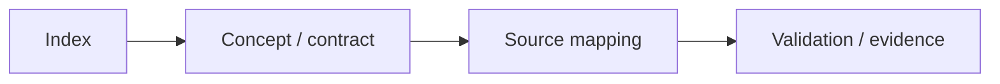

# 03 — haievent: Event-Driven Framework

> **Role:** This page is an index for a documentation group. Each chapter moves from core concept → source mapping → invariant → failure mode → validation so readers can compare the documentation directly with the implementation.

[← Root README](../../README.md)

## Table of Contents

- [Content Map](#content-map)
- [How to Read This Section](#reading-guide)
- [Documents](#documents)
- [Validation baseline](#validation)
- [References](#references)

## Content Map

## How to Read This Section

1. Start with the section README to understand the scope and recommended learning order.
2. When an API appears, refer to `docs/05-api-reference/` for context and return-value contracts; for kernel behavior, prioritize `docs/01`–`03`.
3. Cross-check every timing and ownership statement against the source map at the end of the chapter.
4. Clearly distinguish **host evidence**, **target evidence**, and **future proposals**.

## Documents

| Document | Role |
| --- | --- |
| [`active-object.md`](active-object.md) | Active Object |
| [`architecture.md`](architecture.md) | haievent Architecture |
| [`event-model.md`](event-model.md) | Event model |
| [`ownership-and-rtc.md`](ownership-and-rtc.md) | Event Ownership and Run-to-Completion |
| [`publish-subscribe.md`](publish-subscribe.md) | Publish / Subscribe |
| [`state-machine.md`](state-machine.md) | Flat State Machine |
| [`time-event.md`](time-event.md) | Time Event |

## Validation baseline

- `VERSION`: `1.0.0-rc1`.
- Host validation baseline: all 64 test functions in the current suite pass.
- `02-kernel-data-structures-host`, `14-memory-allocator-lab`, and `16-diagnostics-stress-stabilization` pass on the host.
- The reference target is `bluepill_f103c8`; host evidence does not replace cross-build, OpenOCD, and on-board hardware validation.

## References

**Implementation sources in the repository:**
- `README.md`
- `CMakeLists.txt`
- `cmake/hairtos_examples.cmake`
- `cmake/hairtos_targets.cmake`
