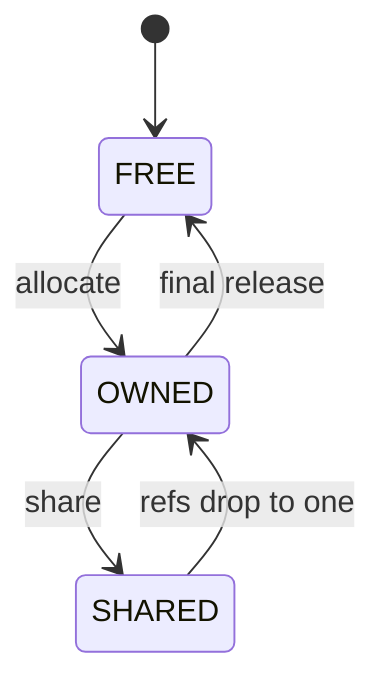
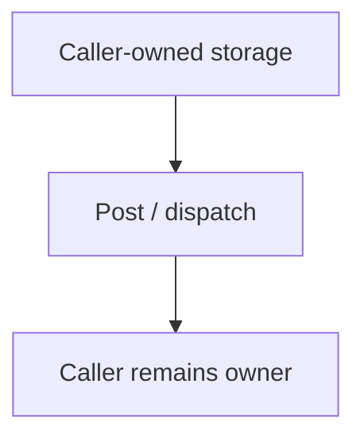

# Event model

> **Scope:** `hairtos 1.0.0-rc1` implementation, including the current source, configuration, build graph, and host-test evidence.

[← Root README](../../README.md) · [↑ Back to section](README.md) · [← Previous](architecture.md) · [Next →](ownership-and-rtc.md)

## Table of Contents

- [Overview and Core Concepts](#overview)
- [Implementation in the Repository](#implementation)
- [Execution Model and Runtime Flow](#runtime-model)
- [Ownership, Concurrency, and Invariants](#invariants)
- [Failure Modes and Limitations](#failure)
- [Validation and Verification](#validation)
- [Source map](#source-map)
- [References](#references)

## Overview and Core Concepts

`haievent` distinguishes static and dynamic events. Dynamic events live in a fixed-block pool and use reference counting; static events are not reclaimed by the framework. The ownership contract is fundamental because queues, AOs, and pub/sub may retain the same event across multiple consumers.

## Implementation in the Repository

The current implementation includes:

- The event pool is a caller-owned arena partitioned into fixed-size blocks; it does not use a general-purpose heap.
- A dynamic event initializes `reference_count` and returns to the pool only when the count reaches zero.
- `he_active_post` retains before enqueue; the AO releases after dispatch; a failed post must roll back the retained reference.
- Publish/subscribe snapshots the subscriber list and then posts the shared event; publish consumes the publisher's dynamic reference even if no subscriber receives it.
- The reference count is `uint16_t` and includes overflow protection.
- owning pool;
- event size;
- reference count;
- pool = NULL;
- does not return to the pool;
- lifetime is the application's responsibility.
- acquire one fixed block;

Key implementation details:

- event size must fit the block;
- reference count starts at 1;
- the final release returns the block to the pool.
- event size is too large;
- pool has no free blocks;
- invalid magic;
- retain overflow;
- incorrect release semantics for invalid/static events.

## Execution Model and Runtime Flow

**Dynamic event lifetime**

Additional retain/release operations can change the reference count while the event remains in `SHARED`; they do not require a state transition.

**Static event ownership**

The corresponding functions and source files are listed in the Source Map section.

## Ownership, Concurrency, and Invariants

The following baseline invariants apply to this topic:

- A public opaque object is valid only after a successful create/init operation and when its magic/internal state matches the contract.
- An intrusive node may be linked into exactly one list at a time; remove/timeout/wake paths must leave the node in a consistent unlinked state.
- A thread API may block only while the kernel is RUNNING and the caller is not in ISR context; ISR APIs must be non-blocking and use `higher_priority_task_woken` when a switch should be deferred to PendSV.
- Critical sections currently use PRIMASK on Cortex-M3, globally masking interrupts for a short bounded interval; therefore critical-section code must remain bounded and must not invoke operations that can block.
- Ready/wait policy uses **effective priority** while mutex priority inheritance is active; base priority remains the task's configured priority.
- Static-first does not mean “no lifetime”: caller-owned TCB, stack, queue storage, and event-pool storage must outlive every object that still references them.

## Failure Modes and Limitations

- `hairtos 1.0.0-rc1` is single-core and provides no SMP, FPU context management, MPU isolation, or general-purpose dynamic kernel heap.
- The current interrupt-masking model uses PRIMASK; the repository does not yet define a BASEPRI ceiling contract for applications with complex ISR-priority schemes.
- Tickless idle is not implemented; the current time model uses a 1 kHz tick on the reference target.
- `haievent` v1 provides a flat state machine and one task per AO; HSMs, deferred events, and a shared executor are Version 2 roadmap items.
- A successful build/link does not by itself prove real-time timing or race-free behavior on hardware; target tests and measurements remain necessary.

## Validation and Verification

- The repository's host suite is built with GCC, AddressSanitizer, UndefinedBehaviorSanitizer, and `ctest`.
- Host validation baseline: `make TARGET=bluepill_f103c8 host-tests` PASS.
- Host examples `02-kernel-data-structures-host`, `14-memory-allocator-lab`, and `16-diagnostics-stress-stabilization` pass; the scheduler stress test reports 500,000 iterations.
- Do not infer target-runtime PASS from host tests. Cortex-M3 assembly, timing, exception priorities, UART/LED behavior, and hardware clocks still require cross-build and board validation.

## Source map

- `haievent/src/he_event.c`
- `haievent/src/he_active.c`
- `haievent/src/he_pubsub.c`
- `tests/host/test_haievent.c`

## References

**Implementation sources in the repository:**
- `haievent/src/he_event.c`
- `haievent/src/he_active.c`
- `haievent/src/he_pubsub.c`
- `tests/host/test_haievent.c`
