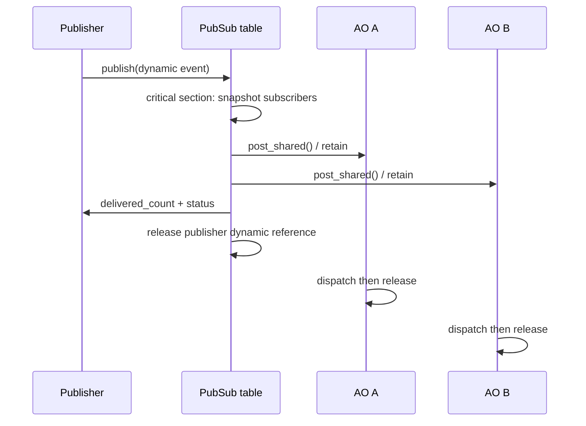

# Publish / Subscribe

> **Phạm vi:** Mô tả implementation `hairtos 1.0.0-rc1` đã được đối chiếu với source, config, build graph và host tests hiện có.

[← Root README](../../README.md) · [↑ Back to section](README.md) · [← Previous](ownership-and-rtc.md) · [Next →](state-machine.md)

## Mục lục

- [Tổng quan và bản chất](#tong-quan)
- [Implementation trong repository](#implementation)
- [Mô hình và luồng thực thi](#mo-hinh)
- [Ownership, concurrency và invariants](#invariants)
- [Failure modes và giới hạn](#failure)
- [Validation và cách kiểm chứng](#validation)
- [Source map](#source-map)
- [Tài liệu tham khảo](#references)

## Tổng quan và bản chất

Publish/subscribe dùng bảng subscriber tĩnh có kích thước `signal_count × max_subscribers_per_signal`. Subscribe/unsubscribe chạy trong critical section; publish chỉ giữ critical section lúc snapshot pointer, sau đó post ra từng AO ngoài critical section.

Trong project này, cách đọc đúng luôn là **contract → data ownership → state transition → concurrency boundary → failure semantics → evidence**. Điều đó quan trọng hơn việc chỉ nhớ tên API: một RTOS nhỏ vẫn có thể sai nghiêm trọng nếu cùng một task node xuất hiện ở hai list, nếu timeout và object wake cùng “thắng”, hoặc nếu context switch không khớp exception frame của CPU.

## Implementation trong repository

Các điểm đã được đối chiếu với source/config hiện tại:

- Signal dưới `HE_SIG_USER` không được subscribe/publish như application signal.
- Mỗi subscriber chỉ xuất hiện một lần cho một signal; subscribe đầy slot trả `HR_ERROR_NO_MEMORY`.
- Unsubscribe compact mảng để slot active nằm liền nhau.
- Publish snapshot tối đa `HE_CFG_MAX_ACTIVE_OBJECTS` rồi release critical section trước khi có thể block trong post.
- Dynamic event: publish luôn tiêu thụ reference của publisher; mỗi post thành công giữ reference riêng cho AO.
- wildcard topic;
- topic string;
- retained value;
- event priority;
- dynamic subscriber table;

## Mô hình và luồng thực thi

Sơ đồ trên mô tả **semantic boundary**, không thay thế source. Khi debug, nên lần theo node của sơ đồ tới function/source file tương ứng thay vì suy luận từ diagram đơn lẻ.

## Ownership, concurrency và invariants

Các invariant nền áp dụng cho chủ đề này:

- Opaque object public chỉ hợp lệ sau create/init thành công và magic/internal state khớp contract.
- Intrusive node chỉ được linked vào đúng một list tại một thời điểm; remove/timeout/wake phải để node về trạng thái unlinked nhất quán.
- Thread API có thể block chỉ khi kernel RUNNING và không ở ISR; ISR API phải non-blocking và sử dụng `higher_priority_task_woken` khi cần defer switch sang PendSV.
- Critical section hiện dùng PRIMASK trên Cortex-M3, nghĩa là mask interrupt toàn cục trong đoạn ngắn; vì vậy code trong critical section phải bounded và không được gọi operation có thể block.
- Priority dùng **effective priority** ở ready/wait policy khi mutex inheritance đang active; base priority chỉ là cấu hình gốc.
- Static-first không có nghĩa “không có lifetime”: caller-owned TCB/stack/queue storage/event pool vẫn phải sống lâu hơn mọi object đang tham chiếu tới chúng.

## Failure modes và giới hạn

- `hairtos 1.0.0-rc1` là single-core, không có SMP, FPU context, MPU isolation hay general dynamic kernel heap.
- Interrupt masking model hiện là PRIMASK; repository chưa có BASEPRI ceiling contract cho application ISR priority phức tạp.
- Tickless idle chưa có; time model hiện dựa trên tick 1 kHz ở target tham chiếu.
- `haievent` v1 là flat state machine và one-task-per-AO; HSM/deferred event/shared executor nằm ở roadmap Version 2.
- Build/link PASS không tự chứng minh real-time timing hoặc race-free behavior trên hardware; target tests và measurement vẫn cần thiết.

## Validation và cách kiểm chứng

- Host suite của repository được build bằng GCC với AddressSanitizer + UndefinedBehaviorSanitizer và `ctest`.
- Audit hiện tại đã chạy `make TARGET=bluepill_f103c8 host-tests`: test suite PASS.
- Host examples `02-kernel-data-structures-host`, `14-memory-allocator-lab`, `16-diagnostics-stress-stabilization` chạy PASS; stress scheduler report 500.000 iteration.
- Không suy ra target runtime PASS từ host test. Cortex-M3 assembly, timing, exception priority, UART/LED và hardware clock vẫn cần cross-build + board validation.

## Source map

- `haievent/src/he_pubsub.c`
- `haievent/src/he_event.c`
- `haievent/src/he_active.c`

## Tài liệu tham khảo

**Nguồn implementation trong repository:**
- `haievent/src/he_pubsub.c`
- `haievent/src/he_event.c`
- `haievent/src/he_active.c`
