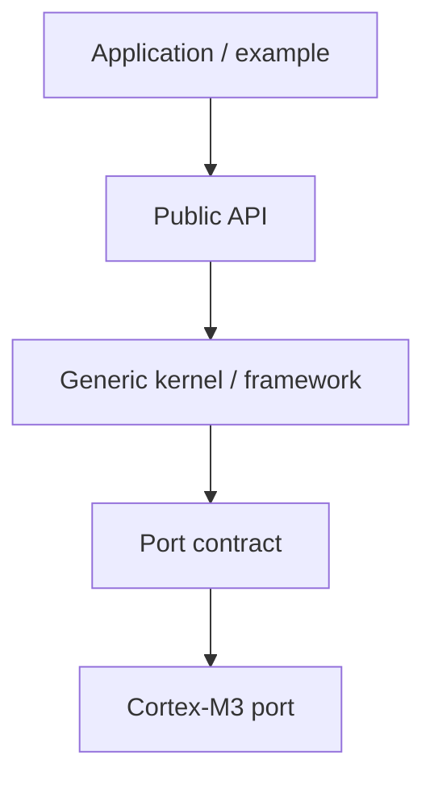
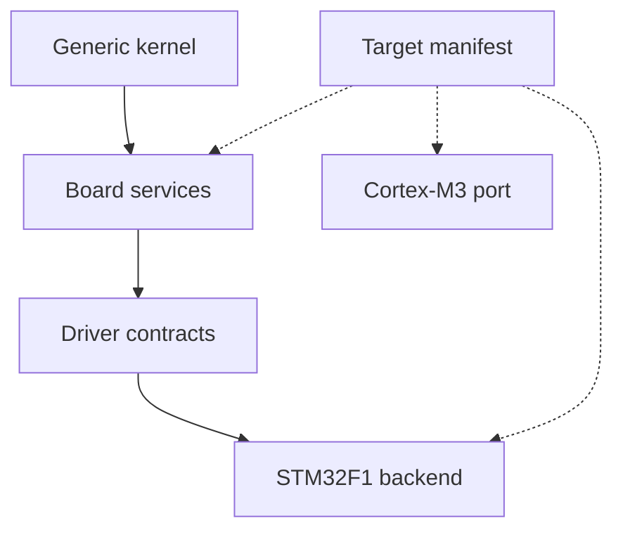

# Target manifest

> **Scope:** `hairtos 1.0.0-rc1` implementation, including the current source, configuration, build graph, and host-test evidence.

[← Root README](../../README.md) · [↑ Back to section](README.md) · [← Previous](stm32f103-platform.md)

## Table of Contents

- [Overview and Core Concepts](#overview)
- [Implementation in the Repository](#implementation)
- [Execution Model and Runtime Flow](#runtime-model)
- [Ownership, Concurrency, and Invariants](#invariants)
- [Failure Modes and Limitations](#failure)
- [Validation and Verification](#validation)
- [Source map](#source-map)
- [References](#references)

## Overview and Core Concepts

Portability in hairtos is divided across the architecture port, SoC, board, driver, and CMake target manifest. The generic kernel calls only the port contract; the target manifest binds source, assembly, linker scripts, OpenOCD configuration, and compiler flags without embedding scheduler logic into build metadata.

## Implementation in the Repository

The current implementation includes:

- The architecture port owns critical sections, ISR-context queries, initial stack construction, first-task startup, and context switching.
- The SoC layer owns startup, register definitions, clock tree, and chip-family-specific IRQ/fault backends.
- The board layer owns pin bindings, UART/LED/benchmark markers, and human-readable target identity.
- Public driver APIs use opaque target-defined identifiers; the STM32F1 backend performs register access.
- The CMake target manifest is the single source of truth for architecture/SoC/board/driver/linker/debug configuration selection.
- a declared file does not exist;
- target name mismatch;
- the required source list is empty;
- linker/OpenOCD path invalid;
- the manifest version is unsupported.

## Execution Model and Runtime Flow

**Runtime path**

**Board and target binding**

The corresponding functions and source files are listed in the Source Map section.

## Ownership, Concurrency, and Invariants

The following baseline invariants apply to this topic:

- A public opaque object is valid only after a successful create/init operation and when its magic/internal state matches the contract.
- An intrusive node may be linked into exactly one list at a time; remove/timeout/wake paths must leave the node in a consistent unlinked state.
- A thread API may block only while the kernel is RUNNING and the caller is not in ISR context; ISR APIs must be non-blocking and use `higher_priority_task_woken` when a switch should be deferred to PendSV.
- Critical sections currently use PRIMASK on Cortex-M3, globally masking interrupts for a short bounded interval; therefore critical-section code must remain bounded and must not invoke operations that can block.
- Ready/wait policy uses **effective priority** while mutex priority inheritance is active; base priority remains the task's configured priority.
- Static-first does not mean “no lifetime”: caller-owned TCB, stack, queue storage, and event-pool storage must outlive every object that still references them.

## Failure Modes and Limitations

- `hairtos 1.0.0-rc1` is single-core and provides no SMP, FPU context management, MPU isolation, or general-purpose dynamic kernel heap.
- The current interrupt-masking model uses PRIMASK; the repository does not yet define a BASEPRI ceiling contract for applications with complex ISR-priority schemes.
- Tickless idle is not implemented; the current time model uses a 1 kHz tick on the reference target.
- `haievent` v1 provides a flat state machine and one task per AO; HSMs, deferred events, and a shared executor are Version 2 roadmap items.
- A successful build/link does not by itself prove real-time timing or race-free behavior on hardware; target tests and measurements remain necessary.

## Validation and Verification

- The repository's host suite is built with GCC, AddressSanitizer, UndefinedBehaviorSanitizer, and `ctest`.
- Host validation baseline: `make TARGET=bluepill_f103c8 host-tests` PASS.
- Host examples `02-kernel-data-structures-host`, `14-memory-allocator-lab`, and `16-diagnostics-stress-stabilization` pass; the scheduler stress test reports 500,000 iterations.
- Do not infer target-runtime PASS from host tests. Cortex-M3 assembly, timing, exception priorities, UART/LED behavior, and hardware clocks still require cross-build and board validation.

## Source map

- `arch/arm/cortex-m3/hr_port.c`
- `arch/arm/cortex-m3/hr_port_stack.c`
- `arch/arm/cortex-m3/hr_portasm.S`
- `soc/stm32f1/startup_stm32f103.S`
- `soc/stm32f1/system_stm32f1.c`
- `soc/stm32f1/stm32f1_clock.c`
- `boards/bluepill_f103c8/board.c`
- `boards/bluepill_f103c8/STM32F103C8Tx_FLASH.ld`
- `cmake/targets/bluepill_f103c8.cmake`
- `drivers/<soc>`
- `boards/<board>/include/board.h`
- `cmake/targets/target_template.cmake.example`
- `cmake/hairtos_targets.cmake`
- `cmake/hairtos_modules.cmake`
- `cmake/targets/<target>.cmake`

## References

- [ST RM0008 — STM32F10x Reference Manual](https://www.st.com/resource/en/reference_manual/cd00171190-stm32f101xx-stm32f102xx-stm32f103xx-stm32f105xx-and-stm32f107xx-advanced-arm-based-32-bit-mcus-stmicroelectronics.pdf)
- [ST PM0056 — STM32F10xxx Cortex-M3 Programming Manual](https://www.st.com/resource/en/programming_manual/cd00228163-stm32f10xxx20xxx21xxxl1xxxx-cortexm3-programming-manual-stmicroelectronics.pdf)
- [STM32F103 documentation portal](https://www.st.com/en/microcontrollers-microprocessors/stm32f103/documentation.html)
- [CMake — CMAKE_TOOLCHAIN_FILE](https://cmake.org/cmake/help/latest/variable/CMAKE_TOOLCHAIN_FILE.html)
- [CMake — CMAKE_EXPORT_COMPILE_COMMANDS](https://cmake.org/cmake/help/latest/variable/CMAKE_EXPORT_COMPILE_COMMANDS.html)

**Implementation sources in the repository:**
- `arch/arm/cortex-m3/hr_port.c`
- `arch/arm/cortex-m3/hr_port_stack.c`
- `arch/arm/cortex-m3/hr_portasm.S`
- `soc/stm32f1/startup_stm32f103.S`
- `soc/stm32f1/system_stm32f1.c`
- `soc/stm32f1/stm32f1_clock.c`
- `boards/bluepill_f103c8/board.c`
- `boards/bluepill_f103c8/STM32F103C8Tx_FLASH.ld`
- `cmake/targets/bluepill_f103c8.cmake`
- `drivers/<soc>`
- `boards/<board>/include/board.h`
- `cmake/targets/target_template.cmake.example`
- `cmake/hairtos_targets.cmake`
- `cmake/hairtos_modules.cmake`
- `cmake/targets/<target>.cmake`
