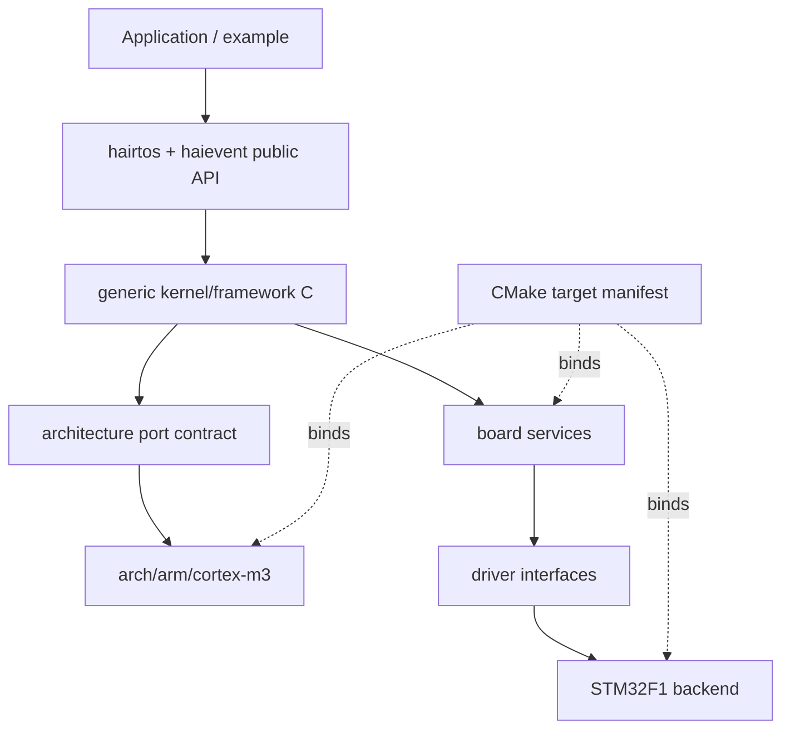

# Target manifest

> **Phạm vi:** Mô tả implementation `hairtos 1.0.0-rc1` đã được đối chiếu với source, config, build graph và host tests hiện có.

[← Root README](../../README.md) · [↑ Back to section](README.md) · [← Previous](stm32f103-platform.md)

## Mục lục

- [Tổng quan và bản chất](#tong-quan)
- [Implementation trong repository](#implementation)
- [Mô hình và luồng thực thi](#mo-hinh)
- [Ownership, concurrency và invariants](#invariants)
- [Failure modes và giới hạn](#failure)
- [Validation và cách kiểm chứng](#validation)
- [Source map](#source-map)
- [Tài liệu tham khảo](#references)

## Tổng quan và bản chất

Portability của hairtos chia thành architecture port, SoC, board, driver và CMake target manifest. Kernel generic chỉ gọi contract port; target manifest bind source/ASM/linker/OpenOCD/compile flags mà không nhét logic scheduler vào build metadata.

Trong project này, cách đọc đúng luôn là **contract → data ownership → state transition → concurrency boundary → failure semantics → evidence**. Điều đó quan trọng hơn việc chỉ nhớ tên API: một RTOS nhỏ vẫn có thể sai nghiêm trọng nếu cùng một task node xuất hiện ở hai list, nếu timeout và object wake cùng “thắng”, hoặc nếu context switch không khớp exception frame của CPU.

## Implementation trong repository

Các điểm đã được đối chiếu với source/config hiện tại:

- Architecture port sở hữu critical section, ISR-context query, initial stack, first task và context switch.
- SoC sở hữu startup, register definitions, clock tree và IRQ/fault backends mang tính chip-family.
- Board sở hữu pin binding, UART/LED/benchmark marker và human-readable identity.
- Driver public API dùng opaque target-defined identifiers; STM32F1 backend thực hiện register access.
- CMake target manifest là single source of truth để chọn architecture/SoC/board/driver/linker/debug config.
- file declared không tồn tại;
- target name mismatch;
- required source list rỗng;
- linker/OpenOCD path invalid;
- manifest version không hỗ trợ.

## Mô hình và luồng thực thi

Sơ đồ trên mô tả **semantic boundary**, không thay thế source. Khi debug, nên lần theo node của sơ đồ tới function/source file tương ứng thay vì suy luận từ diagram đơn lẻ.

## Ownership, concurrency và invariants

Các invariant nền áp dụng cho chủ đề này:

- Opaque object public chỉ hợp lệ sau create/init thành công và magic/internal state khớp contract.
- Intrusive node chỉ được linked vào đúng một list tại một thời điểm; remove/timeout/wake phải để node về trạng thái unlinked nhất quán.
- Thread API có thể block chỉ khi kernel RUNNING và không ở ISR; ISR API phải non-blocking và sử dụng `higher_priority_task_woken` khi cần defer switch sang PendSV.
- Critical section hiện dùng PRIMASK trên Cortex-M3, nghĩa là mask interrupt toàn cục trong đoạn ngắn; vì vậy code trong critical section phải bounded và không được gọi operation có thể block.
- Priority dùng **effective priority** ở ready/wait policy khi mutex inheritance đang active; base priority chỉ là cấu hình gốc.
- Static-first không có nghĩa “không có lifetime”: caller-owned TCB/stack/queue storage/event pool vẫn phải sống lâu hơn mọi object đang tham chiếu tới chúng.

## Failure modes và giới hạn

- `hairtos 1.0.0-rc1` là single-core, không có SMP, FPU context, MPU isolation hay general dynamic kernel heap.
- Interrupt masking model hiện là PRIMASK; repository chưa có BASEPRI ceiling contract cho application ISR priority phức tạp.
- Tickless idle chưa có; time model hiện dựa trên tick 1 kHz ở target tham chiếu.
- `haievent` v1 là flat state machine và one-task-per-AO; HSM/deferred event/shared executor nằm ở roadmap Version 2.
- Build/link PASS không tự chứng minh real-time timing hoặc race-free behavior trên hardware; target tests và measurement vẫn cần thiết.

## Validation và cách kiểm chứng

- Host suite của repository được build bằng GCC với AddressSanitizer + UndefinedBehaviorSanitizer và `ctest`.
- Audit hiện tại đã chạy `make TARGET=bluepill_f103c8 host-tests`: test suite PASS.
- Host examples `02-kernel-data-structures-host`, `14-memory-allocator-lab`, `16-diagnostics-stress-stabilization` chạy PASS; stress scheduler report 500.000 iteration.
- Không suy ra target runtime PASS từ host test. Cortex-M3 assembly, timing, exception priority, UART/LED và hardware clock vẫn cần cross-build + board validation.

## Source map

- `arch/arm/cortex-m3/hr_port.c`
- `arch/arm/cortex-m3/hr_port_stack.c`
- `arch/arm/cortex-m3/hr_portasm.S`
- `soc/stm32f1/startup_stm32f103.S`
- `soc/stm32f1/system_stm32f1.c`
- `soc/stm32f1/stm32f1_clock.c`
- `boards/bluepill_f103c8/board.c`
- `boards/bluepill_f103c8/STM32F103C8Tx_FLASH.ld`
- `cmake/targets/bluepill_f103c8.cmake`
- `drivers/<soc>`
- `boards/<board>/include/board.h`
- `cmake/targets/target_template.cmake.example`
- `cmake/hairtos_targets.cmake`
- `cmake/hairtos_modules.cmake`
- `cmake/targets/<target>.cmake`

## Tài liệu tham khảo

- [ST RM0008 — STM32F10x Reference Manual](https://www.st.com/resource/en/reference_manual/cd00171190-stm32f101xx-stm32f102xx-stm32f103xx-stm32f105xx-and-stm32f107xx-advanced-arm-based-32-bit-mcus-stmicroelectronics.pdf)
- [ST PM0056 — STM32F10xxx Cortex-M3 Programming Manual](https://www.st.com/resource/en/programming_manual/cd00228163-stm32f10xxx20xxx21xxxl1xxxx-cortexm3-programming-manual-stmicroelectronics.pdf)
- [STM32F103 documentation portal](https://www.st.com/en/microcontrollers-microprocessors/stm32f103/documentation.html)
- [CMake — CMAKE_TOOLCHAIN_FILE](https://cmake.org/cmake/help/latest/variable/CMAKE_TOOLCHAIN_FILE.html)
- [CMake — CMAKE_EXPORT_COMPILE_COMMANDS](https://cmake.org/cmake/help/latest/variable/CMAKE_EXPORT_COMPILE_COMMANDS.html)

**Nguồn implementation trong repository:**
- `arch/arm/cortex-m3/hr_port.c`
- `arch/arm/cortex-m3/hr_port_stack.c`
- `arch/arm/cortex-m3/hr_portasm.S`
- `soc/stm32f1/startup_stm32f103.S`
- `soc/stm32f1/system_stm32f1.c`
- `soc/stm32f1/stm32f1_clock.c`
- `boards/bluepill_f103c8/board.c`
- `boards/bluepill_f103c8/STM32F103C8Tx_FLASH.ld`
- `cmake/targets/bluepill_f103c8.cmake`
- `drivers/<soc>`
- `boards/<board>/include/board.h`
- `cmake/targets/target_template.cmake.example`
- `cmake/hairtos_targets.cmake`
- `cmake/hairtos_modules.cmake`
- `cmake/targets/<target>.cmake`
