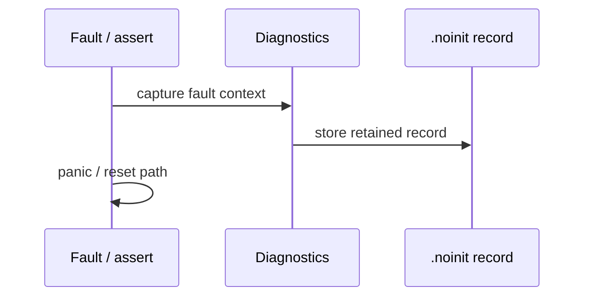
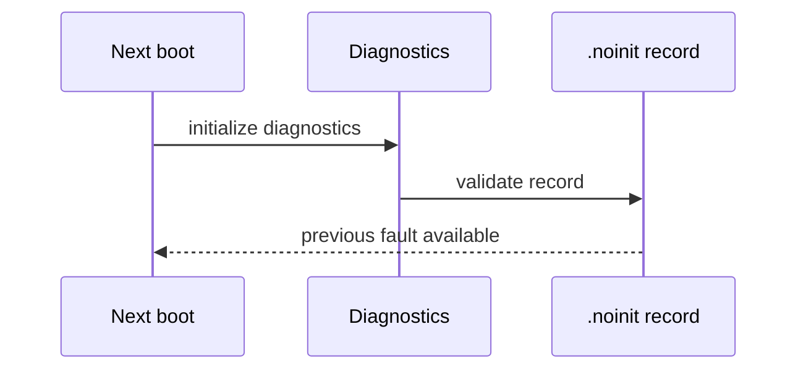

# Diagnostics architecture

> **Scope:** v1 runtime statistics, health checks, stack diagnostics, panic/fault retention, and hooks.

[← Root README](../../README.md) · [↑ Back to section](README.md) · [Next →](kernel-benchmark.md)

## Data model

`hr_runtime_statistics_t` counts SysTick/PendSV/task switches/yields/blocks/preemptions/time slices/timeout wakes/invariant checks/stack checks/panics. `hr_task_diagnostics_t` snapshots state, base/effective priority, free/used stack, and runtime ticks. `hr_health_report_t` aggregates kernel invariants, stack guards, and ready/timeout/task counts.

## Retained fault record

**Fault capture**

**Next-boot recovery**

The linker places `.noinit` outside `.bss`, so startup does not zero the retained record. The record contains stacked registers, exception number, and SCB CFSR/HFSR/DFSR/AFSR/MMFAR/BFAR/SHCSR.

## Fault enabling

When diagnostics are enabled, the Cortex-M port enables MemManage/BusFault/UsageFault and CCR traps for unaligned access and divide-by-zero. When diagnostics are disabled, SoC fault handlers enter a simple fault-stop loop.

## Example 16

The target workload combines queue, semaphore, mutex, periodic timer, and a health-monitor task; the monitor checks ordering, progress, kernel invariants, and stack guards. Optional UsageFault injection uses `udf` to verify retained records after reset.

## Validation

Host diagnostics tests verify task snapshots, runtime counters, retained-panic read/clear behavior, and fault-context capture. Hardware reset retention still requires target validation.

## Source

- `kernel/include/hairtos/hr_diagnostics.h`
- `kernel/src/hr_diagnostics.c`
- `arch/arm/cortex-m3/hr_fault.c`
- `arch/arm/cortex-m3/hr_faultasm.S`
- `boards/bluepill_f103c8/STM32F103C8Tx_FLASH.ld`
- `examples/16-diagnostics-stress-stabilization/main.c`

## References

- [Arm Cortex-M3 Technical Reference Manual](https://developer.arm.com/documentation/100165/latest/)
- [Arm Cortex-M3 Devices Generic User Guide](https://developer.arm.com/documentation/dui0552/latest/)
