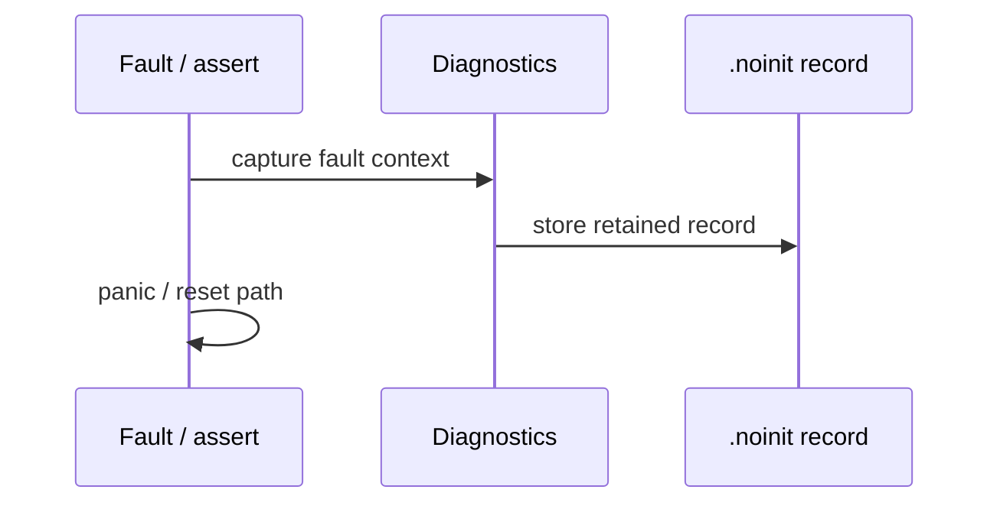
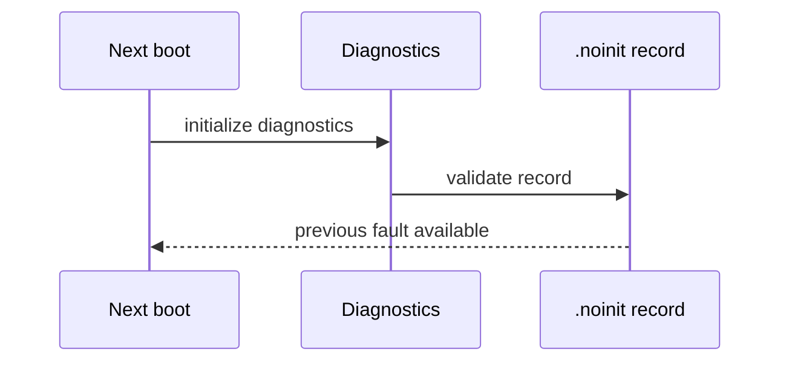

# Diagnostics architecture

> **Scope:** Runtime statistics, health checks, stack diagnostics, panic/fault retention và hooks của v1.

[← Root README](../../README.md) · [↑ Back to section](README.md) · [Next →](kernel-benchmark.md)

## Data model

`hr_runtime_statistics_t` đếm SysTick/PendSV/task switch/yield/block/preemption/time slice/timeout wake/invariant check/stack check/panic. `hr_task_diagnostics_t` chụp state/base/effective priority/stack free-used/runtime ticks. `hr_health_report_t` aggregate kernel invariant + stack guards + ready/timeout/task counts.

## Retained fault record

**Fault capture**

**Next-boot recovery**

Linker đặt `.noinit` ngoài `.bss`, nên startup không zero record. Record chứa stacked register + exception number + SCB CFSR/HFSR/DFSR/AFSR/MMFAR/BFAR/SHCSR.

## Fault enabling

Khi diagnostics bật, Cortex-M port bật MemManage/BusFault/UsageFault và CCR trap unaligned/divide-by-zero. Khi diagnostics tắt, SoC fault handlers đi vào simple fault-stop loop.

## Example 16

Target workload phối hợp queue, semaphore, mutex, periodic timer và health-monitor task; monitor kiểm order/progress/kernel invariant/stack guard. Optional UsageFault injection dùng `udf` để kiểm retained record sau reset.

## Validation

Host diagnostics tests kiểm task snapshot, runtime counters, retained panic clear/read và fault-context capture. Hardware reset retention vẫn cần target.

## Source

- `kernel/include/hairtos/hr_diagnostics.h`
- `kernel/src/hr_diagnostics.c`
- `arch/arm/cortex-m3/hr_fault.c`
- `arch/arm/cortex-m3/hr_faultasm.S`
- `boards/bluepill_f103c8/STM32F103C8Tx_FLASH.ld`
- `examples/16-diagnostics-stress-stabilization/main.c`

## References

- [Arm Cortex-M3 Technical Reference Manual](https://developer.arm.com/documentation/100165/latest/)
- [Arm Cortex-M3 Devices Generic User Guide](https://developer.arm.com/documentation/dui0552/latest/)
