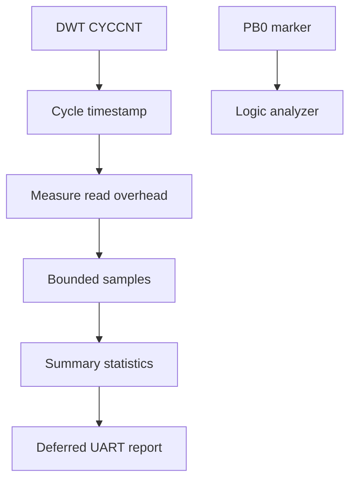

# Kernel benchmark methodology

> **Scope:** Cách example 15 đo và cách diễn giải số liệu; không hard-code kết quả target khi chưa có measurement artifact tương ứng.

[← Root README](../../README.md) · [↑ Back to section](README.md) · [← Previous](diagnostics.md) · [Next →](release-checklist.md)

## Measurement architecture

Metrics trong `examples/15-kernel-benchmark/main.c` gồm timestamp overhead, critical section, scheduler select, primitive queue/semaphore/mutex, yield roundtrip, queue wakeup, haievent dispatch và timer jitter. Footprint lấy từ linker symbols qua board helper.

## Measurement discipline

- UART output bị trì hoãn khỏi hot measurement path.
- Read overhead được đo riêng và adjusted cycle chỉ hợp lệ khi sample lớn hơn overhead.
- Percentile/statistics nằm ở generic benchmark module, clock implementation ở architecture layer.
- DWT frequency phải khớp core clock.
- Toolchain `-Og`, config, target clock và marker phải được ghi cùng result.

## Interpretation

Microbenchmark đo một primitive/path trong workload kiểm soát; nó không chứng minh end-to-end deadline cho application khác. Khi compare, phải cùng target/toolchain/config/sample method.

## Source

- `examples/15-kernel-benchmark/main.c`
- `benchmarks/kernel/src/hr_benchmark_stats.c`
- `arch/arm/cortex-m3/hr_benchmark_clock_dwt.c`
- `boards/bluepill_f103c8/board.c`
- `tests/host/test_benchmark.c`

## References

- [Arm Cortex-M3 Technical Reference Manual](https://developer.arm.com/documentation/100165/latest/)
- [Arm Cortex-M3 Devices Generic User Guide](https://developer.arm.com/documentation/dui0552/latest/)
