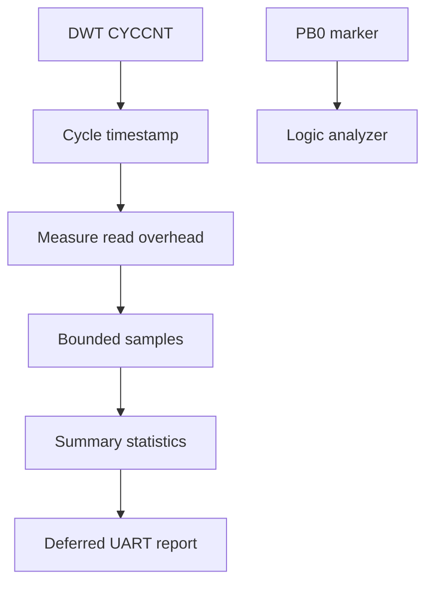

# Kernel benchmark methodology

> **Scope:** How example 15 performs measurements and how to interpret the results; do not hard-code target results without a corresponding measurement artifact.

[← Root README](../../README.md) · [↑ Back to section](README.md) · [← Previous](diagnostics.md) · [Next →](release-checklist.md)

## Measurement architecture

Metrics in `examples/15-kernel-benchmark/main.c` include timestamp-read overhead, critical-section latency, scheduler selection, queue/semaphore/mutex primitives, yield round-trip, queue wakeup, haievent dispatch, and timer jitter. Footprint is obtained from linker symbols through board helpers.

## Measurement discipline

- UART output is deferred outside the hot measurement path.
- Timestamp-read overhead is measured separately; adjusted cycle counts are valid only when the measured sample exceeds that overhead.
- Percentile/statistics logic lives in the generic benchmark module, while the clock implementation lives in the architecture layer.
- The DWT frequency must match the core clock.
- Toolchain `-Og`, configuration, target clock, and marker setup must be recorded with the result.

## Interpretation

A microbenchmark measures one primitive/path under a controlled workload; it does not prove end-to-end deadlines for another application. Comparisons require the same target, toolchain, configuration, and sampling method.

## Source

- `examples/15-kernel-benchmark/main.c`
- `benchmarks/kernel/src/hr_benchmark_stats.c`
- `arch/arm/cortex-m3/hr_benchmark_clock_dwt.c`
- `boards/bluepill_f103c8/board.c`
- `tests/host/test_benchmark.c`

## References

- [Arm Cortex-M3 Technical Reference Manual](https://developer.arm.com/documentation/100165/latest/)
- [Arm Cortex-M3 Devices Generic User Guide](https://developer.arm.com/documentation/dui0552/latest/)
