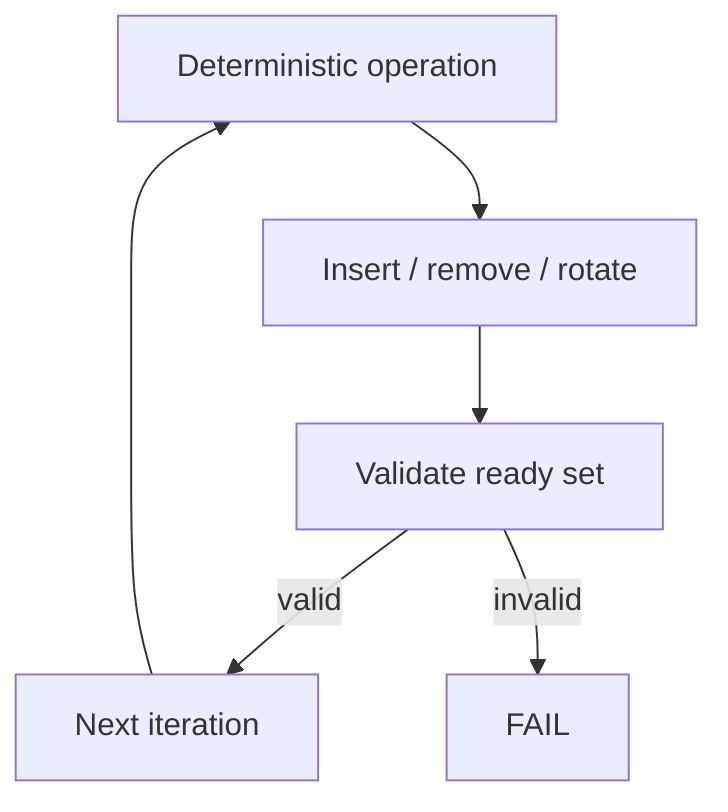

# Stress testing

> **Scope:** The existing deterministic scheduler stress test and the correct interpretation of its evidence.

[← Root README](../../README.md) · [↑ Back to section](README.md) · [← Previous](release-checklist.md) · [Next →](test-matrix.md)

## Workload

`tests/stress/scheduler_stress_core.c` generates insert/remove/rotate sequences on the ready set for 500,000 iterations using a deterministic PRNG/workload. After every iteration, a validator checks list/bitmap/count invariants.

## Why It Is Useful

The stress test finds state-sequence bugs that a few isolated unit cases may miss: stale bitmap bits after removal, double-linked nodes, FIFO corruption after repeated rotation, and count/list mismatches.

## Limitations

It does not generate real preemption, execute PendSV, model cache/FPU behavior (the target also has no FPU), or inject asynchronous MCU interrupts. This is **data-structure/policy stress**, not hardware concurrency stress.

## Validation Result

500,000 iterations PASS with 500,000 validation calls.

## References

- `tests/stress/scheduler_stress_core.c`
- `tests/stress/test_scheduler_stress.c`
- `kernel/src/hr_scheduler.c`
