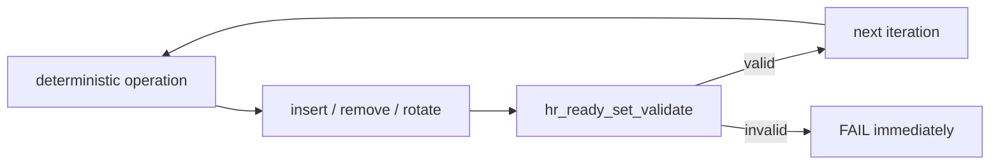

# Stress testing

> **Scope:** Deterministic scheduler stress hiện có và cách hiểu đúng evidence của nó.

[← Root README](../../README.md) · [↑ Back to section](README.md) · [← Previous](release-checklist.md) · [Next →](test-matrix.md)

## Workload

`tests/stress/scheduler_stress_core.c` tạo sequence insert/remove/rotate trên ready-set trong 500.000 iteration với deterministic PRNG/workload. Sau mỗi iteration, validator chạy để kiểm tra list/bitmap/count invariant.

## Vì sao hữu ích

Stress test tìm các bug state-sequence mà vài unit case đơn lẻ không chạm tới: bitmap stale sau remove, node double-link, FIFO corruption sau nhiều rotate, count/list mismatch.

## Giới hạn

Nó không tạo preemption thật, không chạy PendSV, không mô phỏng cache/FPU (target cũng không có FPU) hay asynchronous MCU interrupt. Đây là **data-structure/policy stress**, không phải hardware concurrency stress.

## Kết quả audit

500.000 iteration PASS với 500.000 validation call.

## References

- `tests/stress/scheduler_stress_core.c`
- `tests/stress/test_scheduler_stress.c`
- `kernel/src/hr_scheduler.c`
