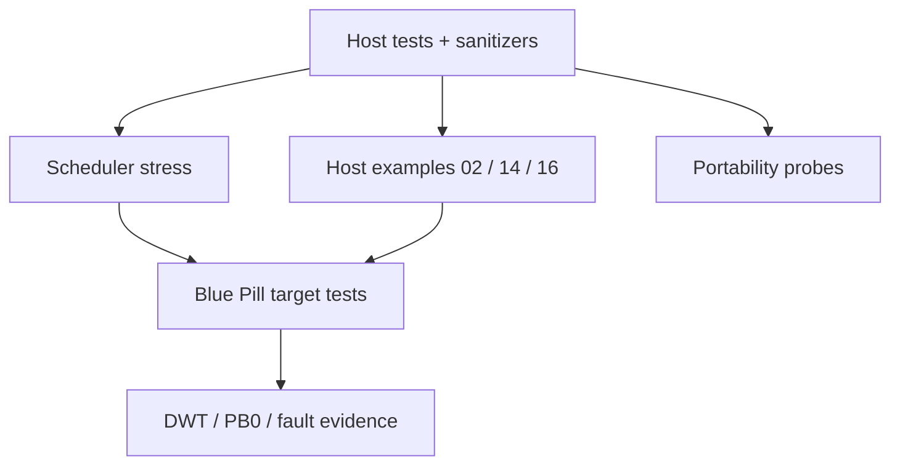

# Testing guide

> **Scope:** Cách kiểm chứng hairtos theo tầng: pure data structures → kernel policy → framework → stress → target/hardware.

[← Root README](../../README.md) · [↑ Back to section](README.md) · [← Previous](test-matrix.md) · [Next →](validation-baseline.md)

## Test pyramid



## Host suite

```bash
make TARGET=bluepill_f103c8 host-tests
```

CMake build host suite với `-O0 -g3`, strict warnings, AddressSanitizer và UndefinedBehaviorSanitizer. `ctest --output-on-failure` là canonical runner.

### Coverage logic hiện có

- intrusive list;
- ready queue + scheduler policy;
- wait list;
- timeout deadline ordering + tick wrap;
- task creation/stack guard/high-watermark;
- initial Cortex-M stack frame builder;
- kernel start/preemption/RR/delay race through mock port;
- queue/semaphore/mutex/timer;
- diagnostics/fault record;
- `haievent` event pool/refcount/FSM/AO/pubsub;
- benchmark stats/helpers;
- allocator heap/pool;
- 500k deterministic scheduler stress.

## Host examples

```bash
make TARGET=bluepill_f103c8 ENVIRONMENT=host EXAMPLE=02-kernel-data-structures-host run
make TARGET=bluepill_f103c8 ENVIRONMENT=host EXAMPLE=14-memory-allocator-lab run
make TARGET=bluepill_f103c8 ENVIRONMENT=host EXAMPLE=16-diagnostics-stress-stabilization run
```

Ba command trên thuộc validation baseline hiện có và đều PASS.

## Target tests

Target-only examples cần cross toolchain và board. Kiểm chứng phải tách:

1. build/link;
2. flash/verify/reset;
3. UART PASS/FAIL semantics;
4. GDB inspection khi panic;
5. benchmark marker/log khi đo timing;
6. reset cycle cho retained fault record.

Host PASS không chứng minh SVC/PendSV hardware behavior, interrupt priority, PLL clock hay peripheral pins.

## Regression rule

Bug fix phải thêm test ở tầng thấp nhất có thể tái tạo bug. Race chỉ xuất hiện target nên thêm target example/check nhưng vẫn cố tách pure policy để host-test nếu có thể.

## References

- [CMake — CMAKE_TOOLCHAIN_FILE](https://cmake.org/cmake/help/latest/variable/CMAKE_TOOLCHAIN_FILE.html)
- [CMake — CMAKE_EXPORT_COMPILE_COMMANDS](https://cmake.org/cmake/help/latest/variable/CMAKE_EXPORT_COMPILE_COMMANDS.html)
- [Arm Cortex-M3 Technical Reference Manual](https://developer.arm.com/documentation/100165/latest/)
- [Arm Cortex-M3 Devices Generic User Guide](https://developer.arm.com/documentation/dui0552/latest/)
