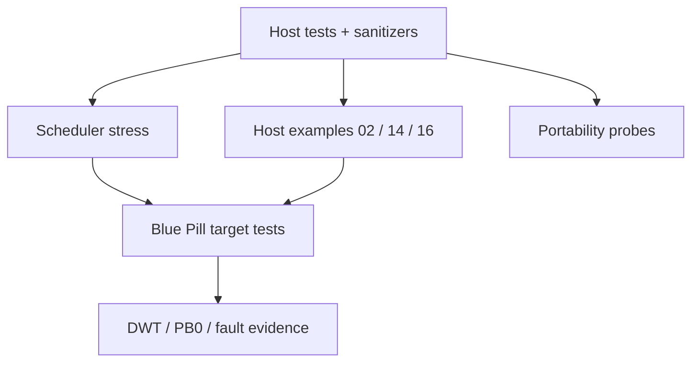

# Testing guide

> **Scope:** How hairtos is validated by layer: pure data structures → kernel policy → framework → stress → target/hardware.

[← Root README](../../README.md) · [↑ Back to section](README.md) · [← Previous](test-matrix.md) · [Next →](validation-baseline.md)

## Test pyramid



## Host suite

```bash
make TARGET=bluepill_f103c8 host-tests
```

CMake builds the host suite with `-O0 -g3`, strict warnings, AddressSanitizer, and UndefinedBehaviorSanitizer. `ctest --output-on-failure` is the canonical runner.

### Existing Logical Coverage

- intrusive list;
- ready queue + scheduler policy;
- wait list;
- timeout deadline ordering + tick wrap;
- task creation/stack guard/high-watermark;
- initial Cortex-M stack frame builder;
- kernel start/preemption/RR/delay race through mock port;
- queue/semaphore/mutex/timer;
- diagnostics/fault record;
- `haievent` event pool/refcount/FSM/AO/pubsub;
- benchmark stats/helpers;
- allocator heap/pool;
- 500k deterministic scheduler stress.

## Host examples

```bash
make TARGET=bluepill_f103c8 ENVIRONMENT=host EXAMPLE=02-kernel-data-structures-host run
make TARGET=bluepill_f103c8 ENVIRONMENT=host EXAMPLE=14-memory-allocator-lab run
make TARGET=bluepill_f103c8 ENVIRONMENT=host EXAMPLE=16-diagnostics-stress-stabilization run
```

The three commands above are part of the current validation baseline and all pass.

## Target tests

Target-only examples require a cross toolchain and board. Verification must distinguish:

1. build/link;
2. flash/verify/reset;
3. UART PASS/FAIL semantics;
4. inspect panic state with GDB;
5. benchmark marker/log behavior during timing measurements;
6. perform a reset cycle to verify the retained fault record.

Host PASS does not prove real SVC/PendSV hardware behavior, interrupt priorities, PLL clocking, or peripheral pin bindings.

## Regression rule

A bug fix should add a test at the lowest layer that can reproduce the defect. If a race exists only on target hardware, add a target example/check while still extracting pure policy into host-testable code whenever possible.

## References

- [CMake — CMAKE_TOOLCHAIN_FILE](https://cmake.org/cmake/help/latest/variable/CMAKE_TOOLCHAIN_FILE.html)
- [CMake — CMAKE_EXPORT_COMPILE_COMMANDS](https://cmake.org/cmake/help/latest/variable/CMAKE_EXPORT_COMPILE_COMMANDS.html)
- [Arm Cortex-M3 Technical Reference Manual](https://developer.arm.com/documentation/100165/latest/)
- [Arm Cortex-M3 Devices Generic User Guide](https://developer.arm.com/documentation/dui0552/latest/)
