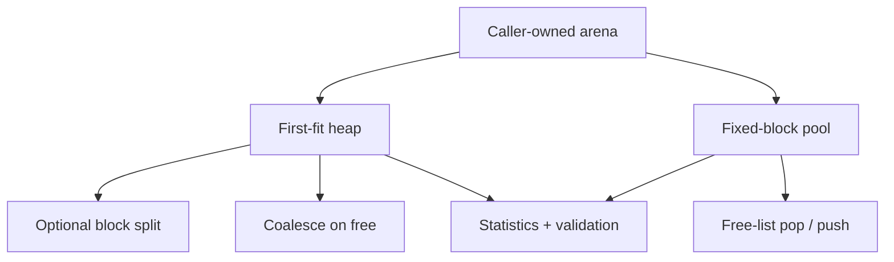

# Memory allocator lab

> **Phạm vi:** Implementation `hairtos 1.0.0-rc1`, bao gồm source, config, build graph và host-test evidence hiện có.

[← Root README](../../README.md) · [↑ Back to section](README.md) · [← Previous](example-index.md)

## Mục lục

- [Tổng quan và bản chất](#tong-quan)
- [Implementation trong repository](#implementation)
- [Mô hình và luồng thực thi](#mo-hinh)
- [Ownership, concurrency và invariants](#invariants)
- [Failure modes và giới hạn](#failure)
- [Validation và cách kiểm chứng](#validation)
- [Source map](#source-map)
- [Tài liệu tham khảo](#references)

## Tổng quan và bản chất

Memory allocator lab cố ý tách khỏi kernel runtime để học fragmentation và metadata mà không phá nguyên tắc static-first của hairtos. Lab có first-fit heap với split/coalesce và fixed-block pool với free-list.

## Implementation trong repository

Implementation hiện tại gồm:

- Arena do caller cấp; implementation không gọi system malloc.
- Heap align theo `max_align_t`, dùng block metadata và first-fit scan; free coalesce cả forward/backward khi adjacent block trống.
- Pool chia block stride cố định và recycle qua free list; allocation/free phù hợp object cùng kích thước.
- Stats phân biệt allocated/free/largest free/internal/external fragmentation và failed allocation.
- Host tests có invalid/double-free, exhaustion, coalescing và randomized sequence; lab không thread-safe và không phải production allocator.
- fixed-block pool;
- first-fit heap.

## Mô hình và luồng thực thi

Các function và source file tương ứng được liệt kê trong phần Source map.

## Ownership, concurrency và invariants

Các invariant nền áp dụng cho chủ đề này:

- Opaque object public chỉ hợp lệ sau create/init thành công và magic/internal state khớp contract.
- Intrusive node chỉ được linked vào đúng một list tại một thời điểm; remove/timeout/wake phải để node về trạng thái unlinked nhất quán.
- Thread API có thể block chỉ khi kernel RUNNING và không ở ISR; ISR API phải non-blocking và sử dụng `higher_priority_task_woken` khi cần defer switch sang PendSV.
- Critical section hiện dùng PRIMASK trên Cortex-M3, nghĩa là mask interrupt toàn cục trong đoạn ngắn; vì vậy code trong critical section phải bounded và không được gọi operation có thể block.
- Priority dùng **effective priority** ở ready/wait policy khi mutex inheritance đang active; base priority chỉ là cấu hình gốc.
- Static-first không có nghĩa “không có lifetime”: caller-owned TCB/stack/queue storage/event pool vẫn phải sống lâu hơn mọi object đang tham chiếu tới chúng.

## Failure modes và giới hạn

- `hairtos 1.0.0-rc1` là single-core, không có SMP, FPU context, MPU isolation hay general dynamic kernel heap.
- Interrupt masking model hiện là PRIMASK; repository chưa có BASEPRI ceiling contract cho application ISR priority phức tạp.
- Tickless idle chưa có; time model hiện dựa trên tick 1 kHz ở target tham chiếu.
- `haievent` v1 là flat state machine và one-task-per-AO; HSM/deferred event/shared executor nằm ở roadmap Version 2.
- Build/link PASS không tự chứng minh real-time timing hoặc race-free behavior trên hardware; target tests và measurement vẫn cần thiết.

## Validation và cách kiểm chứng

- Host suite của repository được build bằng GCC với AddressSanitizer + UndefinedBehaviorSanitizer và `ctest`.
- Host validation baseline: `make TARGET=bluepill_f103c8 host-tests` PASS.
- Host examples `02-kernel-data-structures-host`, `14-memory-allocator-lab`, `16-diagnostics-stress-stabilization` chạy PASS; stress scheduler report 500.000 iteration.
- Không suy ra target runtime PASS từ host test. Cortex-M3 assembly, timing, exception priority, UART/LED và hardware clock vẫn cần cross-build + board validation.

## Source map

- `labs/memory-allocator/src/hr_heap_lab.c`
- `labs/memory-allocator/src/hr_pool_lab.c`
- `labs/memory-allocator/tests/test_heap_lab.c`

## Tài liệu tham khảo

**Nguồn implementation trong repository:**
- `labs/memory-allocator/src/hr_heap_lab.c`
- `labs/memory-allocator/src/hr_pool_lab.c`
- `labs/memory-allocator/tests/test_heap_lab.c`
