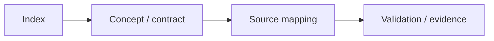

# Version 2 — Kế hoạch tương lai

> **Vai trò:** Nhóm này mô tả proposal Version 2. Baseline để so sánh luôn là `1.0.0-rc1`; không feature nào trong đây được coi là implemented nếu source/test v1 chưa có.

[← Root README](../../README.md)

## Mục lục

- [Bản đồ nội dung](#ban-do)
- [Cách đọc](#cach-doc)
- [Các tài liệu](#tai-lieu)
- [Validation baseline](#validation)
- [Tài liệu tham khảo](#references)

## Bản đồ nội dung

## Cách đọc

1. Bắt đầu từ README của section để biết scope và thứ tự học.
2. Khi gặp API, quay lại `docs/05-api-reference/` để xem context/return contract; khi gặp behavior kernel, ưu tiên `docs/01`–`03`.
3. Đối chiếu mọi statement timing/ownership với source map ở cuối chapter.
4. Phân biệt rõ **host evidence**, **target evidence** và **future proposal**.

## Các tài liệu

| Tài liệu | Vai trò |
| --- | --- |
| [`api-compatibility.md`](api-compatibility.md) | API compatibility policy cho Version 2 |
| [`architecture.md`](architecture.md) | Kiến trúc dự kiến cho Version 2 |
| [`diagnostics-and-observability.md`](diagnostics-and-observability.md) | Diagnostics và observability Version 2 |
| [`haievent-roadmap.md`](haievent-roadmap.md) | haievent roadmap Version 2 |
| [`kernel-roadmap.md`](kernel-roadmap.md) | Kernel roadmap Version 2 |
| [`migration-v1-to-v2.md`](migration-v1-to-v2.md) | Migration từ v1 sang v2 |
| [`portability-roadmap.md`](portability-roadmap.md) | Portability roadmap Version 2 |
| [`risk-register.md`](risk-register.md) | Risk register Version 2 |
| [`roadmap.md`](roadmap.md) | Roadmap Version 2 |
| [`testing-and-release.md`](testing-and-release.md) | Testing và release plan Version 2 |
| [`vision-and-goals.md`](vision-and-goals.md) | Vision và mục tiêu Version 2 |

## Validation baseline

- `VERSION`: `1.0.0-rc1`.
- Host test suite hiện có 64 test function và đã chạy PASS trong lần audit tài liệu này.
- `02-kernel-data-structures-host`, `14-memory-allocator-lab`, `16-diagnostics-stress-stabilization` chạy PASS trên host.
- Target tham chiếu là `bluepill_f103c8`; cross toolchain/OpenOCD không có trong môi trường audit nên không tuyên bố đã flash lại hardware.

## Tài liệu tham khảo

**Nguồn implementation trong repository:**
- `README.md`
- `CMakeLists.txt`
- `cmake/hairtos_examples.cmake`
- `cmake/hairtos_targets.cmake`
