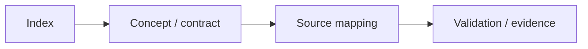

# Version 2 — Future Roadmap

> **Role:** This group contains Version 2 proposals. The comparison baseline is always `1.0.0-rc1`; no feature here is considered implemented unless corresponding source/test evidence exists.

[← Root README](../../README.md)

## Table of Contents

- [Content Map](#content-map)
- [How to Read This Section](#reading-guide)
- [Documents](#documents)
- [Validation baseline](#validation)
- [References](#references)

## Content Map

## How to Read This Section

1. Start with the section README to understand the scope and recommended learning order.
2. When an API appears, refer to `docs/05-api-reference/` for context and return-value contracts; for kernel behavior, prioritize `docs/01`–`03`.
3. Cross-check every timing and ownership statement against the source map at the end of the chapter.
4. Clearly distinguish **host evidence**, **target evidence**, and **future proposals**.

## Documents

| Document | Role |
| --- | --- |
| [`api-compatibility.md`](api-compatibility.md) | API compatibility policy for Version 2 |
| [`architecture.md`](architecture.md) | Proposed Version 2 Architecture |
| [`diagnostics-and-observability.md`](diagnostics-and-observability.md) | Version 2 Diagnostics and Observability |
| [`haievent-roadmap.md`](haievent-roadmap.md) | haievent roadmap Version 2 |
| [`kernel-roadmap.md`](kernel-roadmap.md) | Kernel roadmap Version 2 |
| [`migration-v1-to-v2.md`](migration-v1-to-v2.md) | Migration from v1 to v2 |
| [`portability-roadmap.md`](portability-roadmap.md) | Portability roadmap Version 2 |
| [`risk-register.md`](risk-register.md) | Risk register Version 2 |
| [`roadmap.md`](roadmap.md) | Roadmap Version 2 |
| [`testing-and-release.md`](testing-and-release.md) | Version 2 Testing and Release Plan |
| [`vision-and-goals.md`](vision-and-goals.md) | Version 2 Vision and Goals |

## Validation baseline

- `VERSION`: `1.0.0-rc1`.
- Host validation baseline: all 64 test functions in the current suite pass.
- `02-kernel-data-structures-host`, `14-memory-allocator-lab`, and `16-diagnostics-stress-stabilization` pass on the host.
- The reference target is `bluepill_f103c8`; host evidence does not replace cross-build, OpenOCD, and on-board hardware validation.

## References

**Implementation sources in the repository:**
- `README.md`
- `CMakeLists.txt`
- `cmake/hairtos_examples.cmake`
- `cmake/hairtos_targets.cmake`
