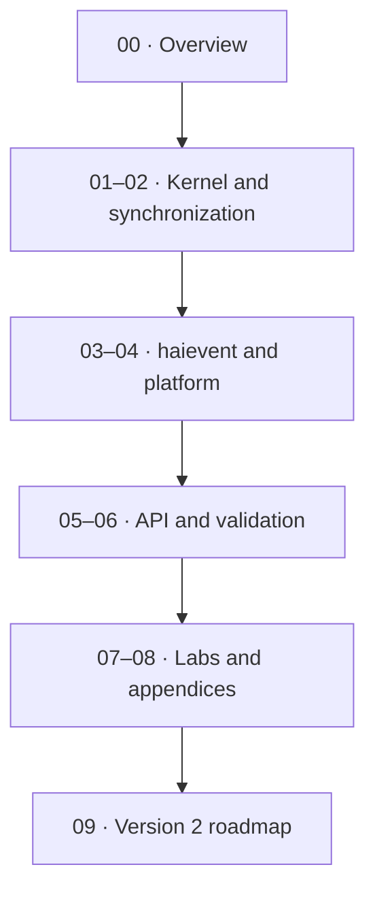

# hairtos Documentation

> **Role:** This is the landing page for the complete technical documentation. Documents `00`–`08` describe the v1 implementation; `09-version2` is a separate future roadmap so proposed capabilities are not mixed with implemented ones.

[← Root README](../README.md)

## Table of Contents

- [Content Map](#content-map)
- [How to Read This Section](#reading-guide)
- [Documents](#documents)
- [Validation baseline](#validation)
- [References](#references)

## Content Map

## How to Read This Section

1. Start with the section README to understand the scope and recommended learning order.
2. When an API appears, refer to `docs/05-api-reference/` for context and return-value contracts; for kernel behavior, prioritize `docs/01`–`03`.
3. Cross-check every timing and ownership statement against the source map at the end of the chapter.
4. Clearly distinguish **host evidence**, **target evidence**, and **future proposals**.

## Documents

### Subgroups

- [`00-overview/`](00-overview/README.md) — 00 — Project Overview and Analysis
- [`01-kernel-core/`](01-kernel-core/README.md) — 01 — Kernel Core
- [`02-synchronization/`](02-synchronization/README.md) — 02 — Synchronization and IPC
- [`03-haievent/`](03-haievent/README.md) — 03 — haievent: Event-Driven Framework
- [`04-platform/`](04-platform/README.md) — 04 — Platform, Architecture Port, and Targets
- [`05-api-reference/`](05-api-reference/README.md) — 05 — Public API reference
- [`06-testing-and-quality/`](06-testing-and-quality/README.md) — 06 — Testing, Diagnostics, and Quality
- [`07-labs-and-examples/`](07-labs-and-examples/README.md) — 07 — Labs and Examples
- [`08-appendices/`](08-appendices/README.md) — 08 — Appendices
- [`09-version2/`](09-version2/README.md) — Version 2 — Future Roadmap

## Validation baseline

- `VERSION`: `1.0.0-rc1`.
- Host validation baseline: all 64 test functions in the current suite pass.
- `02-kernel-data-structures-host`, `14-memory-allocator-lab`, and `16-diagnostics-stress-stabilization` pass on the host.
- The reference target is `bluepill_f103c8`; host evidence does not replace cross-build, OpenOCD, and on-board hardware validation.

## References

**Implementation sources in the repository:**
- `README.md`
- `CMakeLists.txt`
- `cmake/hairtos_examples.cmake`
- `cmake/hairtos_targets.cmake`
