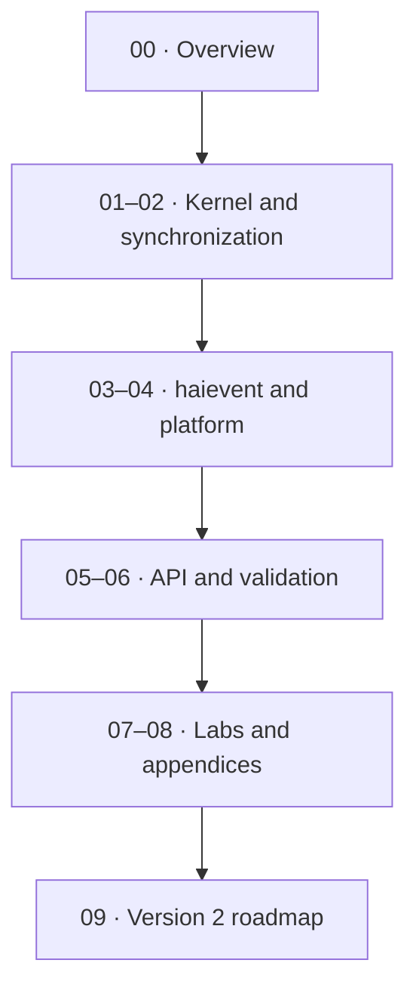

# Tài liệu hairtos

> **Vai trò:** Đây là landing page của toàn bộ technical documentation. Tài liệu `00`–`08` mô tả implementation v1; `09-version2` là kế hoạch tương lai và được tách riêng để không trộn roadmap với capability đã có.

[← Root README](../README.md)

## Mục lục

- [Bản đồ nội dung](#ban-do)
- [Cách đọc](#cach-doc)
- [Các tài liệu](#tai-lieu)
- [Validation baseline](#validation)
- [Tài liệu tham khảo](#references)

## Bản đồ nội dung

## Cách đọc

1. Bắt đầu từ README của section để biết scope và thứ tự học.
2. Khi gặp API, quay lại `docs/05-api-reference/` để xem context/return contract; khi gặp behavior kernel, ưu tiên `docs/01`–`03`.
3. Đối chiếu mọi statement timing/ownership với source map ở cuối chapter.
4. Phân biệt rõ **host evidence**, **target evidence** và **future proposal**.

## Các tài liệu

### Nhóm con

- [`00-overview/`](00-overview/README.md) — 00 — Tổng quan và phân tích project
- [`01-kernel-core/`](01-kernel-core/README.md) — 01 — Lõi kernel
- [`02-synchronization/`](02-synchronization/README.md) — 02 — Đồng bộ hóa và IPC
- [`03-haievent/`](03-haievent/README.md) — 03 — haievent: Event-Driven Framework
- [`04-platform/`](04-platform/README.md) — 04 — Platform, architecture port và target
- [`05-api-reference/`](05-api-reference/README.md) — 05 — Public API reference
- [`06-testing-and-quality/`](06-testing-and-quality/README.md) — 06 — Testing, diagnostics và chất lượng
- [`07-labs-and-examples/`](07-labs-and-examples/README.md) — 07 — Labs và examples
- [`08-appendices/`](08-appendices/README.md) — 08 — Phụ lục
- [`09-version2/`](09-version2/README.md) — Version 2 — Kế hoạch tương lai

## Validation baseline

- `VERSION`: `1.0.0-rc1`.
- Host validation baseline: 64 test function trong suite hiện có đều PASS.
- `02-kernel-data-structures-host`, `14-memory-allocator-lab`, `16-diagnostics-stress-stabilization` chạy PASS trên host.
- Target tham chiếu là `bluepill_f103c8`; host evidence không thay thế cross-build, OpenOCD và hardware validation trên board.

## Tài liệu tham khảo

**Nguồn implementation trong repository:**
- `README.md`
- `CMakeLists.txt`
- `cmake/hairtos_examples.cmake`
- `cmake/hairtos_targets.cmake`
