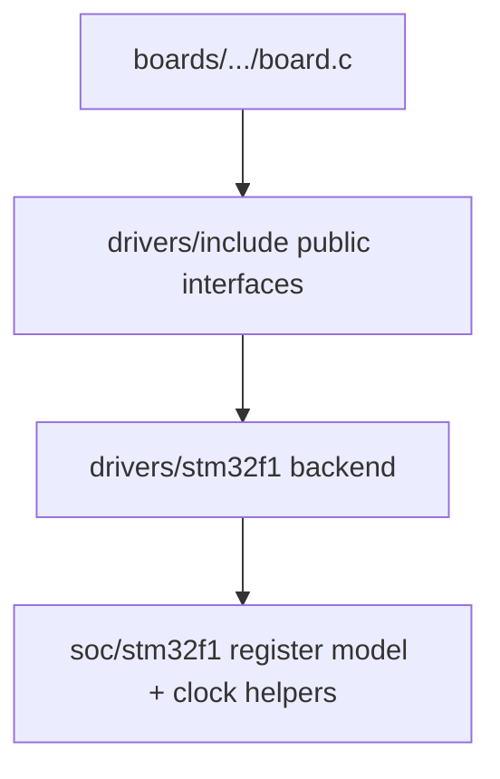

# Driver layer

> **Scope:** Driver API của hairtos cung cấp peripheral contract tối thiểu cho board/examples; đây không phải HAL tổng quát.

[← Root README](../README.md)

## Mục lục

- [Kiến trúc](#architecture)
- [Public contracts](#contracts)
- [STM32F1 backend](#backend)
- [Ownership và timing](#ownership)
- [Porting](#porting)
- [Validation](#validation)
- [References](#references)

## Kiến trúc

Driver không biết scheduler policy. Board chọn pin/instance và dùng driver; kernel generic không include STM32F1 register header.

## Public contracts

- `hr_gpio.h`: configure/write/toggle GPIO với opaque pin identifier target-defined.
- `hr_uart.h`: blocking/simple UART init + write path đủ cho log/demo.
- `hr_hw_timer.h`: board millisecond timebase/delay dành cho bare-metal foundation và utility ngoài kernel tick.

Các identifier pin/UART không được hard-code vào generic kernel. `board_pins.h` bind PC13, PA9/PA10, PB0 cho target hiện tại.

## STM32F1 backend

Backend thao tác RCC/GPIO/USART/timer registers qua `soc/stm32f1/include/stm32f1.h`. Clock divisor phải lấy từ active PCLK/HCLK helper; không giả định mọi peripheral luôn chạy 72 MHz.

## Ownership và timing

- Driver hiện không có async DMA queue hoặc IRQ-driven UART subsystem; UART log có thể làm nhiễu benchmark/timing nếu gọi trong measurement window.
- `board_delay_ms()` dùng hardware timer utility, không phải scheduler delay; task RTOS nên dùng `hr_task_delay*()` nếu mục tiêu là block CPU.
- Board panic disable IRQ và loop breakpoint, phù hợp demo/debug nhưng không phải production recovery policy.

## Porting

Target mới cần implementation driver phù hợp với opaque IDs + board binding tương ứng. Không sửa public kernel chỉ để đổi register map/pin.

## Validation

Host tests mock port chứ không unit-test register backend. Hardware driver cần target build + board test. Platform contract chi tiết ở [`../docs/04-platform/`](../docs/04-platform/README.md).

## References

- [ST RM0008 — STM32F10x Reference Manual](https://www.st.com/resource/en/reference_manual/cd00171190-stm32f101xx-stm32f102xx-stm32f103xx-stm32f105xx-and-stm32f107xx-advanced-arm-based-32-bit-mcus-stmicroelectronics.pdf)
- [ST PM0056 — STM32F10xxx Cortex-M3 Programming Manual](https://www.st.com/resource/en/programming_manual/cd00228163-stm32f10xxx20xxx21xxxl1xxxx-cortexm3-programming-manual-stmicroelectronics.pdf)
- [STM32F103 documentation portal](https://www.st.com/en/microcontrollers-microprocessors/stm32f103/documentation.html)

**Nguồn implementation trong repository:**
- `drivers/include/hr_gpio.h`
- `drivers/include/hr_uart.h`
- `drivers/include/hr_hw_timer.h`
- `drivers/stm32f1/`
- `boards/bluepill_f103c8/board.c`
