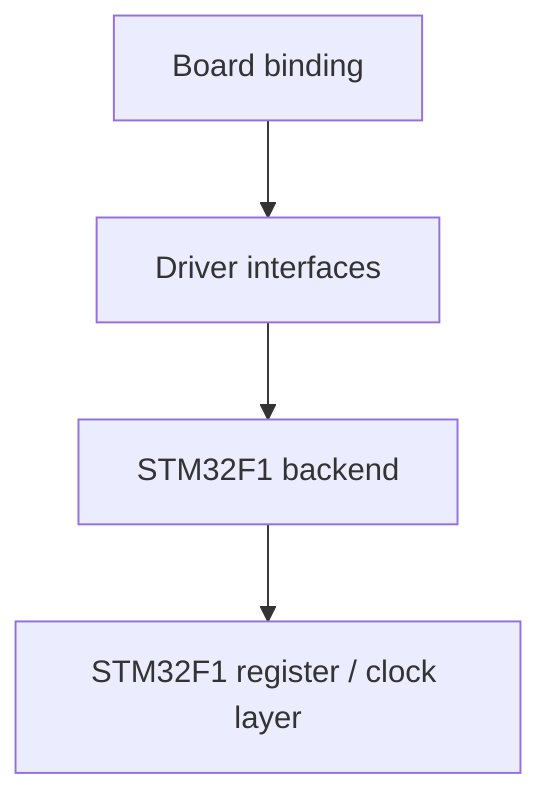

# Driver layer

> **Scope:** The hairtos driver API provides the minimum peripheral contracts required by boards/examples; it is not a general-purpose HAL.

[← Root README](../README.md)

## Table of Contents

- [Architecture](#architecture)
- [Public contracts](#contracts)
- [STM32F1 backend](#backend)
- [Ownership and Timing](#ownership)
- [Porting](#porting)
- [Validation](#validation)
- [References](#references)

## Architecture

Drivers are unaware of scheduler policy. The board selects pins/instances and uses the drivers; the generic kernel does not include STM32F1 register headers.

## Public contracts

- `hr_gpio.h`: configure/write/toggle GPIO through opaque, target-defined pin identifiers.
- `hr_uart.h`: simple/blocking UART initialization and write path sufficient for logs and demos.
- `hr_hw_timer.h`: board millisecond timebase/delay for the bare-metal foundation and utilities outside the kernel tick.

Pin/UART identifiers must not be hard-coded into the generic kernel. `board_pins.h` binds PC13, PA9/PA10, and PB0 for the current target.

## STM32F1 backend

The backend accesses RCC/GPIO/USART/timer registers through `soc/stm32f1/include/stm32f1.h`. Clock divisors must come from active PCLK/HCLK helpers; code must not assume every peripheral always runs at 72 MHz.

## Ownership and Timing

- The current drivers provide no asynchronous DMA queue or IRQ-driven UART subsystem; UART logging can perturb benchmarks/timing if invoked inside a measurement window.
- `board_delay_ms()` uses a hardware-timer utility, not a scheduler delay; RTOS tasks should use `hr_task_delay*()` when the intent is to block the task.
- Board panic disables interrupts and loops on a breakpoint, which is appropriate for demos/debugging but is not a production recovery policy.

## Porting

A new target requires driver implementations compatible with the opaque IDs plus matching board bindings. Do not modify the public kernel merely to change register maps or pin assignments.

## Validation

Host tests mock the port rather than unit-testing register backends. Hardware drivers require a target build and board testing. The detailed platform contract is in [`../docs/04-platform/`](../docs/04-platform/README.md).

## References

- [ST RM0008 — STM32F10x Reference Manual](https://www.st.com/resource/en/reference_manual/cd00171190-stm32f101xx-stm32f102xx-stm32f103xx-stm32f105xx-and-stm32f107xx-advanced-arm-based-32-bit-mcus-stmicroelectronics.pdf)
- [ST PM0056 — STM32F10xxx Cortex-M3 Programming Manual](https://www.st.com/resource/en/programming_manual/cd00228163-stm32f10xxx20xxx21xxxl1xxxx-cortexm3-programming-manual-stmicroelectronics.pdf)
- [STM32F103 documentation portal](https://www.st.com/en/microcontrollers-microprocessors/stm32f103/documentation.html)

**Implementation sources in the repository:**
- `drivers/include/hr_gpio.h`
- `drivers/include/hr_uart.h`
- `drivers/include/hr_hw_timer.h`
- `drivers/stm32f1/`
- `boards/bluepill_f103c8/board.c`
