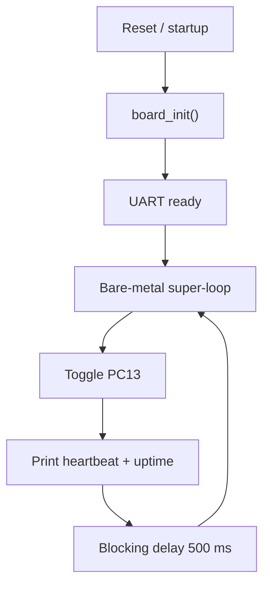

# `01-baremetal-foundation` — Bare-Metal Foundation

> **Environment:** Target  
> **Source:** `examples/01-baremetal-foundation/main.c`  
> **Focus:** Bare-metal baseline before the kernel

[← Root README](../../README.md)

## Table of Contents

- [Objective and Core Concept](#objective)
- [Build Graph and Configuration](#build-graph)
- [Runtime Flow](#runtime)
- [API and Ownership](#api)
- [Invariant / PASS criteria](#pass)
- [Debugging and Failure Modes](#debug)
- [Validation](#validation)
- [Source Map and References](#source-map)

<a id="objective"></a>
## Objective and Core Concept

There are no tasks or scheduler; board initialization, UART, LED control, a millisecond timer, and busy delays establish the baseline for comparison with the RTOS.


<a id="build-graph"></a>
## Build Graph and Configuration

- CMake declares this example as a **Target** environment.
- Modules linked for this example: `platform`, `baremetal_tick`.
- Reference target: `bluepill_f103c8` — STM32F103C8T6 / Cortex-M3 / nominal 72 MHz / USART1 115200 / active-low PC13 LED.

### CMake feature overrides

- The example uses the default configuration except for modules/definitions explicitly declared in `cmake/hairtos_examples.cmake`.

<a id="runtime"></a>
## Runtime Flow



This example does not initialize the kernel, create a TCB, or enter SVC/PendSV paths. Runtime uses only board services and the bare-metal millisecond timebase.

### Details Observed Directly in the Example

- Initialize the Blue Pill and verify that the system clock is running.
- Control the active-low PC13 LED through the board API.
- Emit logs over USART1 and track time using the bare-metal millisecond counter.
- Understand the super-loop model and limitations of blocking delays before a scheduler exists.
- STM32F103 startup copies `.data` and zeros `.bss`.
- HSE 8 MHz → PLL ×9 → 72 MHz, with an HSI fallback path in the platform.
- Active-low GPIO output, polling UART, and bare-metal SysTick.
- No TCB, scheduler, PSP, SVC, or PendSV.
- `board.h`
- `board_init()`
- `board_led_toggle()`
- `board_uart_write_*()`
- `board_millis()`
- `board_delay_ms()`
- `platform`
- `baremetal_tick`
- PC13 LED changes state approximately every 500 ms.
- `heartbeat` increases continuously and `uptime_ms` never decreases.
- Hardware — STM32F103C8T6 Blue Pill — Runs the target firmware.
- Flash/debug — ST-Link V2 over SWD — OpenOCD is used to flash, verify, and reset the target.
- UART — USART1, PA9 TX / PA10 RX, 115200 8-N-1 — Observes logs and PASS/FAIL status.
- LED — PC13, active-low — Displays heartbeat or observable status.
- Main loop — `heartbeat` and `board_millis()` — Toggles LED, increments the counter, and delays 500 ms.
- Tick source — `arch/arm/cortex-m3/hr_baremetal_tick_irq.c` — Provides the millisecond counter before the architecture-port kernel-tick IRQ adapter is introduced.

<a id="api"></a>
## API and Ownership

APIs called directly from `main.c` (extracted from source):

- `board_delay_ms()`
- `board_init()`
- `board_led_toggle()`
- `board_millis()`
- `board_uart_write_line()`
- `board_uart_write_string()`
- `board_uart_write_u32()`

Ownership rules to keep in mind:

- `hr_task_t`, stacks, queue/semaphore/mutex/timer objects, and haievent storage in the examples are all static/caller-owned.
- Kernel APIs retain pointers to this storage after creation, so the storage lifetime must cover the entire period in which the object remains active.
- ISR paths must not call blocking APIs. `_from_isr` APIs perform bounded work and return `higher_priority_task_woken` so PendSV can perform any required switch after ISR exit.
- Dynamic haievent events allocated from a pool use retain/release semantics; static events are not freed automatically by the framework.

<a id="pass"></a>
## Invariants and PASS Criteria

- The architecture port owns critical sections, ISR-context queries, initial stack construction, first-task startup, and context switching.
- The SoC layer owns startup, register definitions, clock tree, and chip-family-specific IRQ/fault backends.
- The board layer owns pin bindings, UART/LED/benchmark markers, and human-readable target identity.
- Public driver APIs use opaque target-defined identifiers; the STM32F1 backend performs register access.
- The CMake target manifest is the single source of truth for architecture/SoC/board/driver/linker/debug configuration selection.

<a id="debug"></a>
## Debugging and Failure Modes

- No UART log: inspect `board_init()`, USART1 clock/pins PA9/PA10, and 115200 baud setup.
- LED does not change state: inspect active-low PC13 behavior and `board_led_toggle()`.
- `uptime_ms` does not advance or delay is incorrect: inspect the bare-metal millisecond timebase and `board_delay_ms()`.
- This example has no TCB, ready set, SVC, or PendSV; debugging should not start from kernel state.

<a id="validation"></a>
## Validation

- This example is target-only in CMake; host evidence does not replace ARM cross-build, OpenOCD, and hardware validation.
- Host validation baseline: `make TARGET=bluepill_f103c8 host-tests` passes the entire suite.

### Standard Commands

```bash
make TARGET=bluepill_f103c8 EXAMPLE=01-baremetal-foundation build
make TARGET=bluepill_f103c8 EXAMPLE=01-baremetal-foundation run
make TARGET=bluepill_f103c8 EXAMPLE=01-baremetal-foundation check
```

<a id="source-map"></a>
## Source Map and References

- `examples/01-baremetal-foundation/main.c`
- `cmake/hairtos_examples.cmake`
- `arch/arm/cortex-m3/hr_port.c`
- `arch/arm/cortex-m3/hr_port_stack.c`
- `arch/arm/cortex-m3/hr_portasm.S`
- `soc/stm32f1/startup_stm32f103.S`
- `soc/stm32f1/system_stm32f1.c`
- `soc/stm32f1/stm32f1_clock.c`
- `boards/bluepill_f103c8/board.c`
- `boards/bluepill_f103c8/STM32F103C8Tx_FLASH.ld`
- `cmake/targets/bluepill_f103c8.cmake`
- `drivers/<soc>`
- `boards/<board>/include/board.h`
- `cmake/targets/target_template.cmake.example`
- `cmake/hairtos_targets.cmake`
- `cmake/hairtos_modules.cmake`
- `cmake/targets/<target>.cmake`

### References

- [ST RM0008 — STM32F10x Reference Manual](https://www.st.com/resource/en/reference_manual/cd00171190-stm32f101xx-stm32f102xx-stm32f103xx-stm32f105xx-and-stm32f107xx-advanced-arm-based-32-bit-mcus-stmicroelectronics.pdf)
- [ST PM0056 — STM32F10xxx Cortex-M3 Programming Manual](https://www.st.com/resource/en/programming_manual/cd00228163-stm32f10xxx20xxx21xxxl1xxxx-cortexm3-programming-manual-stmicroelectronics.pdf)
- [STM32F103 documentation portal](https://www.st.com/en/microcontrollers-microprocessors/stm32f103/documentation.html)

**Implementation sources in the repository:**
- `arch/arm/cortex-m3/hr_port.c`
- `arch/arm/cortex-m3/hr_port_stack.c`
- `arch/arm/cortex-m3/hr_portasm.S`
- `soc/stm32f1/startup_stm32f103.S`
- `soc/stm32f1/system_stm32f1.c`
- `soc/stm32f1/stm32f1_clock.c`
- `boards/bluepill_f103c8/board.c`
- `boards/bluepill_f103c8/STM32F103C8Tx_FLASH.ld`
- `cmake/targets/bluepill_f103c8.cmake`
- `drivers/<soc>`
- `boards/<board>/include/board.h`
- `cmake/targets/target_template.cmake.example`
- `cmake/hairtos_targets.cmake`
- `cmake/hairtos_modules.cmake`
- `cmake/targets/<target>.cmake`
