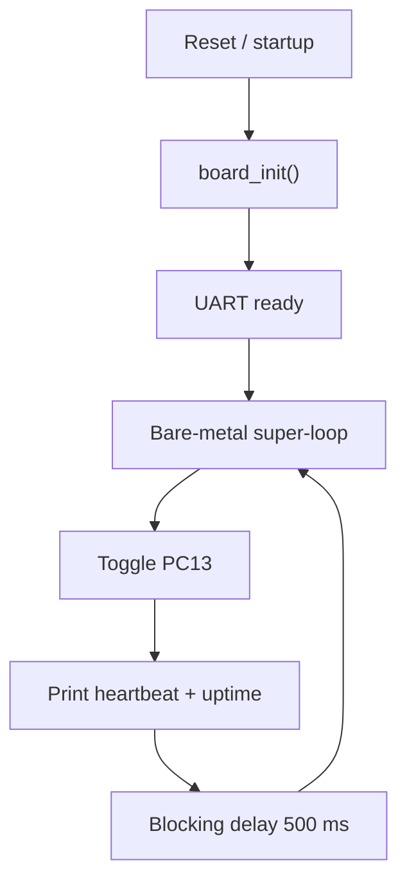

# `01-baremetal-foundation` — Nền tảng bare-metal

> **Môi trường:** Target  
> **Source:** `examples/01-baremetal-foundation/main.c`  
> **Trọng tâm:** Bare-metal baseline trước kernel

[← Root README](../../README.md)

## Mục lục

- [Mục tiêu và bản chất](#muc-tieu)
- [Build graph và cấu hình](#build-graph)
- [Luồng thực thi](#runtime)
- [API và ownership](#api)
- [Invariant / PASS criteria](#pass)
- [Debug và failure modes](#debug)
- [Validation](#validation)
- [Source map và references](#source-map)

<a id="muc-tieu"></a>
## Mục tiêu và bản chất

Không có task/scheduler; board init, UART, LED, millisecond timer và busy delay tạo baseline để so sánh với RTOS.


<a id="build-graph"></a>
## Build graph và cấu hình

- Environment được CMake khai báo: **Target**.
- Module được link cho example này: `platform`, `baremetal_tick`.
- Target tham chiếu: `bluepill_f103c8` — STM32F103C8T6 / Cortex-M3 / 72 MHz nominal / USART1 115200 / LED PC13 active-low.

### CMake feature overrides

- Example dùng default config trừ những module/definition được khai báo trong `cmake/hairtos_examples.cmake`.

<a id="runtime"></a>
## Luồng thực thi



Example này không khởi tạo kernel, không tạo TCB và không đi qua SVC/PendSV. Runtime chỉ dùng board services và bare-metal millisecond timebase.

### Các chi tiết quan sát trực tiếp từ example

- Khởi tạo Blue Pill và xác nhận clock hệ thống hoạt động.
- Điều khiển LED PC13 bằng API board.
- Gửi log qua USART1 và theo dõi thời gian bằng bộ đếm millisecond bare-metal.
- Hiểu vòng lặp super-loop và giới hạn của blocking delay trước khi có scheduler.
- Startup STM32F103, sao chép `.data` và xóa `.bss`.
- HSE 8 MHz → PLL x9 → 72 MHz; có cơ chế fallback về HSI trong platform.
- GPIO output active-low, UART polling và SysTick bare-metal.
- Không có TCB, scheduler, PSP, SVC hoặc PendSV.
- `board.h`
- `board_init()`
- `board_led_toggle()`
- `board_uart_write_*()`
- `board_millis()`
- `board_delay_ms()`
- `platform`
- `baremetal_tick`
- LED PC13 đổi trạng thái xấp xỉ mỗi 500 ms.
- `heartbeat` tăng liên tục và `uptime_ms` không giảm.
- Phần cứng — STM32F103C8T6 Blue Pill — Chạy firmware target.
- Nạp/debug — ST-Link V2 qua SWD — Dùng OpenOCD để flash, verify và reset.
- UART — USART1, PA9 TX / PA10 RX, 115200 8-N-1 — Theo dõi log và trạng thái PASS/FAIL.
- LED — PC13, active-low — Hiển thị heartbeat hoặc trạng thái quan sát.
- Main loop — `heartbeat` và `board_millis()` — Toggle LED, tăng bộ đếm và delay 500 ms.
- Tick source — `arch/arm/cortex-m3/hr_baremetal_tick_irq.c` — Cung cấp millisecond counter trước khi tick IRQ adapter thuộc architecture port.

<a id="api"></a>
## API và ownership

API được gọi trực tiếp trong `main.c` (đã trích từ source):

- `board_delay_ms()`
- `board_init()`
- `board_led_toggle()`
- `board_millis()`
- `board_uart_write_line()`
- `board_uart_write_string()`
- `board_uart_write_u32()`

Ownership cần nhớ:

- `hr_task_t`, stack, queue/semaphore/mutex/timer object và haievent storage trong examples đều là static/caller-owned.
- API kernel giữ pointer tới storage này sau create, vì vậy lifetime phải kéo dài toàn bộ thời gian object còn active.
- ISR path không được gọi blocking API. API `_from_isr` chỉ làm bounded work và trả `higher_priority_task_woken` để PendSV xử lý switch sau ISR.
- Dynamic haievent event từ pool dùng retain/release; static event không được framework tự free.

<a id="pass"></a>
## Invariant và PASS criteria

- Architecture port sở hữu critical section, ISR-context query, initial stack, first task và context switch.
- SoC sở hữu startup, register definitions, clock tree và IRQ/fault backends mang tính chip-family.
- Board sở hữu pin binding, UART/LED/benchmark marker và human-readable identity.
- Driver public API dùng opaque target-defined identifiers; STM32F1 backend thực hiện register access.
- CMake target manifest là single source of truth để chọn architecture/SoC/board/driver/linker/debug config.

<a id="debug"></a>
## Debug và failure modes

- UART không có log: kiểm tra `board_init()`, USART1 clock/pin PA9/PA10 và baud 115200.
- LED không đổi trạng thái: kiểm tra PC13 active-low và `board_led_toggle()`.
- `uptime_ms` không tăng hoặc delay sai: kiểm tra bare-metal millisecond timebase và `board_delay_ms()`.
- Example này không có TCB, ready set, SVC hoặc PendSV; debug không nên bắt đầu từ kernel state.

<a id="validation"></a>
## Validation

- Example là target-only trong CMake; host evidence không thay thế ARM cross-build, OpenOCD và hardware validation.
- Host validation baseline: `make TARGET=bluepill_f103c8 host-tests` PASS toàn bộ suite.

### Lệnh chuẩn

```bash
make TARGET=bluepill_f103c8 EXAMPLE=01-baremetal-foundation build
make TARGET=bluepill_f103c8 EXAMPLE=01-baremetal-foundation run
make TARGET=bluepill_f103c8 EXAMPLE=01-baremetal-foundation check
```

<a id="source-map"></a>
## Source map và references

- `examples/01-baremetal-foundation/main.c`
- `cmake/hairtos_examples.cmake`
- `arch/arm/cortex-m3/hr_port.c`
- `arch/arm/cortex-m3/hr_port_stack.c`
- `arch/arm/cortex-m3/hr_portasm.S`
- `soc/stm32f1/startup_stm32f103.S`
- `soc/stm32f1/system_stm32f1.c`
- `soc/stm32f1/stm32f1_clock.c`
- `boards/bluepill_f103c8/board.c`
- `boards/bluepill_f103c8/STM32F103C8Tx_FLASH.ld`
- `cmake/targets/bluepill_f103c8.cmake`
- `drivers/<soc>`
- `boards/<board>/include/board.h`
- `cmake/targets/target_template.cmake.example`
- `cmake/hairtos_targets.cmake`
- `cmake/hairtos_modules.cmake`
- `cmake/targets/<target>.cmake`

### Tài liệu tham khảo

- [ST RM0008 — STM32F10x Reference Manual](https://www.st.com/resource/en/reference_manual/cd00171190-stm32f101xx-stm32f102xx-stm32f103xx-stm32f105xx-and-stm32f107xx-advanced-arm-based-32-bit-mcus-stmicroelectronics.pdf)
- [ST PM0056 — STM32F10xxx Cortex-M3 Programming Manual](https://www.st.com/resource/en/programming_manual/cd00228163-stm32f10xxx20xxx21xxxl1xxxx-cortexm3-programming-manual-stmicroelectronics.pdf)
- [STM32F103 documentation portal](https://www.st.com/en/microcontrollers-microprocessors/stm32f103/documentation.html)

**Nguồn implementation trong repository:**
- `arch/arm/cortex-m3/hr_port.c`
- `arch/arm/cortex-m3/hr_port_stack.c`
- `arch/arm/cortex-m3/hr_portasm.S`
- `soc/stm32f1/startup_stm32f103.S`
- `soc/stm32f1/system_stm32f1.c`
- `soc/stm32f1/stm32f1_clock.c`
- `boards/bluepill_f103c8/board.c`
- `boards/bluepill_f103c8/STM32F103C8Tx_FLASH.ld`
- `cmake/targets/bluepill_f103c8.cmake`
- `drivers/<soc>`
- `boards/<board>/include/board.h`
- `cmake/targets/target_template.cmake.example`
- `cmake/hairtos_targets.cmake`
- `cmake/hairtos_modules.cmake`
- `cmake/targets/<target>.cmake`
