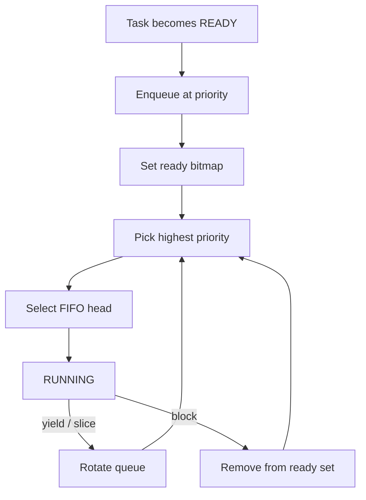

# `02-kernel-data-structures-host` — Cấu trúc dữ liệu kernel — Demo trên host

> **Môi trường:** Host only  
> **Source:** `examples/02-kernel-data-structures-host/main.c`  
> **Trọng tâm:** Intrusive ready/wait structures trên host

[← Root README](../../README.md)

## Mục lục

- [Mục tiêu và bản chất](#muc-tieu)
- [Build graph và cấu hình](#build-graph)
- [Luồng thực thi](#runtime)
- [API và ownership](#api)
- [Invariant / PASS criteria](#pass)
- [Debug và failure modes](#debug)
- [Validation](#validation)
- [Source map và references](#source-map)

<a id="muc-tieu"></a>
## Mục tiêu và bản chất

Chạy không cần MCU để chứng minh ready set chọn priority nhỏ nhất, FIFO rotation và wait list sắp theo priority.


<a id="build-graph"></a>
## Build graph và cấu hình

- Environment được CMake khai báo: **Host only**.
- Module được link cho example này: `hr_list`, `hr_scheduler`, `hr_wait (host sources)`.
- Target tham chiếu: `bluepill_f103c8` — STM32F103C8T6 / Cortex-M3 / 72 MHz nominal / USART1 115200 / LED PC13 active-low.

### CMake feature overrides

- Example dùng default config trừ những module/definition được khai báo trong `cmake/hairtos_examples.cmake`.

<a id="runtime"></a>
## Luồng thực thi




### Các chi tiết quan sát trực tiếp từ example

- Hiểu priority 0 là mức ưu tiên cao nhất.
- Quan sát ready queue FIFO giữa các node cùng priority.
- Quan sát wait list được sắp xếp theo priority và giữ FIFO khi bằng nhau.
- Kiểm tra structural invariants bằng hàm validate.
- Danh sách liên kết đôi intrusive.
- Ready bitmap và một FIFO queue cho mỗi priority.
- Owner pointer từ node trở về đối tượng chứa node.
- Host-native test không có ISR, task stack hoặc context switch.
- `hr_scheduler_internal.h`
- `hr_wait_internal.h`
- `hr_ready_set_init()`
- `hr_ready_set_insert()`
- `hr_ready_set_peek_highest()`
- `hr_ready_set_rotate_highest()`
- `hr_wait_list_insert()`
- `hr_*_validate()`
- `kernel/src/hr_list.c`
- `kernel/src/hr_scheduler.c`
- `communication` — Priority 1 — Phải được chọn trước hai sensor.
- `sensor-a` — Priority 3 — Đứng trước `sensor-b` theo FIFO ban đầu.
- `sensor-b` — Priority 3 — Lên đầu sau khi rotate queue priority 3.
- Ready set — `hr_ready_set_t` — Chọn highest priority và rotate FIFO.
- Wait list — `hr_wait_list_t` — Sắp waiter theo priority.
- Phần cứng — Không cần

<a id="api"></a>
## API và ownership

API được gọi trực tiếp trong `main.c` (đã trích từ source):

- `hr_list_node_owner()`
- `hr_ready_node_init()`
- `hr_ready_set_init()`
- `hr_ready_set_insert()`
- `hr_ready_set_peek_highest()`
- `hr_ready_set_remove()`
- `hr_ready_set_rotate_highest()`
- `hr_ready_set_validate()`
- `hr_wait_list_init()`
- `hr_wait_list_insert()`
- `hr_wait_list_peek()`
- `hr_wait_list_validate()`
- `hr_wait_node_init()`

Ownership cần nhớ:

- `hr_task_t`, stack, queue/semaphore/mutex/timer object và haievent storage trong examples đều là static/caller-owned.
- API kernel giữ pointer tới storage này sau create, vì vậy lifetime phải kéo dài toàn bộ thời gian object còn active.
- ISR path không được gọi blocking API. API `_from_isr` chỉ làm bounded work và trả `higher_priority_task_woken` để PendSV xử lý switch sau ISR.
- Dynamic haievent event từ pool dùng retain/release; static event không được framework tự free.

<a id="pass"></a>
## Invariant và PASS criteria

- Ready task xuất hiện đúng một lần trong ready set; node không được đồng thời nằm ở list khác.
- Selection không phụ thuộc thứ tự đăng ký giữa các priority khác nhau: priority nhỏ nhất đang có bit trong bitmap luôn thắng.
- Giữa các task cùng priority, thứ tự là FIFO; `yield`/time slice rotate hàng đợi cao nhất thay vì làm thay đổi priority.
- Preemption chỉ xảy ra khi có task READY với effective priority nhỏ hơn current task; peer cùng priority cần yield hoặc time slice để đổi lượt.
- Mọi thay đổi effective priority của task READY phải requeue ready node để bitmap/list phản ánh priority mới.

<a id="debug"></a>
## Debug và failure modes

- Highest-ready sai: kiểm tra priority ordering, ready bitmap và owner mapping của intrusive node.
- Round-robin sai sau `hr_ready_set_rotate_highest()`: kiểm tra FIFO links/count ở priority cao nhất.
- Wait-list head sai: kiểm tra effective-priority ordering và insert/remove invariants.
- Example chạy trên host; GDB có thể đặt breakpoint trực tiếp vào `hr_ready_set_*` và `hr_wait_list_*`, không cần OpenOCD.

<a id="validation"></a>
## Validation

- Host validation baseline: example này chạy trực tiếp trên host và PASS.
- Host validation baseline: `make TARGET=bluepill_f103c8 host-tests` PASS toàn bộ suite.

### Lệnh chuẩn

```bash
make TARGET=bluepill_f103c8 ENVIRONMENT=host EXAMPLE=02-kernel-data-structures-host run
```

<a id="source-map"></a>
## Source map và references

- `examples/02-kernel-data-structures-host/main.c`
- `cmake/hairtos_examples.cmake`
- `kernel/src/hr_scheduler.c`
- `kernel/internal/hr_scheduler_internal.h`
- `kernel/src/hr_kernel.c`
- `tests/host/test_ready_queue.c`
- `tests/host/test_scheduler_policy.c`
- `labs/memory-allocator/`

### Tài liệu tham khảo

- [Arm Cortex-M3 Technical Reference Manual](https://developer.arm.com/documentation/100165/latest/)
- [Arm Cortex-M3 Devices Generic User Guide](https://developer.arm.com/documentation/dui0552/latest/)

**Nguồn implementation trong repository:**
- `kernel/src/hr_scheduler.c`
- `kernel/internal/hr_scheduler_internal.h`
- `kernel/src/hr_kernel.c`
- `tests/host/test_ready_queue.c`
- `tests/host/test_scheduler_policy.c`
- `labs/memory-allocator/`
