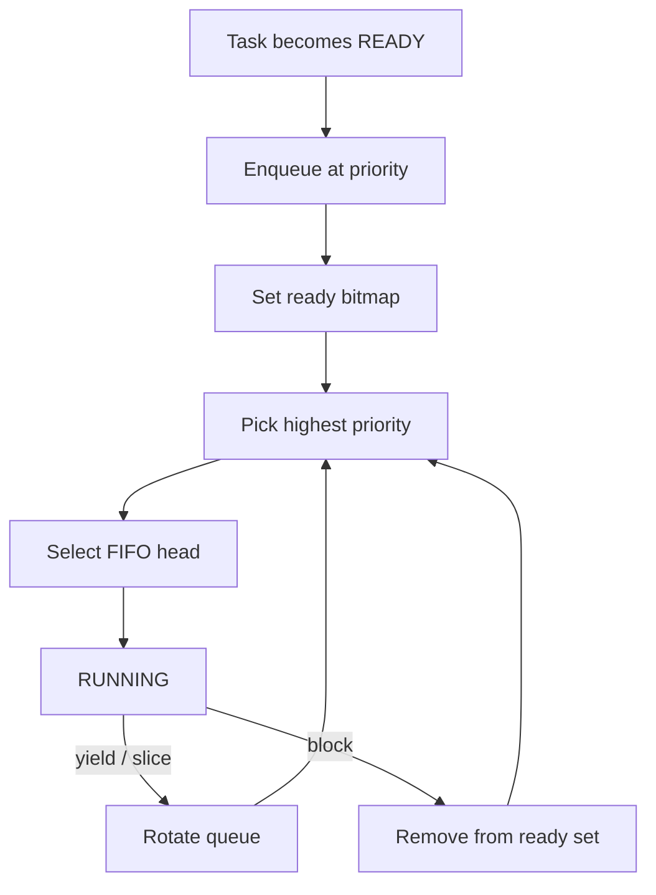

# `02-kernel-data-structures-host` — Kernel Data Structures — Host Demo

> **Environment:** Host only  
> **Source:** `examples/02-kernel-data-structures-host/main.c`  
> **Focus:** Intrusive ready/wait structures on the host

[← Root README](../../README.md)

## Table of Contents

- [Objective and Core Concept](#objective)
- [Build Graph and Configuration](#build-graph)
- [Runtime Flow](#runtime)
- [API and Ownership](#api)
- [Invariant / PASS criteria](#pass)
- [Debugging and Failure Modes](#debug)
- [Validation](#validation)
- [Source Map and References](#source-map)

<a id="objective"></a>
## Objective and Core Concept

Runs without an MCU to prove that the ready set selects the numerically lowest priority, preserves FIFO rotation, and orders wait lists by priority.


<a id="build-graph"></a>
## Build Graph and Configuration

- CMake declares this example as **Host only**.
- Modules linked for this example: `hr_list`, `hr_scheduler`, `hr_wait (host sources)`.
- Reference target: `bluepill_f103c8` — STM32F103C8T6 / Cortex-M3 / nominal 72 MHz / USART1 115200 / active-low PC13 LED.

### CMake feature overrides

- The example uses the default configuration except for modules/definitions explicitly declared in `cmake/hairtos_examples.cmake`.

<a id="runtime"></a>
## Runtime Flow




### Details Observed Directly in the Example

- Understand that priority 0 is the highest priority.
- Observe FIFO ready-queue ordering between nodes at the same priority.
- Observe a wait list sorted by priority while preserving FIFO order among equal-priority waiters.
- Validate structural invariants using the validator function.
- Intrusive doubly linked list.
- Ready bitmap plus one FIFO queue per priority.
- Owner pointer from an intrusive node back to its containing object.
- Host-native test with no ISR, task stack, or context switch.
- `hr_scheduler_internal.h`
- `hr_wait_internal.h`
- `hr_ready_set_init()`
- `hr_ready_set_insert()`
- `hr_ready_set_peek_highest()`
- `hr_ready_set_rotate_highest()`
- `hr_wait_list_insert()`
- `hr_*_validate()`
- `kernel/src/hr_list.c`
- `kernel/src/hr_scheduler.c`
- `communication` — Priority 1 — Must be selected before the two sensor nodes.
- `sensor-a` — Priority 3 — Initially precedes `sensor-b` by FIFO order.
- `sensor-b` — Priority 3 — Moves to the head after rotating priority-3 queue.
- Ready set — `hr_ready_set_t` — Selects highest priority and rotates FIFO order.
- Wait list — `hr_wait_list_t` — Orders waiters by priority.
- Hardware — Not required

<a id="api"></a>
## API and Ownership

APIs called directly from `main.c` (extracted from source):

- `hr_list_node_owner()`
- `hr_ready_node_init()`
- `hr_ready_set_init()`
- `hr_ready_set_insert()`
- `hr_ready_set_peek_highest()`
- `hr_ready_set_remove()`
- `hr_ready_set_rotate_highest()`
- `hr_ready_set_validate()`
- `hr_wait_list_init()`
- `hr_wait_list_insert()`
- `hr_wait_list_peek()`
- `hr_wait_list_validate()`
- `hr_wait_node_init()`

Ownership rules to keep in mind:

- `hr_task_t`, stacks, queue/semaphore/mutex/timer objects, and haievent storage in the examples are all static/caller-owned.
- Kernel APIs retain pointers to this storage after creation, so the storage lifetime must cover the entire period in which the object remains active.
- ISR paths must not call blocking APIs. `_from_isr` APIs perform bounded work and return `higher_priority_task_woken` so PendSV can perform any required switch after ISR exit.
- Dynamic haievent events allocated from a pool use retain/release semantics; static events are not freed automatically by the framework.

<a id="pass"></a>
## Invariants and PASS Criteria

- A READY task appears exactly once in the ready set; its node must not simultaneously belong to another list.
- Selection is independent of registration order across different priorities: the lowest-numbered priority whose bitmap bit is set always wins.
- Tasks at the same priority are ordered FIFO; `yield`/time slicing rotates the highest-priority ready queue rather than changing priority.
- Preemption occurs only when a READY task has a numerically lower effective priority than the current task; equal-priority peers require yield or time slicing to rotate execution.
- Any change to the effective priority of a READY task must requeue its ready node so the bitmap/list reflects the new priority.

<a id="debug"></a>
## Debugging and Failure Modes

- Incorrect highest-ready selection: inspect priority ordering, ready bitmap, and intrusive-node owner mapping.
- Incorrect round-robin after `hr_ready_set_rotate_highest()`: inspect FIFO links/count at the highest priority.
- Incorrect wait-list head: inspect effective-priority ordering and insert/remove invariants.
- This example runs on the host; GDB can break directly in `hr_ready_set_*` and `hr_wait_list_*` without OpenOCD.

<a id="validation"></a>
## Validation

- Host validation baseline: this example runs directly on the host and passes.
- Host validation baseline: `make TARGET=bluepill_f103c8 host-tests` passes the entire suite.

### Standard Commands

```bash
make TARGET=bluepill_f103c8 ENVIRONMENT=host EXAMPLE=02-kernel-data-structures-host run
```

<a id="source-map"></a>
## Source Map and References

- `examples/02-kernel-data-structures-host/main.c`
- `cmake/hairtos_examples.cmake`
- `kernel/src/hr_scheduler.c`
- `kernel/internal/hr_scheduler_internal.h`
- `kernel/src/hr_kernel.c`
- `tests/host/test_ready_queue.c`
- `tests/host/test_scheduler_policy.c`
- `labs/memory-allocator/`

### References

- [Arm Cortex-M3 Technical Reference Manual](https://developer.arm.com/documentation/100165/latest/)
- [Arm Cortex-M3 Devices Generic User Guide](https://developer.arm.com/documentation/dui0552/latest/)

**Implementation sources in the repository:**
- `kernel/src/hr_scheduler.c`
- `kernel/internal/hr_scheduler_internal.h`
- `kernel/src/hr_kernel.c`
- `tests/host/test_ready_queue.c`
- `tests/host/test_scheduler_policy.c`
- `labs/memory-allocator/`
