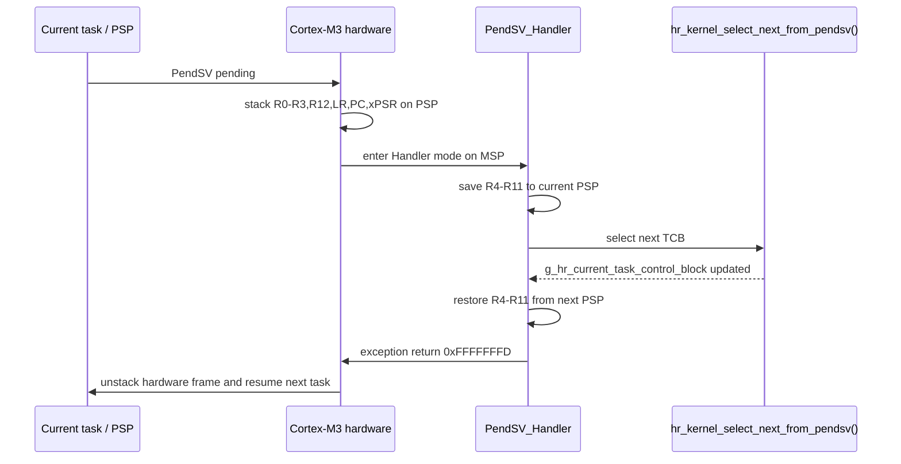

# `03-static-task-stack` — TCB tĩnh và ngăn xếp khởi tạo của tác vụ

> **Môi trường:** Target  
> **Source:** `examples/03-static-task-stack/main.c`  
> **Trọng tâm:** Static TCB và initial Cortex-M stack

[← Root README](../../README.md)

## Mục lục

- [Mục tiêu và bản chất](#muc-tieu)
- [Build graph và cấu hình](#build-graph)
- [Luồng thực thi](#runtime)
- [API và ownership](#api)
- [Invariant / PASS criteria](#pass)
- [Debug và failure modes](#debug)
- [Validation](#validation)
- [Source map và references](#source-map)

<a id="muc-tieu"></a>
## Mục tiêu và bản chất

Tạo task nhưng chưa start kernel; mục tiêu là kiểm tra object tĩnh, stack fill/guard và initial exception-compatible frame.

Example này không được hiểu như một application production. Nó cố ý cô lập một cơ chế để người học nhìn thấy **state transition và scheduling consequence** mà không bị che bởi middleware lớn. Những log/PASS check trong `main.c` là executable documentation: nếu invariant bị vi phạm, example gọi `board_panic()` hoặc trả failure trên host.

<a id="build-graph"></a>
## Build graph và cấu hình

- Environment được CMake khai báo: **Target**.
- Module được link cho example này: `platform`, `baremetal_tick`, `task_kernel`.
- Target tham chiếu: `bluepill_f103c8` — STM32F103C8T6 / Cortex-M3 / 72 MHz nominal / USART1 115200 / LED PC13 active-low.

### CMake feature overrides

- Example dùng default config trừ những module/definition được khai báo trong `cmake/hairtos_examples.cmake`.

<a id="runtime"></a>
## Luồng thực thi



Để hiểu runtime thật, đọc sơ đồ cùng `main.c` và module source. Các điểm chuyển task state/context không diễn ra trong application code đơn lẻ mà qua kernel + architecture port.

### Các chi tiết quan sát trực tiếp từ example

- Tạo opaque `hr_task_t` bằng API public.
- Cấp stack tĩnh từ application.
- Đưa task vào trạng thái CREATED và kiểm tra frame khởi tạo.
- Phân biệt tạo task với đăng ký/start task.
- TCB static-first.
- Stack fill và stack guard.
- Initial frame chứa R0–R3, R12, LR, PC, xPSR và vùng R4–R11.
- Task argument được đặt vào R0 để dùng khi task bắt đầu.
- `board.h`
- `hairtos/hr_task.h`
- `hr_task_create_static()`
- `board_delay_ms()`
- `platform`
- `baremetal_tick`
- `task_kernel`
- Thông báo tạo task thành công xuất hiện.
- Main vẫn nháy LED; không có dấu hiệu `demo_task()` đã chạy.
- Build map cho thấy TCB và stack nằm trong RAM tĩnh.
- Phần cứng — STM32F103C8T6 Blue Pill — Chạy firmware target.
- Nạp/debug — ST-Link V2 qua SWD — Dùng OpenOCD để flash, verify và reset.
- UART — USART1, PA9 TX / PA10 RX, 115200 8-N-1 — Theo dõi log và trạng thái PASS/FAIL.
- LED — PC13, active-low — Hiển thị heartbeat hoặc trạng thái quan sát.
- Task `demo` — Priority 2, stack 96 words — Nhận con trỏ `counter` nhưng không được thực thi trong bài này.
- TCB — `g_demo_task` — Opaque public storage.

<a id="api"></a>
## API và ownership

API được gọi trực tiếp trong `main.c` (đã trích từ source):

- `board_delay_ms()`
- `board_init()`
- `board_led_toggle()`
- `board_uart_write_line()`
- `hr_task_create_static()`

Ownership cần nhớ:

- `hr_task_t`, stack, queue/semaphore/mutex/timer object và haievent storage trong examples đều là static/caller-owned.
- API kernel giữ pointer tới storage này sau create, vì vậy lifetime phải kéo dài toàn bộ thời gian object còn active.
- ISR path không được gọi blocking API. API `_from_isr` chỉ làm bounded work và trả `higher_priority_task_woken` để PendSV xử lý switch sau ISR.
- Dynamic haievent event từ pool dùng retain/release; static event không được framework tự free.

<a id="pass"></a>
## Invariant và PASS criteria

- TCB đặt `stack_pointer` ở offset 0 và có `_Static_assert` để assembly có thể load/store saved PSP mà không cần biết layout C còn lại.
- Initial stack frame được dựng giống exception-return frame thật; top stack được align xuống 8 byte.
- Thread mode sau SVC chạy privileged với PSP (`CONTROL.SPSEL=1`); handler mode tiếp tục dùng MSP.
- PendSV được cấu hình priority thấp nhất để việc chọn next task không cắt ngang exception quan trọng hơn.
- Port hiện không lưu FPU context vì `HR_CFG_USE_FPU=0` và target Cortex-M3 không có FPU.

Các check/log cứng trong source:

- `Task creation failed.`

<a id="debug"></a>
## Debug và failure modes

- Nếu target treo trong `board_panic()`, xem UART log ngay trước đó rồi attach GDB/OpenOCD để kiểm tra current task, PSP/MSP, ready bitmap và fault record nếu diagnostics bật.
- Nếu behavior sai chỉ khi optimize/timing thay đổi, kiểm tra race giữa task/ISR, critical-section scope và việc log UART làm nhiễu thời gian.
- Nếu task không chạy, phân biệt CREATED/READY/BLOCKED/SUSPENDED và kiểm tra task có được `hr_task_start()` hay không.
- Nếu wake không xảy ra, kiểm tra cả object wait list lẫn timeout node; một wake path không được để node stale trong structure còn lại.
- Target log là evidence runtime; build PASS chỉ là evidence compile/link.

<a id="validation"></a>
## Validation

- Example là target-only trong CMake. Môi trường audit không có `arm-none-eabi-gcc`/OpenOCD nên không tuyên bố đã build/flash lại target.
- `make TARGET=bluepill_f103c8 host-tests` đã PASS toàn bộ host suite trong audit tài liệu này.

### Lệnh chuẩn

```bash
make TARGET=bluepill_f103c8 EXAMPLE=03-static-task-stack build
make TARGET=bluepill_f103c8 EXAMPLE=03-static-task-stack run
make TARGET=bluepill_f103c8 EXAMPLE=03-static-task-stack check
```

<a id="source-map"></a>
## Source map và references

- `examples/03-static-task-stack/main.c`
- `cmake/hairtos_examples.cmake`
- `arch/arm/cortex-m3/hr_portasm.S`
- `arch/arm/cortex-m3/hr_port_stack.c`
- `arch/arm/cortex-m3/hr_port.c`
- `kernel/internal/hr_task_internal.h`
- `tests/host/test_port_stack.c`

### Tài liệu tham khảo

- [Arm Cortex-M3 Technical Reference Manual](https://developer.arm.com/documentation/100165/latest/)
- [Arm Cortex-M3 Devices Generic User Guide](https://developer.arm.com/documentation/dui0552/latest/)

**Nguồn implementation trong repository:**
- `arch/arm/cortex-m3/hr_portasm.S`
- `arch/arm/cortex-m3/hr_port_stack.c`
- `arch/arm/cortex-m3/hr_port.c`
- `kernel/internal/hr_task_internal.h`
- `tests/host/test_port_stack.c`
