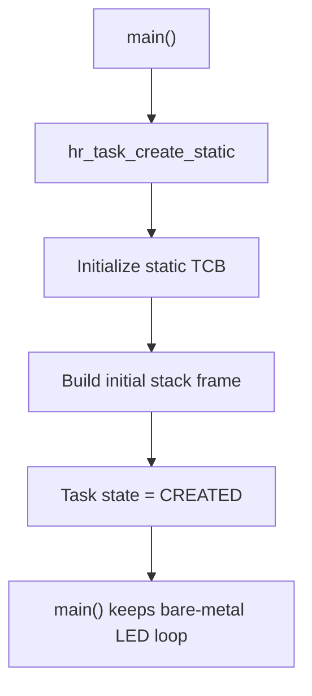

# `03-static-task-stack` — Static TCB and Initial Task Stack

> **Environment:** Target  
> **Source:** `examples/03-static-task-stack/main.c`  
> **Focus:** Static TCB and initial Cortex-M stack

[← Root README](../../README.md)

## Table of Contents

- [Objective and Core Concept](#objective)
- [Build Graph and Configuration](#build-graph)
- [Runtime Flow](#runtime)
- [API and Ownership](#api)
- [Invariant / PASS criteria](#pass)
- [Debugging and Failure Modes](#debug)
- [Validation](#validation)
- [Source Map and References](#source-map)

<a id="objective"></a>
## Objective and Core Concept

Create a task without starting the kernel; the goal is to verify static object storage, stack fill/guard behavior, and the initial exception-compatible frame.


<a id="build-graph"></a>
## Build Graph and Configuration

- CMake declares this example as a **Target** environment.
- Modules linked for this example: `platform`, `baremetal_tick`, `task_kernel`.
- Reference target: `bluepill_f103c8` — STM32F103C8T6 / Cortex-M3 / nominal 72 MHz / USART1 115200 / active-low PC13 LED.

### CMake feature overrides

- The example uses the default configuration except for modules/definitions explicitly declared in `cmake/hairtos_examples.cmake`.

<a id="runtime"></a>
## Runtime Flow



`demo_task()` is not scheduled in this example. The objective is to validate object/stack construction before the SVC startup stage introduced in example 04.

### Details Observed Directly in the Example

- Create an opaque `hr_task_t` through the public API.
- Provide static stack storage from the application.
- Place the task in CREATED state and inspect the initial frame.
- Distinguish task creation from task registration/start.
- TCB static-first.
- Stack fill and stack guard.
- The initial frame contains R0–R3, R12, LR, PC, xPSR, plus the R4–R11 save area.
- The task argument is placed in R0 for use when the task eventually starts.
- `board.h`
- `hairtos/hr_task.h`
- `hr_task_create_static()`
- `board_delay_ms()`
- `platform`
- `baremetal_tick`
- `task_kernel`
- A successful task-creation message appears.
- The main loop continues blinking the LED; there is no evidence that `demo_task()` has executed.
- The build map shows the TCB and stack in static RAM.
- Hardware — STM32F103C8T6 Blue Pill — Runs the target firmware.
- Flash/debug — ST-Link V2 over SWD — OpenOCD is used to flash, verify, and reset the target.
- UART — USART1, PA9 TX / PA10 RX, 115200 8-N-1 — Observes logs and PASS/FAIL status.
- LED — PC13, active-low — Displays heartbeat or observable status.
- Task `demo` — Priority 2, stack 96 words — Receives a `counter` pointer but is not executed in this example.
- TCB — `g_demo_task` — Opaque public storage.

<a id="api"></a>
## API and Ownership

APIs called directly from `main.c` (extracted from source):

- `board_delay_ms()`
- `board_init()`
- `board_led_toggle()`
- `board_uart_write_line()`
- `hr_task_create_static()`

Ownership rules to keep in mind:

- `hr_task_t`, stacks, queue/semaphore/mutex/timer objects, and haievent storage in the examples are all static/caller-owned.
- Kernel APIs retain pointers to this storage after creation, so the storage lifetime must cover the entire period in which the object remains active.
- ISR paths must not call blocking APIs. `_from_isr` APIs perform bounded work and return `higher_priority_task_woken` so PendSV can perform any required switch after ISR exit.
- Dynamic haievent events allocated from a pool use retain/release semantics; static events are not freed automatically by the framework.

<a id="pass"></a>
## Invariants and PASS Criteria

- The TCB places `stack_pointer` at offset 0 and uses `_Static_assert` so assembly can load/store the saved PSP without knowing the rest of the C layout.
- The initial stack frame is constructed to match a real exception-return frame; the top of stack is aligned down to 8 bytes.
- After SVC, Thread mode runs privileged using PSP (`CONTROL.SPSEL=1`); Handler mode continues using MSP.
- PendSV is configured at the lowest priority so next-task selection cannot preempt more important exceptions.
- The current port does not save FPU context because `HR_CFG_USE_FPU=0` and the Cortex-M3 reference target has no FPU.

Hard-coded checks/logs in the source:

- `Task creation failed.`

<a id="debug"></a>
## Debugging and Failure Modes

- `hr_task_create_static()` fails: inspect object/stack pointers, stack size, and alignment contract.
- Incorrect initial frame: inspect `hr_port_stack_initialize()`, the xPSR Thumb bit, PC/LR, and the argument in R0.
- `demo_task()` must not run at this stage; if it does, the CREATED → RUNNING boundary has been violated.
- The LED loop in `main()` must continue running after the task object is created.

<a id="validation"></a>
## Validation

- This example is target-only in CMake; host evidence does not replace ARM cross-build, OpenOCD, and hardware validation.
- Host validation baseline: `make TARGET=bluepill_f103c8 host-tests` passes the entire suite.

### Standard Commands

```bash
make TARGET=bluepill_f103c8 EXAMPLE=03-static-task-stack build
make TARGET=bluepill_f103c8 EXAMPLE=03-static-task-stack run
make TARGET=bluepill_f103c8 EXAMPLE=03-static-task-stack check
```

<a id="source-map"></a>
## Source Map and References

- `examples/03-static-task-stack/main.c`
- `cmake/hairtos_examples.cmake`
- `arch/arm/cortex-m3/hr_portasm.S`
- `arch/arm/cortex-m3/hr_port_stack.c`
- `arch/arm/cortex-m3/hr_port.c`
- `kernel/internal/hr_task_internal.h`
- `tests/host/test_port_stack.c`

### References

- [Arm Cortex-M3 Technical Reference Manual](https://developer.arm.com/documentation/100165/latest/)
- [Arm Cortex-M3 Devices Generic User Guide](https://developer.arm.com/documentation/dui0552/latest/)

**Implementation sources in the repository:**
- `arch/arm/cortex-m3/hr_portasm.S`
- `arch/arm/cortex-m3/hr_port_stack.c`
- `arch/arm/cortex-m3/hr_port.c`
- `kernel/internal/hr_task_internal.h`
- `tests/host/test_port_stack.c`
