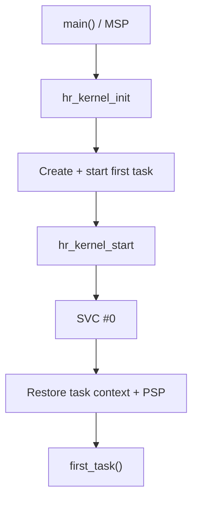

# `04-start-first-task` — Khởi chạy tác vụ đầu tiên bằng SVC

> **Môi trường:** Target  
> **Source:** `examples/04-start-first-task/main.c`  
> **Trọng tâm:** SVC startup và PSP

[← Root README](../../README.md)

## Mục lục

- [Mục tiêu và bản chất](#muc-tieu)
- [Build graph và cấu hình](#build-graph)
- [Luồng thực thi](#runtime)
- [API và ownership](#api)
- [Invariant / PASS criteria](#pass)
- [Debug và failure modes](#debug)
- [Validation](#validation)
- [Source map và references](#source-map)

<a id="muc-tieu"></a>
## Mục tiêu và bản chất

Kernel tạo idle + first task, SVC chuyển từ main/MSP sang Thread mode/PSP và kiểm tra argument R0 được phục hồi.


<a id="build-graph"></a>
## Build graph và cấu hình

- Environment được CMake khai báo: **Target**.
- Module được link cho example này: `platform`, `baremetal_tick`, `task_kernel`, `kernel_runtime`.
- Target tham chiếu: `bluepill_f103c8` — STM32F103C8T6 / Cortex-M3 / 72 MHz nominal / USART1 115200 / LED PC13 active-low.

### Compile-time / source constants

| Symbol | Giá trị trong `main.c` |
| --- | --- |
| `FIRST_TASK_ARGUMENT_MAGIC` | `0x50483421UL` |

### CMake feature overrides

- Example dùng default config trừ những module/definition được khai báo trong `cmake/hairtos_examples.cmake`.

<a id="runtime"></a>
## Luồng thực thi



SVC là boundary chuyển từ startup context dùng MSP sang Thread mode dùng PSP. Nếu startup thành công, `hr_kernel_start()` không quay lại `main()`.

### Các chi tiết quan sát trực tiếp từ example

- Khởi tạo kernel và idle task.
- Đăng ký một application task vào ready set.
- Khởi chạy scheduler bằng `hr_kernel_start()`.
- Xác nhận argument được restore qua R0 và Thread mode dùng PSP.
- SVC là exception chuyển quyền từ startup code sang kernel port.
- MSP dùng cho exception/handler; PSP dùng cho task Thread mode.
- Exception return `0xFFFFFFFD` khôi phục hardware frame từ PSP.
- `main()` không được quay lại sau khi kernel start thành công.
- `hairtos/hr_kernel.h`
- `hairtos/hr_task.h`
- `hr_port.h`
- `hr_kernel_init()`
- `hr_task_create_static()`
- `hr_task_start()`
- `hr_kernel_start()`
- `hr_task_current()`
- `hr_task_get_name()`
- `task_kernel`
- Phần cứng — STM32F103C8T6 Blue Pill — Chạy firmware target.
- Nạp/debug — ST-Link V2 qua SWD — Dùng OpenOCD để flash, verify và reset.
- UART — USART1, PA9 TX / PA10 RX, 115200 8-N-1 — Theo dõi log và trạng thái PASS/FAIL.
- LED — PC13, active-low — Hiển thị heartbeat hoặc trạng thái quan sát.
- Task `first-task` — Priority 2, stack 128 words — Task application đầu tiên.
- Idle task — Priority thấp nhất, tạo nội bộ — Fallback khi không có task application READY.

<a id="api"></a>
## API và ownership

API được gọi trực tiếp trong `main.c` (đã trích từ source):

- `board_delay_ms()`
- `board_init()`
- `board_led_toggle()`
- `board_panic()`
- `board_uart_write_line()`
- `board_uart_write_string()`
- `board_uart_write_u32()`
- `hr_kernel_init()`
- `hr_kernel_start()`
- `hr_port_thread_uses_psp()`
- `hr_task_create_static()`
- `hr_task_current()`
- `hr_task_get_name()`
- `hr_task_start()`

Ownership cần nhớ:

- `hr_task_t`, stack, queue/semaphore/mutex/timer object và haievent storage trong examples đều là static/caller-owned.
- API kernel giữ pointer tới storage này sau create, vì vậy lifetime phải kéo dài toàn bộ thời gian object còn active.
- ISR path không được gọi blocking API. API `_from_isr` chỉ làm bounded work và trả `higher_priority_task_woken` để PendSV xử lý switch sau ISR.
- Dynamic haievent event từ pool dùng retain/release; static event không được framework tự free.

<a id="pass"></a>
## Invariant và PASS criteria

- TCB đặt `stack_pointer` ở offset 0 và có `_Static_assert` để assembly có thể load/store saved PSP mà không cần biết layout C còn lại.
- Initial stack frame được dựng giống exception-return frame thật; top stack được align xuống 8 byte.
- Thread mode sau SVC chạy privileged với PSP (`CONTROL.SPSEL=1`); handler mode tiếp tục dùng MSP.
- PendSV được cấu hình priority thấp nhất để việc chọn next task không cắt ngang exception quan trọng hơn.
- Port hiện không lưu FPU context vì `HR_CFG_USE_FPU=0` và target Cortex-M3 không có FPU.

Các check/log cứng trong source:

- `ERROR: Thread mode is not using PSP.`
- `ERROR: task argument was not restored in R0.`
- `First-task startup: PASS`
- `Kernel initialization failed.`
- `First task creation failed.`
- `First task registration failed.`
- `ERROR: hr_kernel_start returned status=`

<a id="debug"></a>
## Debug và failure modes

- `hr_kernel_start()` trả về là failure path; startup thành công phải chuyển hẳn vào first task.
- Fault khi vào SVC: kiểm tra vector table, SVC handler và initial task frame.
- `hr_port_thread_uses_psp()` false: kiểm tra CONTROL/PSP và exception-return value.
- Task argument sai: kiểm tra R0 trong initial hardware frame được tạo ở task creation.

<a id="validation"></a>
## Validation

- Example là target-only trong CMake; host evidence không thay thế ARM cross-build, OpenOCD và hardware validation.
- Host validation baseline: `make TARGET=bluepill_f103c8 host-tests` PASS toàn bộ suite.

### Lệnh chuẩn

```bash
make TARGET=bluepill_f103c8 EXAMPLE=04-start-first-task build
make TARGET=bluepill_f103c8 EXAMPLE=04-start-first-task run
make TARGET=bluepill_f103c8 EXAMPLE=04-start-first-task check
```

<a id="source-map"></a>
## Source map và references

- `examples/04-start-first-task/main.c`
- `cmake/hairtos_examples.cmake`
- `arch/arm/cortex-m3/hr_portasm.S`
- `arch/arm/cortex-m3/hr_port_stack.c`
- `arch/arm/cortex-m3/hr_port.c`
- `kernel/internal/hr_task_internal.h`
- `tests/host/test_port_stack.c`

### Tài liệu tham khảo

- [Arm Cortex-M3 Technical Reference Manual](https://developer.arm.com/documentation/100165/latest/)
- [Arm Cortex-M3 Devices Generic User Guide](https://developer.arm.com/documentation/dui0552/latest/)

**Nguồn implementation trong repository:**
- `arch/arm/cortex-m3/hr_portasm.S`
- `arch/arm/cortex-m3/hr_port_stack.c`
- `arch/arm/cortex-m3/hr_port.c`
- `kernel/internal/hr_task_internal.h`
- `tests/host/test_port_stack.c`
