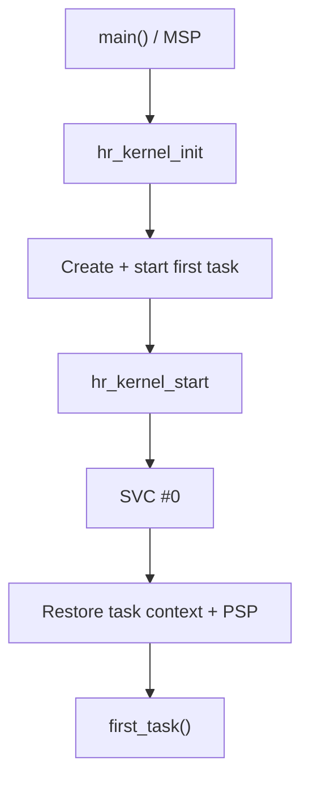

# `04-start-first-task` — Starting the First Task with SVC

> **Environment:** Target  
> **Source:** `examples/04-start-first-task/main.c`  
> **Focus:** SVC startup and PSP

[← Root README](../../README.md)

## Table of Contents

- [Objective and Core Concept](#objective)
- [Build Graph and Configuration](#build-graph)
- [Runtime Flow](#runtime)
- [API and Ownership](#api)
- [Invariant / PASS criteria](#pass)
- [Debugging and Failure Modes](#debug)
- [Validation](#validation)
- [Source Map and References](#source-map)

<a id="objective"></a>
## Objective and Core Concept

The kernel creates idle + first task, SVC transitions from main/MSP to Thread mode/PSP, and the example verifies that argument R0 is restored.


<a id="build-graph"></a>
## Build Graph and Configuration

- CMake declares this example as a **Target** environment.
- Modules linked for this example: `platform`, `baremetal_tick`, `task_kernel`, `kernel_runtime`.
- Reference target: `bluepill_f103c8` — STM32F103C8T6 / Cortex-M3 / nominal 72 MHz / USART1 115200 / active-low PC13 LED.

### Compile-time / source constants

| Symbol | Value in `main.c` |
| --- | --- |
| `FIRST_TASK_ARGUMENT_MAGIC` | `0x50483421UL` |

### CMake feature overrides

- The example uses the default configuration except for modules/definitions explicitly declared in `cmake/hairtos_examples.cmake`.

<a id="runtime"></a>
## Runtime Flow



SVC is the boundary that transitions from startup context using MSP to Thread mode using PSP. If startup succeeds, `hr_kernel_start()` never returns to `main()`.

### Details Observed Directly in the Example

- Initialize the kernel and idle task.
- Register one application task in the ready set.
- Start the scheduler with `hr_kernel_start()`.
- Verify that the argument is restored through R0 and Thread mode uses PSP.
- SVC is the exception that transfers control from startup code to the kernel port.
- MSP is used by exceptions/handlers; PSP is used by task Thread mode.
- Exception return value `0xFFFFFFFD` restores the hardware frame from PSP.
- `main()` must not resume after a successful kernel start.
- `hairtos/hr_kernel.h`
- `hairtos/hr_task.h`
- `hr_port.h`
- `hr_kernel_init()`
- `hr_task_create_static()`
- `hr_task_start()`
- `hr_kernel_start()`
- `hr_task_current()`
- `hr_task_get_name()`
- `task_kernel`
- Hardware — STM32F103C8T6 Blue Pill — Runs the target firmware.
- Flash/debug — ST-Link V2 over SWD — OpenOCD is used to flash, verify, and reset the target.
- UART — USART1, PA9 TX / PA10 RX, 115200 8-N-1 — Observes logs and PASS/FAIL status.
- LED — PC13, active-low — Displays heartbeat or observable status.
- Task `first-task` — Priority 2, stack 128 words — First application task.
- Idle task — Lowest priority, created internally — Fallback when no application task is READY.

<a id="api"></a>
## API and Ownership

APIs called directly from `main.c` (extracted from source):

- `board_delay_ms()`
- `board_init()`
- `board_led_toggle()`
- `board_panic()`
- `board_uart_write_line()`
- `board_uart_write_string()`
- `board_uart_write_u32()`
- `hr_kernel_init()`
- `hr_kernel_start()`
- `hr_port_thread_uses_psp()`
- `hr_task_create_static()`
- `hr_task_current()`
- `hr_task_get_name()`
- `hr_task_start()`

Ownership rules to keep in mind:

- `hr_task_t`, stacks, queue/semaphore/mutex/timer objects, and haievent storage in the examples are all static/caller-owned.
- Kernel APIs retain pointers to this storage after creation, so the storage lifetime must cover the entire period in which the object remains active.
- ISR paths must not call blocking APIs. `_from_isr` APIs perform bounded work and return `higher_priority_task_woken` so PendSV can perform any required switch after ISR exit.
- Dynamic haievent events allocated from a pool use retain/release semantics; static events are not freed automatically by the framework.

<a id="pass"></a>
## Invariants and PASS Criteria

- The TCB places `stack_pointer` at offset 0 and uses `_Static_assert` so assembly can load/store the saved PSP without knowing the rest of the C layout.
- The initial stack frame is constructed to match a real exception-return frame; the top of stack is aligned down to 8 bytes.
- After SVC, Thread mode runs privileged using PSP (`CONTROL.SPSEL=1`); Handler mode continues using MSP.
- PendSV is configured at the lowest priority so next-task selection cannot preempt more important exceptions.
- The current port does not save FPU context because `HR_CFG_USE_FPU=0` and the Cortex-M3 reference target has no FPU.

Hard-coded checks/logs in the source:

- `ERROR: Thread mode is not using PSP.`
- `ERROR: task argument was not restored in R0.`
- `First-task startup: PASS`
- `Kernel initialization failed.`
- `First task creation failed.`
- `First task registration failed.`
- `ERROR: hr_kernel_start returned status=`

<a id="debug"></a>
## Debugging and Failure Modes

- `hr_kernel_start()` returning is a failure path; successful startup must transfer permanently into the first task.
- Fault on SVC entry: inspect the vector table, SVC handler, and initial task frame.
- `hr_port_thread_uses_psp()` is false: inspect CONTROL/PSP setup and the exception-return value.
- Incorrect task argument: inspect R0 in the initial hardware frame created during task creation.

<a id="validation"></a>
## Validation

- This example is target-only in CMake; host evidence does not replace ARM cross-build, OpenOCD, and hardware validation.
- Host validation baseline: `make TARGET=bluepill_f103c8 host-tests` passes the entire suite.

### Standard Commands

```bash
make TARGET=bluepill_f103c8 EXAMPLE=04-start-first-task build
make TARGET=bluepill_f103c8 EXAMPLE=04-start-first-task run
make TARGET=bluepill_f103c8 EXAMPLE=04-start-first-task check
```

<a id="source-map"></a>
## Source Map and References

- `examples/04-start-first-task/main.c`
- `cmake/hairtos_examples.cmake`
- `arch/arm/cortex-m3/hr_portasm.S`
- `arch/arm/cortex-m3/hr_port_stack.c`
- `arch/arm/cortex-m3/hr_port.c`
- `kernel/internal/hr_task_internal.h`
- `tests/host/test_port_stack.c`

### References

- [Arm Cortex-M3 Technical Reference Manual](https://developer.arm.com/documentation/100165/latest/)
- [Arm Cortex-M3 Devices Generic User Guide](https://developer.arm.com/documentation/dui0552/latest/)

**Implementation sources in the repository:**
- `arch/arm/cortex-m3/hr_portasm.S`
- `arch/arm/cortex-m3/hr_port_stack.c`
- `arch/arm/cortex-m3/hr_port.c`
- `kernel/internal/hr_task_internal.h`
- `tests/host/test_port_stack.c`
