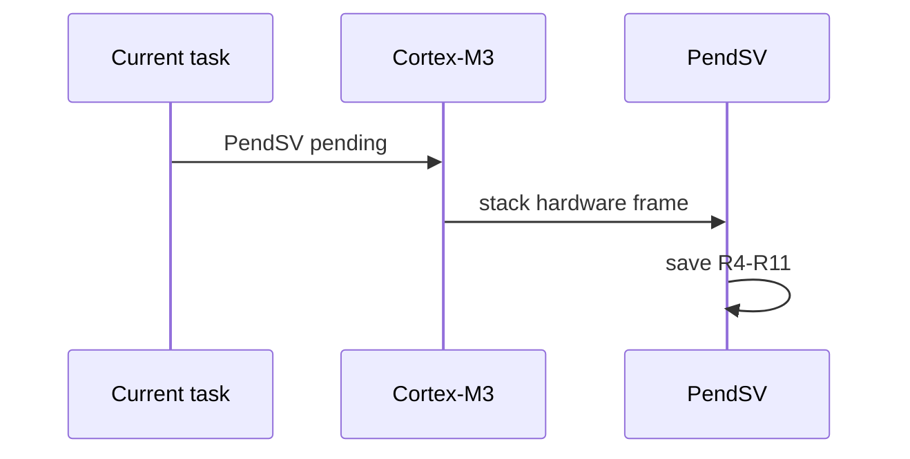
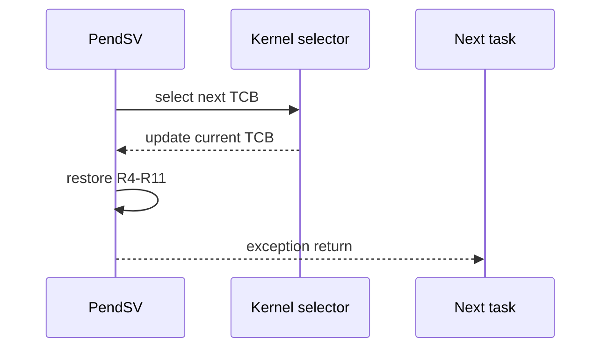

# `05-cooperative-context-switch` — Cooperative Context Switching

> **Environment:** Target  
> **Source:** `examples/05-cooperative-context-switch/main.c`  
> **Focus:** Cooperative PendSV context switching

[← Root README](../../README.md)

## Table of Contents

- [Objective and Core Concept](#objective)
- [Build Graph and Configuration](#build-graph)
- [Runtime Flow](#runtime)
- [API and Ownership](#api)
- [Invariant / PASS criteria](#pass)
- [Debugging and Failure Modes](#debug)
- [Validation](#validation)
- [Source Map and References](#source-map)

<a id="objective"></a>
## Objective and Core Concept

Two equal-priority tasks call yield explicitly; stack-local counters/cookies demonstrate preservation of R4–R11 plus the hardware frame.


<a id="build-graph"></a>
## Build Graph and Configuration

- CMake declares this example as a **Target** environment.
- Modules linked for this example: `platform`, `baremetal_tick`, `task_kernel`, `kernel_runtime`.
- Reference target: `bluepill_f103c8` — STM32F103C8T6 / Cortex-M3 / nominal 72 MHz / USART1 115200 / active-low PC13 LED.

### Compile-time / source constants

| Symbol | Value in `main.c` |
| --- | --- |
| `COOPERATIVE_TASK_PRIORITY` | `2U` |
| `TASK_STACK_WORDS` | `160U` |
| `TASK_PRINT_DELAY_MS` | `250U` |

### CMake feature overrides

- The example uses the default configuration except for modules/definitions explicitly declared in `cmake/hairtos_examples.cmake`.

<a id="runtime"></a>
## Runtime Flow

**Exception entry and software save**



**Task selection and restore**




### Details Observed Directly in the Example

- Save PSP and R4–R11 for the running task.
- Restore the next task's context.
- Verify that each task's local variables and stack cookie are preserved.
- Understand cooperative scheduling: a task switches only when it yields explicitly.
- Hardware automatically stacks R0–R3, R12, LR, PC, and xPSR.
- Port assembly stack/unstack R4–R11.
- The TCB stores the saved PSP.
- The equal-priority FIFO is rotated on yield.
- `hairtos/hr_kernel.h`
- `hairtos/hr_task.h`
- `hr_port.h`
- `hr_task_yield()`
- `hr_task_current()`
- `hr_kernel_start()`
- `task_kernel`
- `kernel_runtime`
- `baremetal_tick`
- A/B output alternates consistently.
- Hardware — STM32F103C8T6 Blue Pill — Runs the target firmware.
- Flash/debug — ST-Link V2 over SWD — OpenOCD is used to flash, verify, and reset the target.
- UART — USART1, PA9 TX / PA10 RX, 115200 8-N-1 — Observes logs and PASS/FAIL status.
- LED — PC13, active-low — Displays heartbeat or observable status.
- `task-a` — Priority 2, stack 160 words — Counter starts at 0 and increments by 1.
- `task-b` — Priority 2, stack 160 words — Counter starts at 1000 and increments by 10.

<a id="api"></a>
## API and Ownership

APIs called directly from `main.c` (extracted from source):

- `board_delay_ms()`
- `board_init()`
- `board_led_toggle()`
- `board_panic()`
- `board_uart_write_line()`
- `board_uart_write_string()`
- `board_uart_write_u32()`
- `hr_kernel_init()`
- `hr_kernel_start()`
- `hr_port_thread_uses_psp()`
- `hr_task_create_static()`
- `hr_task_current()`
- `hr_task_start()`
- `hr_task_yield()`

Ownership rules to keep in mind:

- `hr_task_t`, stacks, queue/semaphore/mutex/timer objects, and haievent storage in the examples are all static/caller-owned.
- Kernel APIs retain pointers to this storage after creation, so the storage lifetime must cover the entire period in which the object remains active.
- ISR paths must not call blocking APIs. `_from_isr` APIs perform bounded work and return `higher_priority_task_woken` so PendSV can perform any required switch after ISR exit.
- Dynamic haievent events allocated from a pool use retain/release semantics; static events are not freed automatically by the framework.

<a id="pass"></a>
## Invariants and PASS Criteria

- The TCB places `stack_pointer` at offset 0 and uses `_Static_assert` so assembly can load/store the saved PSP without knowing the rest of the C layout.
- The initial stack frame is constructed to match a real exception-return frame; the top of stack is aligned down to 8 bytes.
- After SVC, Thread mode runs privileged using PSP (`CONTROL.SPSEL=1`); Handler mode continues using MSP.
- PendSV is configured at the lowest priority so next-task selection cannot preempt more important exceptions.
- The current port does not save FPU context because `HR_CFG_USE_FPU=0` and the Cortex-M3 reference target has no FPU.

Hard-coded checks/logs in the source:

- `ERROR: wrong current task in `
- `ERROR: cooperative task is not using PSP.`
- `ERROR: task A stack-local state was corrupted.`
- `ERROR: task B stack-local state was corrupted.`
- `Kernel initialization failed.`
- `Task A creation failed.`
- `Task B creation failed.`
- `Task registration failed.`
- `ERROR: hr_kernel_start returned status=`

<a id="debug"></a>
## Debugging and Failure Modes

- Tasks A/B do not alternate after `hr_task_yield()`: inspect PendSV pending state, ready-FIFO rotation, and scheduler selection.
- Stack-local counter is corrupted: inspect each task's PSP and the save/restore of R4–R11.
- Current-task check fails: inspect `g_hr_current_task_control_block` after scheduler selection.
- UART logging and `board_delay_ms()` are only for observation; the cooperative switch occurs at `hr_task_yield()`.

<a id="validation"></a>
## Validation

- This example is target-only in CMake; host evidence does not replace ARM cross-build, OpenOCD, and hardware validation.
- Host validation baseline: `make TARGET=bluepill_f103c8 host-tests` passes the entire suite.

### Standard Commands

```bash
make TARGET=bluepill_f103c8 EXAMPLE=05-cooperative-context-switch build
make TARGET=bluepill_f103c8 EXAMPLE=05-cooperative-context-switch run
make TARGET=bluepill_f103c8 EXAMPLE=05-cooperative-context-switch check
```

<a id="source-map"></a>
## Source Map and References

- `examples/05-cooperative-context-switch/main.c`
- `cmake/hairtos_examples.cmake`
- `arch/arm/cortex-m3/hr_portasm.S`
- `arch/arm/cortex-m3/hr_port_stack.c`
- `arch/arm/cortex-m3/hr_port.c`
- `kernel/internal/hr_task_internal.h`
- `tests/host/test_port_stack.c`

### References

- [Arm Cortex-M3 Technical Reference Manual](https://developer.arm.com/documentation/100165/latest/)
- [Arm Cortex-M3 Devices Generic User Guide](https://developer.arm.com/documentation/dui0552/latest/)

**Implementation sources in the repository:**
- `arch/arm/cortex-m3/hr_portasm.S`
- `arch/arm/cortex-m3/hr_port_stack.c`
- `arch/arm/cortex-m3/hr_port.c`
- `kernel/internal/hr_task_internal.h`
- `tests/host/test_port_stack.c`
