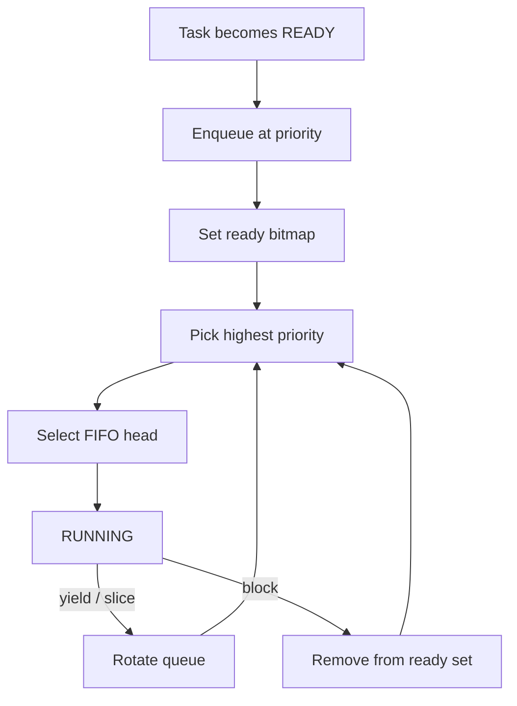

# `06-priority-scheduler` — Fixed-Priority Scheduler

> **Environment:** Target  
> **Source:** `examples/06-priority-scheduler/main.c`  
> **Focus:** Fixed-priority scheduling + equal-priority yield

[← Root README](../../README.md)

## Table of Contents

- [Objective and Core Concept](#objective)
- [Build Graph and Configuration](#build-graph)
- [Runtime Flow](#runtime)
- [API and Ownership](#api)
- [Invariant / PASS criteria](#pass)
- [Debugging and Failure Modes](#debug)
- [Validation](#validation)
- [Source Map and References](#source-map)

<a id="objective"></a>
## Objective and Core Concept

The low-priority task is registered first but must not run while high-priority tasks are READY; two equal-priority high tasks rotate using yield.


<a id="build-graph"></a>
## Build Graph and Configuration

- CMake declares this example as a **Target** environment.
- Modules linked for this example: `platform`, `baremetal_tick`, `task_kernel`, `kernel_runtime`.
- Reference target: `bluepill_f103c8` — STM32F103C8T6 / Cortex-M3 / nominal 72 MHz / USART1 115200 / active-low PC13 LED.

### Compile-time / source constants

| Symbol | Value in `main.c` |
| --- | --- |
| `HIGH_TASK_PRIORITY` | `1U` |
| `LOW_TASK_PRIORITY` | `5U` |
| `TASK_STACK_WORDS` | `160U` |
| `TASK_PRINT_DELAY_MS` | `250U` |

### CMake feature overrides

- The example uses the default configuration except for modules/definitions explicitly declared in `cmake/hairtos_examples.cmake`.

<a id="runtime"></a>
## Runtime Flow




### Details Observed Directly in the Example

- Understand the convention that lower numeric values represent higher urgency/priority.
- Distinguish registration order from scheduling order.
- Verify FIFO behavior between `high-a` and `high-b`.
- Prove the low-priority task does not run while high-priority tasks remain READY.
- Ready queues are organized by priority.
- The ready bitmap identifies the highest-priority non-empty queue.
- Yield rotates the current queue and does not drop to a lower priority while a high-priority task remains READY.
- Scheduler policy is still cooperative at this stage.
- `hairtos/hr_kernel.h`
- `hairtos/hr_task.h`
- `hr_task_get_effective_priority()`
- `hr_task_yield()`
- `hr_task_start()`
- `task_kernel`
- `kernel_runtime`
- `baremetal_tick`
- Only alternating `high-A` and `high-B` output appears.
- No `low-priority task ran` error appears.
- Hardware — STM32F103C8T6 Blue Pill — Runs the target firmware.
- Flash/debug — ST-Link V2 over SWD — OpenOCD is used to flash, verify, and reset the target.
- UART — USART1, PA9 TX / PA10 RX, 115200 8-N-1 — Observes logs and PASS/FAIL status.
- LED — PC13, active-low — Displays heartbeat or observable status.
- `high-a` — Priority 1, stack 160 words — Yields to an equal-priority peer.
- `high-b` — Priority 1, stack 160 words — Yields to an equal-priority peer.

<a id="api"></a>
## API and Ownership

APIs called directly from `main.c` (extracted from source):

- `board_delay_ms()`
- `board_init()`
- `board_led_toggle()`
- `board_panic()`
- `board_uart_write_line()`
- `board_uart_write_string()`
- `board_uart_write_u32()`
- `hr_kernel_init()`
- `hr_kernel_start()`
- `hr_port_thread_uses_psp()`
- `hr_task_create_static()`
- `hr_task_current()`
- `hr_task_get_effective_priority()`
- `hr_task_start()`
- `hr_task_yield()`

Ownership rules to keep in mind:

- `hr_task_t`, stacks, queue/semaphore/mutex/timer objects, and haievent storage in the examples are all static/caller-owned.
- Kernel APIs retain pointers to this storage after creation, so the storage lifetime must cover the entire period in which the object remains active.
- ISR paths must not call blocking APIs. `_from_isr` APIs perform bounded work and return `higher_priority_task_woken` so PendSV can perform any required switch after ISR exit.
- Dynamic haievent events allocated from a pool use retain/release semantics; static events are not freed automatically by the framework.

<a id="pass"></a>
## Invariants and PASS Criteria

- A READY task appears exactly once in the ready set; its node must not simultaneously belong to another list.
- Selection is independent of registration order across different priorities: the lowest-numbered priority whose bitmap bit is set always wins.
- Tasks at the same priority are ordered FIFO; `yield`/time slicing rotates the highest-priority ready queue rather than changing priority.
- Preemption occurs only when a READY task has a numerically lower effective priority than the current task; equal-priority peers require yield or time slicing to rotate execution.
- Any change to the effective priority of a READY task must requeue its ready node so the bitmap/list reflects the new priority.

Hard-coded checks/logs in the source:

- `ERROR: scheduler selected wrong task in `
- `ERROR: scheduled task is not using PSP.`
- `ERROR: low-priority task ran while high tasks were READY.`
- `Kernel initialization failed.`
- `Low task creation failed.`
- `High task A creation failed.`
- `High task B creation failed.`
- `Task registration failed.`

<a id="debug"></a>
## Debugging and Failure Modes

- Low-priority task runs while high-priority tasks remain READY: inspect the ready bitmap and the lower-number-is-higher-priority convention.
- High-A/High-B do not alternate on yield: inspect FIFO rotation within the same priority.
- Current-task mismatch: inspect the selector choosing the FIFO head of the highest-priority ready level.
- Do not infer scheduler order from task registration order; priority takes precedence over registration order.

<a id="validation"></a>
## Validation

- This example is target-only in CMake; host evidence does not replace ARM cross-build, OpenOCD, and hardware validation.
- Host validation baseline: `make TARGET=bluepill_f103c8 host-tests` passes the entire suite.

### Standard Commands

```bash
make TARGET=bluepill_f103c8 EXAMPLE=06-priority-scheduler build
make TARGET=bluepill_f103c8 EXAMPLE=06-priority-scheduler run
make TARGET=bluepill_f103c8 EXAMPLE=06-priority-scheduler check
```

<a id="source-map"></a>
## Source Map and References

- `examples/06-priority-scheduler/main.c`
- `cmake/hairtos_examples.cmake`
- `kernel/src/hr_scheduler.c`
- `kernel/internal/hr_scheduler_internal.h`
- `kernel/src/hr_kernel.c`
- `tests/host/test_ready_queue.c`
- `tests/host/test_scheduler_policy.c`
- `labs/memory-allocator/`

### References

- [Arm Cortex-M3 Technical Reference Manual](https://developer.arm.com/documentation/100165/latest/)
- [Arm Cortex-M3 Devices Generic User Guide](https://developer.arm.com/documentation/dui0552/latest/)

**Implementation sources in the repository:**
- `kernel/src/hr_scheduler.c`
- `kernel/internal/hr_scheduler_internal.h`
- `kernel/src/hr_kernel.c`
- `tests/host/test_ready_queue.c`
- `tests/host/test_scheduler_policy.c`
- `labs/memory-allocator/`
