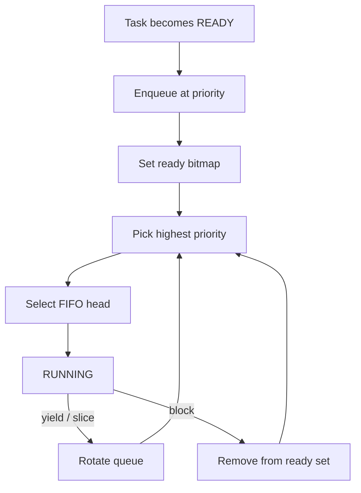

# `06-priority-scheduler` — Bộ lập lịch ưu tiên cố định

> **Môi trường:** Target  
> **Source:** `examples/06-priority-scheduler/main.c`  
> **Trọng tâm:** Fixed-priority scheduling + equal-priority yield

[← Root README](../../README.md)

## Mục lục

- [Mục tiêu và bản chất](#muc-tieu)
- [Build graph và cấu hình](#build-graph)
- [Luồng thực thi](#runtime)
- [API và ownership](#api)
- [Invariant / PASS criteria](#pass)
- [Debug và failure modes](#debug)
- [Validation](#validation)
- [Source map và references](#source-map)

<a id="muc-tieu"></a>
## Mục tiêu và bản chất

Low được register trước nhưng không được chạy khi high READY; hai high task cùng priority rotate bằng yield.


<a id="build-graph"></a>
## Build graph và cấu hình

- Environment được CMake khai báo: **Target**.
- Module được link cho example này: `platform`, `baremetal_tick`, `task_kernel`, `kernel_runtime`.
- Target tham chiếu: `bluepill_f103c8` — STM32F103C8T6 / Cortex-M3 / 72 MHz nominal / USART1 115200 / LED PC13 active-low.

### Compile-time / source constants

| Symbol | Giá trị trong `main.c` |
| --- | --- |
| `HIGH_TASK_PRIORITY` | `1U` |
| `LOW_TASK_PRIORITY` | `5U` |
| `TASK_STACK_WORDS` | `160U` |
| `TASK_PRINT_DELAY_MS` | `250U` |

### CMake feature overrides

- Example dùng default config trừ những module/definition được khai báo trong `cmake/hairtos_examples.cmake`.

<a id="runtime"></a>
## Luồng thực thi




### Các chi tiết quan sát trực tiếp từ example

- Hiểu quy ước priority số nhỏ hơn là khẩn cấp hơn.
- Phân biệt registration order với scheduling order.
- Kiểm tra FIFO giữa `high-a` và `high-b`.
- Chứng minh task low không được chạy khi high tasks luôn READY.
- Ready queues theo priority.
- Ready bitmap tìm priority cao nhất.
- Yield rotate queue hiện tại, không hạ xuống priority thấp hơn khi vẫn còn task high READY.
- Scheduler policy vẫn cooperative ở thời điểm này.
- `hairtos/hr_kernel.h`
- `hairtos/hr_task.h`
- `hr_task_get_effective_priority()`
- `hr_task_yield()`
- `hr_task_start()`
- `task_kernel`
- `kernel_runtime`
- `baremetal_tick`
- Chỉ thấy `high-A` và `high-B` xen kẽ.
- Không thấy lỗi low-priority task ran.
- Phần cứng — STM32F103C8T6 Blue Pill — Chạy firmware target.
- Nạp/debug — ST-Link V2 qua SWD — Dùng OpenOCD để flash, verify và reset.
- UART — USART1, PA9 TX / PA10 RX, 115200 8-N-1 — Theo dõi log và trạng thái PASS/FAIL.
- LED — PC13, active-low — Hiển thị heartbeat hoặc trạng thái quan sát.
- `high-a` — Priority 1, stack 160 words — Yield cho peer cùng priority.
- `high-b` — Priority 1, stack 160 words — Yield cho peer cùng priority.

<a id="api"></a>
## API và ownership

API được gọi trực tiếp trong `main.c` (đã trích từ source):

- `board_delay_ms()`
- `board_init()`
- `board_led_toggle()`
- `board_panic()`
- `board_uart_write_line()`
- `board_uart_write_string()`
- `board_uart_write_u32()`
- `hr_kernel_init()`
- `hr_kernel_start()`
- `hr_port_thread_uses_psp()`
- `hr_task_create_static()`
- `hr_task_current()`
- `hr_task_get_effective_priority()`
- `hr_task_start()`
- `hr_task_yield()`

Ownership cần nhớ:

- `hr_task_t`, stack, queue/semaphore/mutex/timer object và haievent storage trong examples đều là static/caller-owned.
- API kernel giữ pointer tới storage này sau create, vì vậy lifetime phải kéo dài toàn bộ thời gian object còn active.
- ISR path không được gọi blocking API. API `_from_isr` chỉ làm bounded work và trả `higher_priority_task_woken` để PendSV xử lý switch sau ISR.
- Dynamic haievent event từ pool dùng retain/release; static event không được framework tự free.

<a id="pass"></a>
## Invariant và PASS criteria

- Ready task xuất hiện đúng một lần trong ready set; node không được đồng thời nằm ở list khác.
- Selection không phụ thuộc thứ tự đăng ký giữa các priority khác nhau: priority nhỏ nhất đang có bit trong bitmap luôn thắng.
- Giữa các task cùng priority, thứ tự là FIFO; `yield`/time slice rotate hàng đợi cao nhất thay vì làm thay đổi priority.
- Preemption chỉ xảy ra khi có task READY với effective priority nhỏ hơn current task; peer cùng priority cần yield hoặc time slice để đổi lượt.
- Mọi thay đổi effective priority của task READY phải requeue ready node để bitmap/list phản ánh priority mới.

Các check/log cứng trong source:

- `ERROR: scheduler selected wrong task in `
- `ERROR: scheduled task is not using PSP.`
- `ERROR: low-priority task ran while high tasks were READY.`
- `Kernel initialization failed.`
- `Low task creation failed.`
- `High task A creation failed.`
- `High task B creation failed.`
- `Task registration failed.`

<a id="debug"></a>
## Debug và failure modes

- Low-priority task chạy khi high tasks còn READY: kiểm tra ready bitmap và quy tắc số priority nhỏ hơn là cao hơn.
- High-A/High-B không thay phiên khi yield: kiểm tra FIFO rotation trong cùng priority.
- Current-task mismatch: kiểm tra selector lấy FIFO head của mức priority cao nhất.
- Đừng suy luận scheduler từ thứ tự task được đăng ký; priority quyết định trước registration order.

<a id="validation"></a>
## Validation

- Example là target-only trong CMake; host evidence không thay thế ARM cross-build, OpenOCD và hardware validation.
- Host validation baseline: `make TARGET=bluepill_f103c8 host-tests` PASS toàn bộ suite.

### Lệnh chuẩn

```bash
make TARGET=bluepill_f103c8 EXAMPLE=06-priority-scheduler build
make TARGET=bluepill_f103c8 EXAMPLE=06-priority-scheduler run
make TARGET=bluepill_f103c8 EXAMPLE=06-priority-scheduler check
```

<a id="source-map"></a>
## Source map và references

- `examples/06-priority-scheduler/main.c`
- `cmake/hairtos_examples.cmake`
- `kernel/src/hr_scheduler.c`
- `kernel/internal/hr_scheduler_internal.h`
- `kernel/src/hr_kernel.c`
- `tests/host/test_ready_queue.c`
- `tests/host/test_scheduler_policy.c`
- `labs/memory-allocator/`

### Tài liệu tham khảo

- [Arm Cortex-M3 Technical Reference Manual](https://developer.arm.com/documentation/100165/latest/)
- [Arm Cortex-M3 Devices Generic User Guide](https://developer.arm.com/documentation/dui0552/latest/)

**Nguồn implementation trong repository:**
- `kernel/src/hr_scheduler.c`
- `kernel/internal/hr_scheduler_internal.h`
- `kernel/src/hr_kernel.c`
- `tests/host/test_ready_queue.c`
- `tests/host/test_scheduler_policy.c`
- `labs/memory-allocator/`
