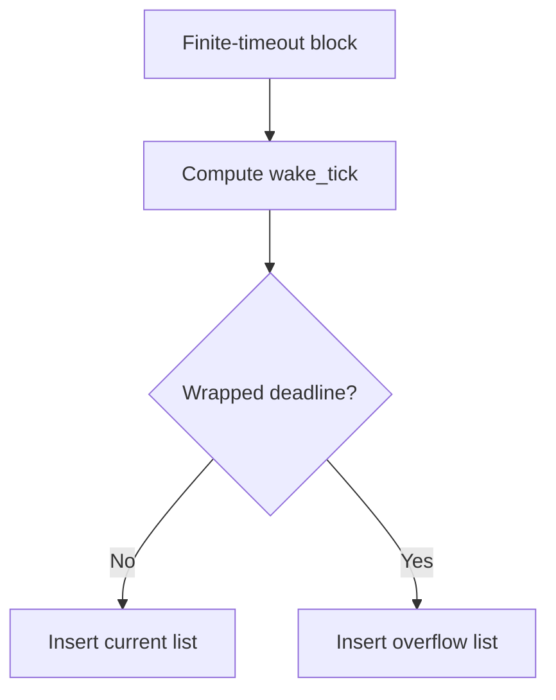
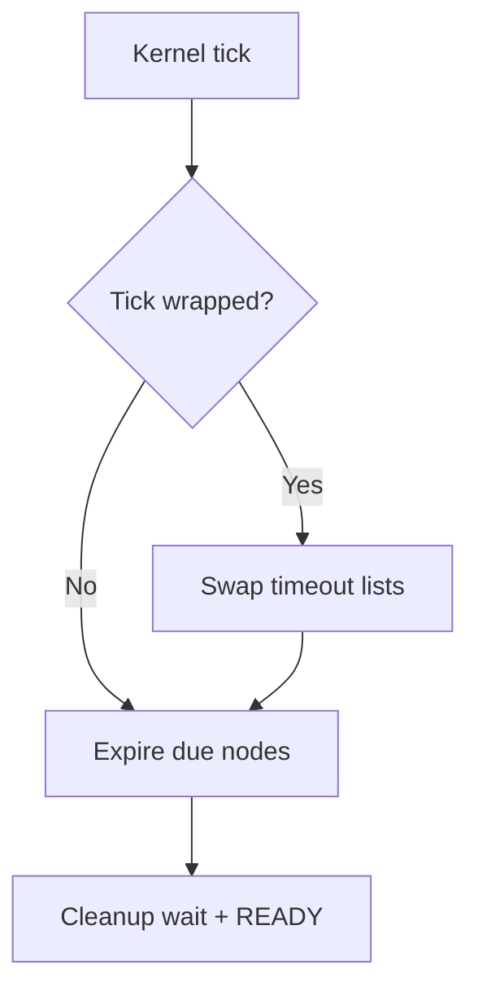

# `07-task-delay-timeout` — SysTick, Task Delay, and Timeouts

> **Environment:** Target  
> **Source:** `examples/07-task-delay-timeout/main.c`  
> **Focus:** SysTick, delays, and absolute periodic timing

[← Root README](../../README.md)

## Table of Contents

- [Objective and Core Concept](#objective)
- [Build Graph and Configuration](#build-graph)
- [Runtime Flow](#runtime)
- [API and Ownership](#api)
- [Invariant / PASS criteria](#pass)
- [Debugging and Failure Modes](#debug)
- [Validation](#validation)
- [Source Map and References](#source-map)

<a id="objective"></a>
## Objective and Core Concept

Preemption/time slicing are disabled in this example to isolate block → idle → timeout wake and `delay_until` behavior.


<a id="build-graph"></a>
## Build Graph and Configuration

- CMake declares this example as a **Target** environment.
- Modules linked for this example: `platform`, `task_kernel`, `kernel_runtime`, `kernel_time`.
- Reference target: `bluepill_f103c8` — STM32F103C8T6 / Cortex-M3 / nominal 72 MHz / USART1 115200 / active-low PC13 LED.

### Compile-time / source constants

| Symbol | Value in `main.c` |
| --- | --- |
| `PERIODIC_TASK_PRIORITY` | `2U` |
| `HEARTBEAT_TASK_PRIORITY` | `3U` |
| `TASK_STACK_WORDS` | `160U` |
| `PERIODIC_INTERVAL_TICKS` | `500U` |
| `HEARTBEAT_INTERVAL_TICKS` | `1000U` |

### CMake feature overrides

- `HR_CFG_PREEMPTION=0` and `HR_CFG_TIME_SLICING=0` so blocking/timeout behavior can be observed without mixing in preemption.

<a id="runtime"></a>
## Runtime Flow

**Timeout insertion**



**Tick expiry path**




### Details Observed Directly in the Example

- Use `hr_task_delay()` for relative blocking.
- Use `hr_task_delay_until()` for drift-resistant periodic execution.
- Observe the idle task running while all application tasks are BLOCKED.
- Understand timeout lists and wakeup at the tick deadline.
- SysTick is managed by the kernel.
- State transition RUNNING → BLOCKED → READY.
- Dual timeout lists support tick wrap-around.
- This example disables general preemption and time slicing to focus on delays.
- `hairtos/hr_time.h`
- `hairtos/hr_task.h`
- `hr_time_now()`
- `hr_task_delay()`
- `hr_task_delay_until()`
- `task_kernel`
- `kernel_runtime`
- `kernel_time`
- Periodic output appears near ticks that are multiples of 500.
- Heartbeat output appears near ticks that are multiples of 1000.
- Hardware — STM32F103C8T6 Blue Pill — Runs the target firmware.
- Flash/debug — ST-Link V2 over SWD — OpenOCD is used to flash, verify, and reset the target.
- UART — USART1, PA9 TX / PA10 RX, 115200 8-N-1 — Observes logs and PASS/FAIL status.
- LED — PC13, active-low — Displays heartbeat or observable status.
- `periodic` — Priority 2, stack 160 words — `delay_until` every 500 ticks.
- `heartbeat` — Priority 3, stack 160 words — `delay` every 1000 ticks.

<a id="api"></a>
## API and Ownership

APIs called directly from `main.c` (extracted from source):

- `board_init()`
- `board_led_toggle()`
- `board_panic()`
- `board_uart_write_line()`
- `board_uart_write_string()`
- `board_uart_write_u32()`
- `hr_kernel_init()`
- `hr_kernel_start()`
- `hr_port_thread_uses_psp()`
- `hr_task_create_static()`
- `hr_task_current()`
- `hr_task_delay()`
- `hr_task_delay_until()`
- `hr_task_start()`
- `hr_time_now()`

Ownership rules to keep in mind:

- `hr_task_t`, stacks, queue/semaphore/mutex/timer objects, and haievent storage in the examples are all static/caller-owned.
- Kernel APIs retain pointers to this storage after creation, so the storage lifetime must cover the entire period in which the object remains active.
- ISR paths must not call blocking APIs. `_from_isr` APIs perform bounded work and return `higher_priority_task_woken` so PendSV can perform any required switch after ISR exit.
- Dynamic haievent events allocated from a pool use retain/release semantics; static events are not freed automatically by the framework.

<a id="pass"></a>
## Invariants and PASS Criteria

- Each blocked task has exactly one timeout node, and that node belongs to exactly one of the two timeout lists while a finite timeout is active.
- `HR_WAIT_FOREVER` requires no timeout node; `HR_NO_WAIT` does not block.
- Object wakeup and timeout wakeup race on the same wait state; the winning path must remove the task consistently from both the wait list and timeout list.
- `delay_until()` uses an absolute periodic reference to reduce phase drift compared with adding a delay after each actual execution.
- Wrap-around behavior is unit-tested directly in `test_timeout.c`.

Hard-coded checks/logs in the source:

- `ERROR: invalid task context.`
- `ERROR: periodic delay failed.`
- `ERROR: heartbeat delay failed.`
- `Kernel initialization failed.`
- `Periodic task creation failed.`
- `Heartbeat task creation failed.`
- `Task registration failed.`

<a id="debug"></a>
## Debugging and Failure Modes

- Delayed task does not wake: inspect SysTick, `hr_time_now()`, timeout insertion, and expiry cleanup.
- Incorrect wakeup around `uint32_t` wrap: inspect current/overflow timeout lists and list swapping at tick wrap.
- Task remains in the ready set while BLOCKED: inspect single ownership of ready/timeout nodes.
- The example disables preemption/time slicing through CMake; interpret all behavior under that configuration.

<a id="validation"></a>
## Validation

- This example is target-only in CMake; host evidence does not replace ARM cross-build, OpenOCD, and hardware validation.
- Host validation baseline: `make TARGET=bluepill_f103c8 host-tests` passes the entire suite.

### Standard Commands

```bash
make TARGET=bluepill_f103c8 EXAMPLE=07-task-delay-timeout build
make TARGET=bluepill_f103c8 EXAMPLE=07-task-delay-timeout run
make TARGET=bluepill_f103c8 EXAMPLE=07-task-delay-timeout check
```

<a id="source-map"></a>
## Source Map and References

- `examples/07-task-delay-timeout/main.c`
- `cmake/hairtos_examples.cmake`
- `kernel/src/hr_timeout.c`
- `kernel/src/hr_kernel.c`
- `kernel/src/hr_time.c`
- `tests/host/test_timeout.c`

### References

- [Arm Cortex-M3 Technical Reference Manual](https://developer.arm.com/documentation/100165/latest/)
- [Arm Cortex-M3 Devices Generic User Guide](https://developer.arm.com/documentation/dui0552/latest/)

**Implementation sources in the repository:**
- `kernel/src/hr_timeout.c`
- `kernel/src/hr_kernel.c`
- `kernel/src/hr_time.c`
- `tests/host/test_timeout.c`
