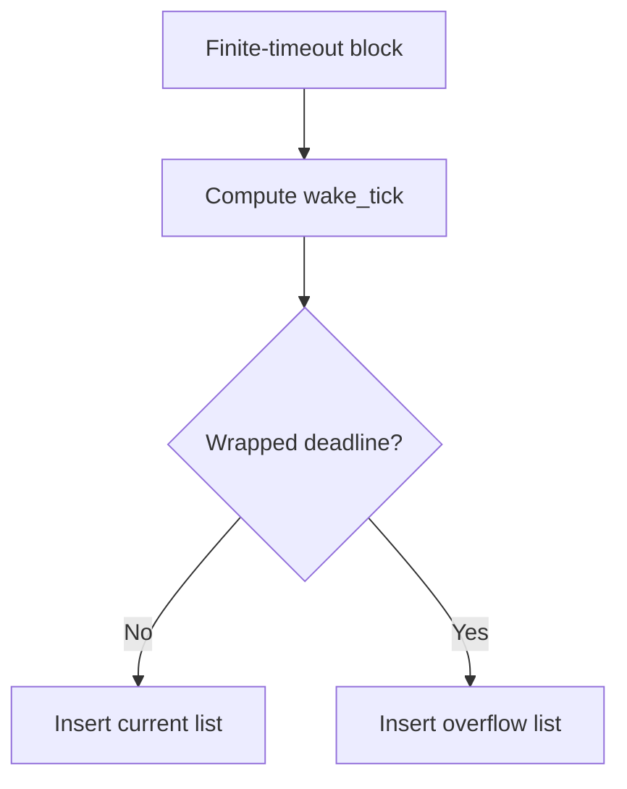
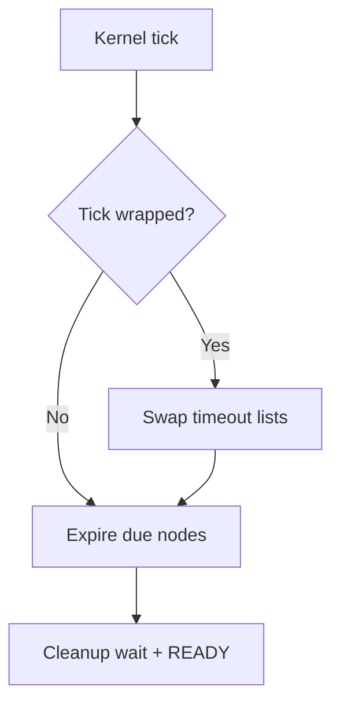

# `07-task-delay-timeout` — SysTick, trì hoãn tác vụ và timeout

> **Môi trường:** Target  
> **Source:** `examples/07-task-delay-timeout/main.c`  
> **Trọng tâm:** SysTick, delay và absolute periodic timing

[← Root README](../../README.md)

## Mục lục

- [Mục tiêu và bản chất](#muc-tieu)
- [Build graph và cấu hình](#build-graph)
- [Luồng thực thi](#runtime)
- [API và ownership](#api)
- [Invariant / PASS criteria](#pass)
- [Debug và failure modes](#debug)
- [Validation](#validation)
- [Source map và references](#source-map)

<a id="muc-tieu"></a>
## Mục tiêu và bản chất

Preemption/time slicing bị tắt cho bài này để tập trung vào block → idle → timeout wake và delay_until.


<a id="build-graph"></a>
## Build graph và cấu hình

- Environment được CMake khai báo: **Target**.
- Module được link cho example này: `platform`, `task_kernel`, `kernel_runtime`, `kernel_time`.
- Target tham chiếu: `bluepill_f103c8` — STM32F103C8T6 / Cortex-M3 / 72 MHz nominal / USART1 115200 / LED PC13 active-low.

### Compile-time / source constants

| Symbol | Giá trị trong `main.c` |
| --- | --- |
| `PERIODIC_TASK_PRIORITY` | `2U` |
| `HEARTBEAT_TASK_PRIORITY` | `3U` |
| `TASK_STACK_WORDS` | `160U` |
| `PERIODIC_INTERVAL_TICKS` | `500U` |
| `HEARTBEAT_INTERVAL_TICKS` | `1000U` |

### CMake feature overrides

- `HR_CFG_PREEMPTION=0` và `HR_CFG_TIME_SLICING=0` để quan sát blocking/timeout mà không trộn preemption.

<a id="runtime"></a>
## Luồng thực thi

**Timeout insertion**



**Tick expiry path**




### Các chi tiết quan sát trực tiếp từ example

- Dùng `hr_task_delay()` để block tương đối.
- Dùng `hr_task_delay_until()` để chạy periodic không drift.
- Quan sát idle task chạy khi mọi application task đều BLOCKED.
- Hiểu timeout list và wake-up tại tick deadline.
- SysTick do kernel quản lý.
- Chuyển trạng thái RUNNING → BLOCKED → READY.
- Dual timeout list hỗ trợ tick wrap.
- Example tắt general preemption và time slicing để tập trung vào delay.
- `hairtos/hr_time.h`
- `hairtos/hr_task.h`
- `hr_time_now()`
- `hr_task_delay()`
- `hr_task_delay_until()`
- `task_kernel`
- `kernel_runtime`
- `kernel_time`
- Periodic xuất hiện gần các tick bội 500.
- Heartbeat xuất hiện gần các tick bội 1000.
- Phần cứng — STM32F103C8T6 Blue Pill — Chạy firmware target.
- Nạp/debug — ST-Link V2 qua SWD — Dùng OpenOCD để flash, verify và reset.
- UART — USART1, PA9 TX / PA10 RX, 115200 8-N-1 — Theo dõi log và trạng thái PASS/FAIL.
- LED — PC13, active-low — Hiển thị heartbeat hoặc trạng thái quan sát.
- `periodic` — Priority 2, stack 160 words — `delay_until` mỗi 500 ticks.
- `heartbeat` — Priority 3, stack 160 words — `delay` mỗi 1000 ticks.

<a id="api"></a>
## API và ownership

API được gọi trực tiếp trong `main.c` (đã trích từ source):

- `board_init()`
- `board_led_toggle()`
- `board_panic()`
- `board_uart_write_line()`
- `board_uart_write_string()`
- `board_uart_write_u32()`
- `hr_kernel_init()`
- `hr_kernel_start()`
- `hr_port_thread_uses_psp()`
- `hr_task_create_static()`
- `hr_task_current()`
- `hr_task_delay()`
- `hr_task_delay_until()`
- `hr_task_start()`
- `hr_time_now()`

Ownership cần nhớ:

- `hr_task_t`, stack, queue/semaphore/mutex/timer object và haievent storage trong examples đều là static/caller-owned.
- API kernel giữ pointer tới storage này sau create, vì vậy lifetime phải kéo dài toàn bộ thời gian object còn active.
- ISR path không được gọi blocking API. API `_from_isr` chỉ làm bounded work và trả `higher_priority_task_woken` để PendSV xử lý switch sau ISR.
- Dynamic haievent event từ pool dùng retain/release; static event không được framework tự free.

<a id="pass"></a>
## Invariant và PASS criteria

- Mỗi blocked task có đúng một timeout node và node chỉ nằm trong một trong hai timeout list khi timeout hữu hạn đang active.
- `HR_WAIT_FOREVER` không cần timeout node; `HR_NO_WAIT` không block.
- Wake do object và wake do timeout cạnh tranh trên cùng wait state; đường thắng phải remove task khỏi cả wait list và timeout list một cách nhất quán.
- `delay_until()` dùng absolute periodic reference để giảm phase drift so với cộng delay sau mỗi lần task thực sự chạy.
- Wrap-around được unit test trực tiếp trong `test_timeout.c`.

Các check/log cứng trong source:

- `ERROR: invalid task context.`
- `ERROR: periodic delay failed.`
- `ERROR: heartbeat delay failed.`
- `Kernel initialization failed.`
- `Periodic task creation failed.`
- `Heartbeat task creation failed.`
- `Task registration failed.`

<a id="debug"></a>
## Debug và failure modes

- Task delay không wake: kiểm tra SysTick, `hr_time_now()`, timeout insertion và expiry cleanup.
- Wake sai quanh `uint32_t` wrap: kiểm tra current/overflow timeout lists và swap khi tick wrap.
- Task còn nằm trong ready set khi BLOCKED: kiểm tra single ownership của ready/timeout nodes.
- Example tắt preemption/time slicing theo CMake; mọi behavior phải được đọc trong config đó.

<a id="validation"></a>
## Validation

- Example là target-only trong CMake; host evidence không thay thế ARM cross-build, OpenOCD và hardware validation.
- Host validation baseline: `make TARGET=bluepill_f103c8 host-tests` PASS toàn bộ suite.

### Lệnh chuẩn

```bash
make TARGET=bluepill_f103c8 EXAMPLE=07-task-delay-timeout build
make TARGET=bluepill_f103c8 EXAMPLE=07-task-delay-timeout run
make TARGET=bluepill_f103c8 EXAMPLE=07-task-delay-timeout check
```

<a id="source-map"></a>
## Source map và references

- `examples/07-task-delay-timeout/main.c`
- `cmake/hairtos_examples.cmake`
- `kernel/src/hr_timeout.c`
- `kernel/src/hr_kernel.c`
- `kernel/src/hr_time.c`
- `tests/host/test_timeout.c`

### Tài liệu tham khảo

- [Arm Cortex-M3 Technical Reference Manual](https://developer.arm.com/documentation/100165/latest/)
- [Arm Cortex-M3 Devices Generic User Guide](https://developer.arm.com/documentation/dui0552/latest/)

**Nguồn implementation trong repository:**
- `kernel/src/hr_timeout.c`
- `kernel/src/hr_kernel.c`
- `kernel/src/hr_time.c`
- `tests/host/test_timeout.c`
