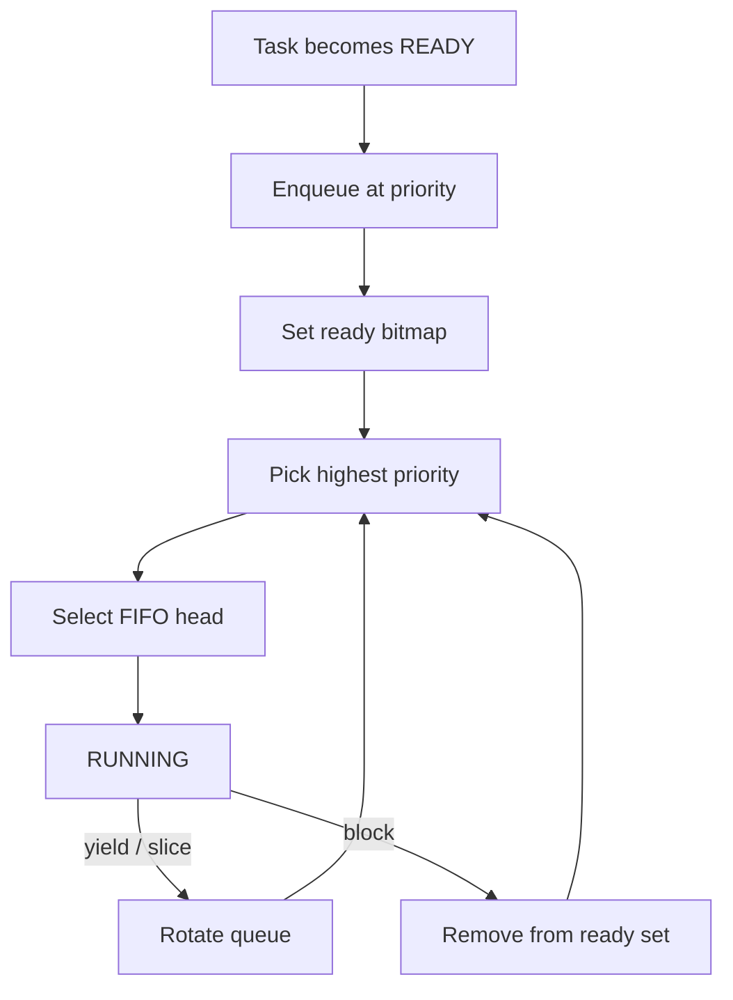

# `08-preemption-round-robin` — Chiếm quyền và Round-Robin

> **Môi trường:** Target  
> **Source:** `examples/08-preemption-round-robin/main.c`  
> **Trọng tâm:** Preemption + tick time slicing

[← Root README](../../README.md)

## Mục lục

- [Mục tiêu và bản chất](#muc-tieu)
- [Build graph và cấu hình](#build-graph)
- [Luồng thực thi](#runtime)
- [API và ownership](#api)
- [Invariant / PASS criteria](#pass)
- [Debug và failure modes](#debug)
- [Validation](#validation)
- [Source map và references](#source-map)

<a id="muc-tieu"></a>
## Mục tiêu và bản chất

Hai worker CPU-bound không yield vẫn chia CPU; monitor priority cao wake theo period và preempt worker.


<a id="build-graph"></a>
## Build graph và cấu hình

- Environment được CMake khai báo: **Target**.
- Module được link cho example này: `platform`, `task_kernel`, `kernel_runtime`, `kernel_time`.
- Target tham chiếu: `bluepill_f103c8` — STM32F103C8T6 / Cortex-M3 / 72 MHz nominal / USART1 115200 / LED PC13 active-low.

### Compile-time / source constants

| Symbol | Giá trị trong `main.c` |
| --- | --- |
| `MONITOR_TASK_PRIORITY` | `1U` |
| `WORKER_TASK_PRIORITY` | `3U` |
| `TASK_STACK_WORDS` | `192U` |
| `MONITOR_PERIOD_TICKS` | `250U` |

### CMake feature overrides

- Example dùng default config trừ những module/definition được khai báo trong `cmake/hairtos_examples.cmake`.

<a id="runtime"></a>
## Luồng thực thi




### Các chi tiết quan sát trực tiếp từ example

- Chứng minh preemption khi task priority cao chuyển READY.
- Chứng minh time slicing giữa hai task cùng priority.
- Phát hiện starvation bằng cách so sánh worker counters.
- Giữ PendSV là nơi duy nhất save/restore context.
- SysTick quyết định PREEMPT hoặc TIME_SLICE rồi pend PendSV.
- Monitor priority 1 cao hơn worker priority 3.
- Worker không gọi kernel API trong vòng lặp.
- Round-robin dùng quantum `HR_CFG_TIME_SLICE_TICKS`.
- `hairtos/hr_time.h`
- `hr_port.h`
- `hr_task_delay_until()`
- `hr_task_current()`
- `task_kernel`
- `kernel_runtime`
- `kernel_time`
- Sau activation đầu, cả hai worker counter đều tăng giữa hai report.
- Monitor chạy gần mỗi 250 tick.
- Không xuất hiện starvation error.
- Phần cứng — STM32F103C8T6 Blue Pill — Chạy firmware target.
- Nạp/debug — ST-Link V2 qua SWD — Dùng OpenOCD để flash, verify và reset.
- UART — USART1, PA9 TX / PA10 RX, 115200 8-N-1 — Theo dõi log và trạng thái PASS/FAIL.
- LED — PC13, active-low — Hiển thị heartbeat hoặc trạng thái quan sát.
- `monitor` — Priority 1, stack 192 words — Chạy mỗi 250 ticks và kiểm tra counters.
- `worker-a` — Priority 3, stack 192 words — CPU-bound counter.

<a id="api"></a>
## API và ownership

API được gọi trực tiếp trong `main.c` (đã trích từ source):

- `board_init()`
- `board_led_toggle()`
- `board_panic()`
- `board_uart_write_line()`
- `board_uart_write_string()`
- `board_uart_write_u32()`
- `hr_kernel_init()`
- `hr_kernel_start()`
- `hr_port_thread_uses_psp()`
- `hr_task_create_static()`
- `hr_task_current()`
- `hr_task_delay_until()`
- `hr_task_start()`
- `hr_time_now()`

Ownership cần nhớ:

- `hr_task_t`, stack, queue/semaphore/mutex/timer object và haievent storage trong examples đều là static/caller-owned.
- API kernel giữ pointer tới storage này sau create, vì vậy lifetime phải kéo dài toàn bộ thời gian object còn active.
- ISR path không được gọi blocking API. API `_from_isr` chỉ làm bounded work và trả `higher_priority_task_woken` để PendSV xử lý switch sau ISR.
- Dynamic haievent event từ pool dùng retain/release; static event không được framework tự free.

<a id="pass"></a>
## Invariant và PASS criteria

- Ready task xuất hiện đúng một lần trong ready set; node không được đồng thời nằm ở list khác.
- Selection không phụ thuộc thứ tự đăng ký giữa các priority khác nhau: priority nhỏ nhất đang có bit trong bitmap luôn thắng.
- Giữa các task cùng priority, thứ tự là FIFO; `yield`/time slice rotate hàng đợi cao nhất thay vì làm thay đổi priority.
- Preemption chỉ xảy ra khi có task READY với effective priority nhỏ hơn current task; peer cùng priority cần yield hoặc time slice để đổi lượt.
- Mọi thay đổi effective priority của task READY phải requeue ready node để bitmap/list phản ánh priority mới.

Các check/log cứng trong source:

- `ERROR: invalid task context.`
- `ERROR: equal-priority worker starvation detected.`
- `ERROR: monitor delay failed.`
- `Kernel initialization failed.`
- `Monitor task creation failed.`
- `Worker A creation failed.`
- `Worker B creation failed.`
- `Task registration failed.`
- `ERROR: hr_kernel_start returned status=`

<a id="debug"></a>
## Debug và failure modes

- Higher-priority task wake nhưng không preempt: kiểm tra wake path có pend PendSV.
- Equal-priority tasks không round-robin: kiểm tra time-slice counter và FIFO rotation.
- Priority ordering sai: kiểm tra effective priority và ready bitmap.
- Nếu lỗi chỉ xuất hiện sau nhiều tick, kiểm tra cả time-slice reset khi task/block state thay đổi.

<a id="validation"></a>
## Validation

- Example là target-only trong CMake; host evidence không thay thế ARM cross-build, OpenOCD và hardware validation.
- Host validation baseline: `make TARGET=bluepill_f103c8 host-tests` PASS toàn bộ suite.

### Lệnh chuẩn

```bash
make TARGET=bluepill_f103c8 EXAMPLE=08-preemption-round-robin build
make TARGET=bluepill_f103c8 EXAMPLE=08-preemption-round-robin run
make TARGET=bluepill_f103c8 EXAMPLE=08-preemption-round-robin check
```

<a id="source-map"></a>
## Source map và references

- `examples/08-preemption-round-robin/main.c`
- `cmake/hairtos_examples.cmake`
- `kernel/src/hr_scheduler.c`
- `kernel/internal/hr_scheduler_internal.h`
- `kernel/src/hr_kernel.c`
- `tests/host/test_ready_queue.c`
- `tests/host/test_scheduler_policy.c`
- `labs/memory-allocator/`

### Tài liệu tham khảo


**Nguồn implementation trong repository:**
- `kernel/src/hr_scheduler.c`
- `kernel/internal/hr_scheduler_internal.h`
- `kernel/src/hr_kernel.c`
- `tests/host/test_ready_queue.c`
- `tests/host/test_scheduler_policy.c`
- `labs/memory-allocator/`
